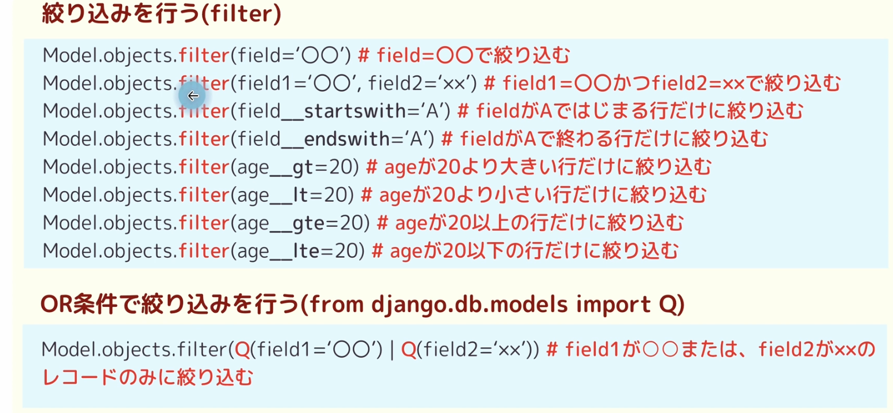
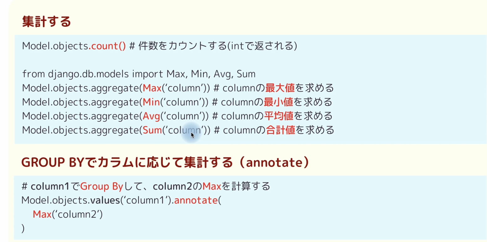
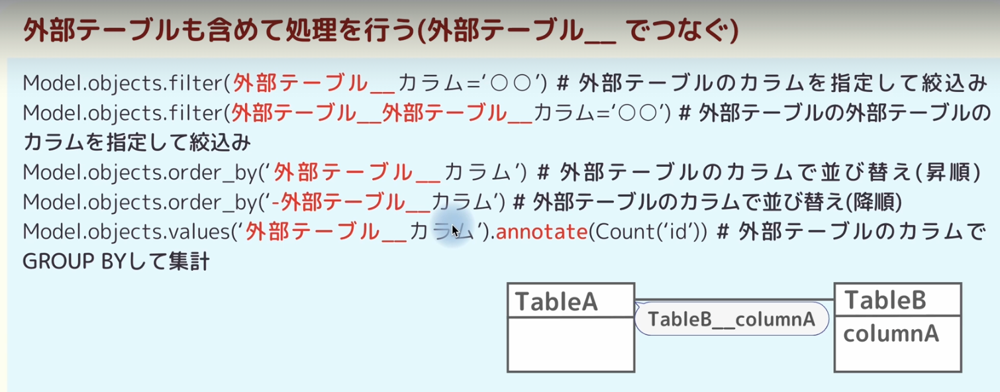
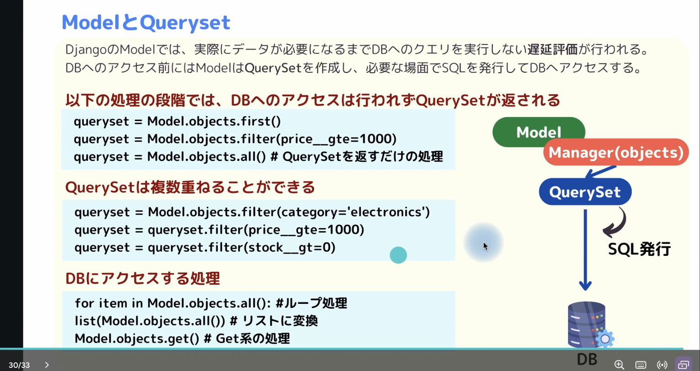
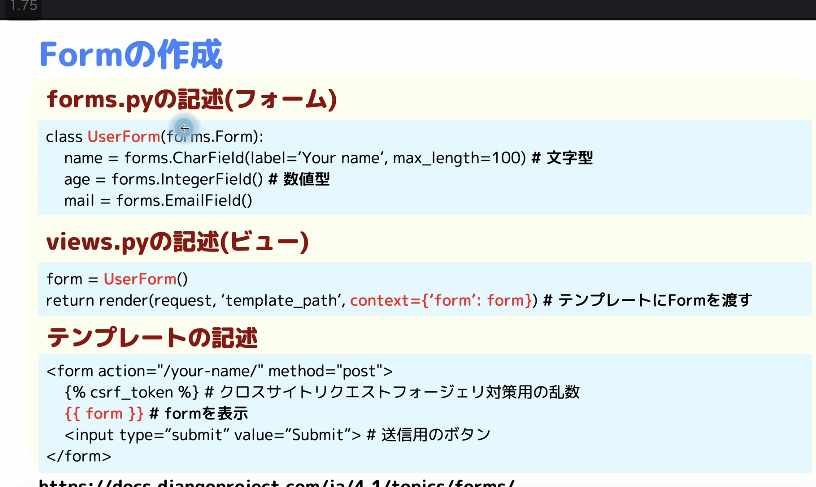
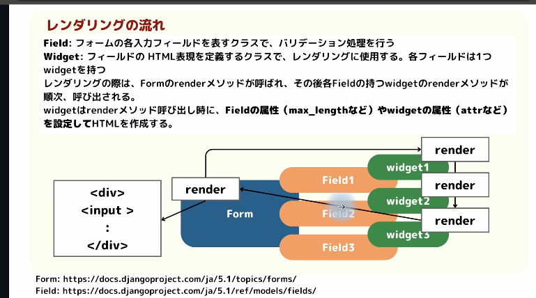
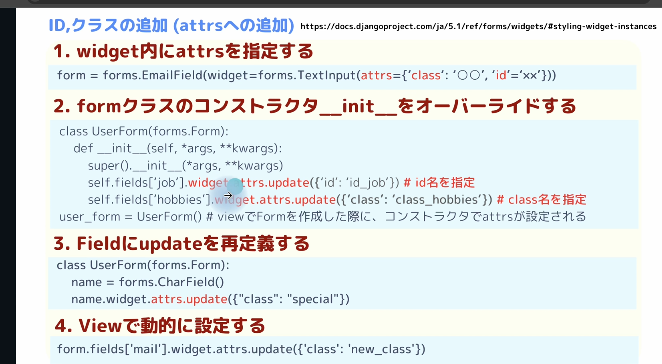

## 5章
- Web3層構造
    - webサーバ
    - Apサーバ
    - DB
- Djangoが担当するのはAPの部分。webサーバはapachやnginxなどのこと。
- Webサーバはユーザからリクエストを受け取る。インタネットと直接繋がっているので セキュリティ的に問題のあるものは置かない。写真やHTM L,CSSなど静的なもの。
- で、複数のAPサーバに負荷分散してリクエストを処理する。APサーバは複数プロセスを作って処理を効率的にやるためにある。

- django-admin startproject 〇〇　でプロジェクト作成
- python manage,py runserver　でサーバ起動

```py
# settings.py
LANGUAGE_CODE = 'ja'

TIME_ZONE = 'Asia/Tokyo'
```

- 以下はこのライブラリを使ってDBを作成しますよって設定
```py
# settings.py
DATABASES = {
    'default': {
        'ENGINE': 'django.db.backends.sqlite3',
        'NAME': BASE_DIR / 'db.sqlite3',
    }
}
```

- 以下はPath(__file__).resolve()はこのsettings.pyのディレクトリ。parent.parent何度絵2つ上のディレクトリを指しており、そこがベースと言っている。
```py
# settings.py
BASE_DIR = Path(__file__).resolve().parent.parent
```
- sqliteの拡張機能で、vscode上からSQLITEの中身を確認できる
- アプリケーションというのは機能みたいなもの。
- python3 manage.py startapp first_app でアプリ作成
- settings.pyの INSTALLED_APPに作ったアプリを追加


- 以下の設定をプロジェクトのurls.pyに書いた場合、localhost://localhost:8000/first_app/にアクセスした場合にfirst_appアプリのurls.pyに飛ぶ
```py
urls.py
urlpatterns = [
    path('admin/', admin.site.urls),
    path('first_app/',include('first_app.urls'))
]
```

## 6章
- テンプレートの使用方法
    - アプリケーション直下にtemplatesフォルダを作成、中にhtmlファイルを作る
⇩
- 以下のようにsettings.py のTEMPLATESのDIRSが空の場合はアプリケーション直下にtempaltesをつくってhtmlファイルを配置していくこととなる、
```py
# settings.py
TEMPLATES = [
    {
        'BACKEND': 'django.template.backends.django.DjangoTemplates',
        'DIRS': [],
        'APP_DIRS': True,
        'OPTIONS': {
            'context_processors': [
                'django.template.context_processors.debug',
                'django.template.context_processors.request',
                'django.contrib.auth.context_processors.auth',
                'django.contrib.messages.context_processors.messages',
            ],
        },
    },
]

```
- 上記の「DIRS」の値にtemplateとして利用するディレクトリのパスを記述する→鐵mプレートを置く場所を変更できる。ここが体とアプリ内のtemplatesを勝手に見るが、値が指定されていればそれを優先的に見てくれるしくみ

- 以下のようにDIRSを設定すれば、ベースディレクトリ下のtempaltesフォルダを見てくれるようになる
```py
import os
BASE_DIR = Path(__file__).resolve().parent.parent
TEMPLATES = [
    {
        'BACKEND': 'django.template.backends.django.DjangoTemplates',
        'DIRS': [os.path.join(BASE_DIR, 'templates')],
        'APP_DIRS': True,
        'OPTIONS': {
            'context_processors': [
                'django.template.context_processors.debug',
                'django.template.context_processors.request',
                'django.contrib.auth.context_processors.auth',
                'django.contrib.messages.context_processors.messages',
            ],
        },
    },
]
```
- DTL(Django template language)
    - contextで渡した変数は「{{ }}」で表示できる
    - if forなどの式（制御文）を記載
- Tempalteフィルター
    - Viewで渡した値をTemplate上で変換する。Tempalteでもpython関数で利用できる
    - パイプやコンマを使って整形できる。
- Templatefilterの自作
    - アプリケーションはいかにtemplatetagsフォルダを作成
    - templatetagsフォルダ下に「__init__.py」を作成(中身は何も書かなくていい)
    - 同じ階層にfilter.pyを作成
    （Djangoを立ち上げた際にtemplatetagsフォルダをdjnagoが読み取ってくれて、その中にあるfilterの設定を見てくれる）
    - 今回は以下のように設定
    ```py
    # filter.py
    from django import template

    register = template.Library()

    @register.filter(name='status_to_string')
    def convert_status_to_string(status):
        if status ==10:
            return 'success'
        elif status == 20:
            return 'Error'
        elif status == 30:
            return 'Pending'
        elif status == 40:
            return 'failed '
        else:
            return 'Unknown'
    ```
    - 今回自作したタグを使用するhtmlでロードする必要がある。のでタグを使いたいhtmlファイルで以下を記載。（templatetagsフォルダは以下においたfilter.pyのファイル名を記載。（filter.pyじゃなくても良い））
    ```html
    
    ```

    - 自作フィルターを使用できる！
        - 既存のフィルターと同じようにパイプの右側に自作のフィルター名を記載
        - 自作フィルターを使用するときはfilter.pyで定義したフィルター関数の「@register.filter(name='status_to_string')」のname属性の部分をかく
        - 
    ```html
    <h1>{{ status |  status_to_string}}</h1>
    ```

    -  上記の例ではfilter関数（convert_status_to_string）の引数である「status」には「
    <h1>{{ status |  status_to_string}}</h1>」のstatusが入るが、第２引数を渡すっ場合はどうするか
    - その場合は以下のようにする。
    <h1>{{ status |  status_to_string:'ABC'}}</h1>
- 画面遷移
    - 以下のように書いていた場合、appはアプリケーションのurls,pyで書いた「app_name='template_app'」と対応している。
    ```html
    <a href="<% url 'template_app:home' %>...
    ```
    - 上記のクエリパラメータで引数を渡したいとき
        - 以下の形で引数を渡せる。
        ```html
        <a href="">aaaa</a>
        ```
        - ↑は   「<a href="/template_app/home/kenya/tanka">aaaa</a>」のようにレンダリングされる
        - urls.pyも忘れずに修正
        ```py
        path('home/<str:first_name>/<str:last_name>', views.home, name='home'),
        ```

        - views.py、も引数を上取れるように修正
        ```py
        def home(request, first_name,last_name):# 引数を追加！  
        my_name='Taro yamada'
        favorite_fruits =['Apple', 'Grape', 'Lemon']
        my_info={
            'name':'Taro',
            'age':18
        }

        return render(request, 'TemplateApp/home.html',
                    context={"my_name":my_name,
                            "favorite_fruits":favorite_fruits,
                            "my_info":my_info,
                            "first_name":first_name,
                            "last_name":last_name,
                            })
        ```
- 静的ファイルに関して

    - STATICFILES_DIRS (Prefixes (optional))
        - 何も設定なければアプリのstaticをデフォルトで参照してくれル。
        - 各アプリケーションのstatic以外に配信するディレクトリがある場合に追加する。
        -以下の設定の場合は、プロジェクトとアプリケーションのフォルダが並ぶディレクトリの1つ上のディレクトリ配下のstaticを見る設定になる。
    ```py
    # settings.py
    BASE_DIR = Path(__file__).resolve().parent.parent
    #TEMPLATE_DIR = os.path.join(BASE_DIR, 'templates')
    STATIC_DIR = os.path.join(BASE_DIR, 'static')
    STATICFILES_DIRS = [STATIC_DIR,]
    ```

    - STATIC_URL
        - 以下のように設定していれば、ブラウザのURLでimage始まりで画像にアクセスできる（デフォルトはsaticになっており、特に変更する必要はない）
    ```py
    # settngs.py
    STATIC_URL = 'image/'
    ```
    http://127.0.0.1:8000/image/sample.png

    - 同じようにｃｓｓファイルもstaticフォルダ下に置いた場合は以下の記述でhtmｌから読み込める
    ```html
    <link rel="stylesheet" type="text/css" href="">
    ```

    - staticフォルダないで新たにフォルダを切ってその中に静的ファイル置いた場合はhtmlのlinkやimgタグ内に記載するパスにて、そのパスを追記する
        - 以下、staticフォルダ内に新たにcssフォルダとimageフォルダを切った際の修正
        ```html 
        <link rel="stylesheet" type="text/css" href="">
        
        ```
    - staticフォルダを複数作ってそれぞれのフォルダへのパス作って各に識別しつけてhtmlからいろんなstaticフォルダ内を参照できるようにする
        ```py
        # settngs.py
        BASE_DIR = Path(__file__).resolve().parent.parent
        #TEMPLATE_DIR = os.path.join(BASE_DIR, 'templates')
        STATIC_DIR = os.path.join(BASE_DIR, 'static')
        STATIC_DIR2 = os.path.join(BASE_DIR, 'static2') #追加！
        ```
        - staticフォルダと並べてstatic2フォルダを新規でつくる
        - STATICFILES_DIRSに以下のように設定する
            - 第一引数は識別しで各々のstaticフォルダに名前をつけている。
        ```py
        # settings.py
        STATICFILES_DIRS = [('static_file', STATIC_DIR),
                            ('static2', STATIC_DIR2),]
        ```
        - そんでhtmlの方で以下のように記載
            - パスの先頭に上記の識別しを書くだけで向き先を変更できる。他は同じ。
            - （static2の方はimageフォルダ切ってないです）
        ```html
        
        
        ```
## 7章
- マイグレーションを特定の位置まで戻す
    - python manage.py migrate アプリケーション名 マイグレーションの名前
    - 戻したい地点のマイグレーションファイルを指定してマイグレートする。

    ```txt
    (.venv) k_tanaka@tanakakenyanoMacBook-Air ModelProject % python manage.py migrate ModelApp 0001_initial
    Operations to perform:
    Target specific migration: 0001_initial, from ModelApp
    Running migrations:
    Rendering model states... DONE
    Unapplying ModelApp.0002_add_sales... OK
    ```

- マイグレーションを実施していない状態に戻す
python manage.py migrate アプリケーション名 zero
- Meta
    - メタクラスのこと。モデルクラス自体にオプションで設定をつけることができる。
    - 以下ではmodelクラスにBeseMetaクラスを作ってそのクラスをpersonモデルで継承している。
    - このPersonクラスをマイグレートすると、DBにBeseMetaとPersonに定義されたカラムが追加される。
    ```py
    # models.py
    from django.db import models
    from datetime import date

    # Create your models here.

    class BaseMeta(models.Model):
        created_at = models.DateTimeField(auto_now_add=True)
        updated_at = models.DateTimeField(auto_now=True)

        class Meta:
            abstract =True #abstractでそのモデルクラスクを抽象クラスにすることができる。この抽象モデルはDBに登録されない

    class Person(BaseMeta):
        first_name = models.CharField(max_length=30)
        last_name = models.CharField(max_length=30)
        birthday = models.DateField(default=date(1990,1,1))
        email = models.EmailField(db_index=True)
        salary = models.FloatField(null=True)
        memo = models.TextField()
        web_site = models.URLField(null=True)

        class Meta:
            db_table ='person'
            indexes=[
                models.Index(fields=['first_name','last_name'])
            ]
            ordering=['salary']
    ```
- INSERT
    - インスタンスを作成してsave()メソッド実行
    ```py
    web_site = WebSite(url="www.sample.com",name="sample")
    web_site.save()
    ```

    - クラスメソッドのcreate()メソッド実行
    ```py
    WebSite.objects.create(
        name='sample',url='www.sample.com'
    )
    ```

    - get_or_createメソッド実行
    ```
    obj ,create = Person.objects.get_or_create(first_name='Jiro', last_name='Satos')
    ```
- SELECT
```py
persons = Person.objects.all()
print(persons)

# 1件も取得できない、もしくは複数権取得の場合、エラーはく
person = Person.objects.get(first_name='taro')
print(person.first_name)

# エラーにならない。複数取得可能
p = Person.objects.filter(first_name='taro').all()
```

- UPDATE

```py
# modelインスタンスのsaveメソッドによる更新
person = Person.objects.get(first_name='taro')
person.first_name='jiro'
person.save()# 更新

# updateメソッドメソッドを使用して更新(一度に更新する)
Event.objects.filter(id=4).update(event_date=event_date)# id=4のレコードに対して更新
```

- DELETE

```py
# filterでデータを絞り込んでdeleteメソッドを実行
Person.objects.filter(name='taro').delete()#nameがtaroのものを削除

# allで、全権取得してdeleteメソッドを実行し、レコードをレコードを削除
Perosn.objects.all().delete()#Personクラス内のデータを全て削除
```

- Modelでの他テーブルとの紐付け（外部キー）１
    - models.forginKey()のon_deleteオプションの値一覧
        - models.CASCADE(紐付けもとのレコード消えると、紐付け先のレコードも消える)
            - manufacturテーブル（トヨタ、日産、etc）、carテーブル（manufacturに紐づく車のテーブル）があるとすれば、
            ```py
            class Car(models.Model):
                manufactur = models.FreignKey(
                    'Manufacture'
                    on_delete = models.CASCADE
                )
            ```
            のようにクリエートした場合は、manufacturのid=1のレコード（トヨタ）が消えると、carモデルのプリウスとかのトヨタに紐づくレコードが消える

        ```py
        class Student(models.Model):
            name=models.CharField(max_length=28)
            age = models.IntegerField()
            major = models.CharField(max_length=20)
            school = models.ForeignKey(
                'Schools',
                on_delete=models.CASCADE
            )

            class Meta:
                db_table='students'

            def ___str__(self):
                return f'{self.pk}, {self.name}, {self.age}'

        class Schools(models.Model):
            name=models.CharField(max_length=20)
            prefecture=models.ForeignKey(
                'Prefecture',
                on_delete=models.CASCADE
            )

            class Meta:
                db_table='schools'

        class Prefecture(models.Model):
            name=models.CharField(max_length=20)

            class Meta:
                db_table='prefectures'
        ```
        - migrateを戻すときのやり方
            - python3 manage.py showmigrations でマイグレートバージョン表示
            - python3 manage.py migrate (↑で出たバージョンのいずれかを入力)
            - マイグレート完了

        - models.PROTECT
            - (紐付け元のレコード削除時にProtectedErrorを出して削除で着ないようにする。なので紐付け先（carモデルの方）を全て削除すれば大元のレコードも削除できるよってやつ)
            - django.db.models.deletion.ProtectedErrorってエラーが出る。紐づいているレコード（carモデルの方）がある限り、大元のレコードは消せないってこと。
            - 以下のようにmodels.PROTECTの場合、紐づく大元のSchoolのレコードが消されようとするとエラーを吐いて削除されないようにしてくれる。
            ```py
            class Student(models.Model):
                name=models.CharField(max_length=28)
                age = models.IntegerField()
                major = models.CharField(max_length=20)
                school = models.ForeignKey(
                    'Schools',
                    on_delete=models.PROTECT
                )

                class Meta:
                    db_table='students'

                def ___str__(self):
                    return f'{self.pk}, {self.name}, {self.age}'
            ```
        - models.SET_NULL
            - 大元のレコードが消されると、紐づいているレコードの外部キーにはNULLが入るようにする。
        
        - models.RESTRICT
            - 紐付け先が削除されようとすると防ぐ、
            - ただし、紐付け元（Student）のレコードのカラムで、別の外部キーで他テーブル（例えばPrefectureなど）と紐づいていて、models.CASCADEで紐づいていたら、Prefectureのレコードが消された時は、それに紐づくStudentのレコードはCAscadeで紐づいているので消されるという仕組みになっている
            - つまり上の例でStudentテーブルからSchoolテーブルに対してRESTRICTEDで外部キーを設定していたが、それをPROTECTEDにすると、CASCADEで紐付けていたPrefectureのレコードを消そうとすると、PROTECTEDErrorで消されない、
            - RestrictedErrorを出す

- models.OneToOneFieldで1対1で紐付ける
    - 外部キーの方に、外部キーと合わせて主キーも持たせることで、１対１の紐付けになる
- 多対多はManyToManyFieldで紐づける
    - BookとAuthorのテーブルがあったとする。1つの著者に対して多の本が描かれます、逆に1つの本に対して共著で複数の著者がいます。こういった場合は多対多のリレーションになる。その際にManyToManyFieldが必須。この際に２テーブル間につなぎのテーブルが1つできる（AuthorsBook）。←AuthorsBookテーブル自体のプライマリーキーカラムと、AuthorとBookのテーブルの外部キーの３カラムを持つ。

- related_name
    - 多対多の場合もそうだし、1対多の場合でもそうだが、modesl.ForeginKeyやmodels.OneToOneFieldでも、models.ManyToManyFieldでもそうだけど、それらのオプションとしてrelated_nameを設定できる
    - これを設定すると、以下のように紐づいたレコードを取得できる。
    .png>)

    - 外部キーの方にrelated_nameを設定して、紐付けもとから逆引きする際にrelated_nameを使って外部の紐づいているレコードを取得する。

- レコードを１件だけ取得
    - Model.objects.first()

- 要素数を制限する
    - Model.objects.all()[:5]



.png>)

-1.png>)





- QuerySetとManagerについて

    - Modelはマネージャーというものを持っていて、いつも書いているobjectsがManager.
    - そのマネージャーがクエリセットをを作成し、データが必要になったらSQLを発行する。
    上記画像の左上の３処理も、クエリセットを作っているだけでDBにはアクセスしていない、データはとってきてない
    - このようにすることで複数のクエリセットを重ねて処理を分割できる。
        - この条件のときはfilterで〜とか、この条件じゃないないならgte使って〜とかできる
    - で、DBにアクセスするタイミングはループ処理とかループ処理とかリストに変換とか、getの処理とか（getはSQLの発行までせっとなので。）

    - Managerでは狗w理想さを分離することで異論んな複雑な処理をmanagerの中で定義するためのもの。
    - Managerでせっていしたクエリ操作の塊を、User.objects.(managerで設定したメソッド名)で呼び出して使うことができる


## 8章
- フォームとは
    - データの入力をサーバに送信して、データが正しいかチェックして処理を行う機能
    

    .png>)

    - form.is_valid()を使ってform内の値が正しいかチェックしてくれる

    - forms.pyにフォームクラスを作る
    ```py
    # forms.py
    from django import forms

    class UserInfo(forms.Form):
        name = forms.CharField()
        age = forms.IntegerField()
        mail = forms.EmailField()
    ```

    - view.pyでフォームを読み込んでコンテキストで使う
    ```py
    from django.shortcuts import render
    from . import forms
    # Create your views here.

    def index(request):
        return render(request, 'formapp/index.html')

    def form_page(request):
        form = forms.UserInfo()
        print("form: ", form)
        return render(request,'formapp/form_page.html',
                    context={
                        'form': form
                    }
                )
    ```



- フォームの仕組み。レンダリングの流れ
    - Fieldは上記でも記述したフォームの各入力欄のこと。フィールドではバリデーション処理を行う。
    - そんで各フィールドにはウィジェット(Widget)という要素がある
        - widgetはフィールドのhtmｌ表現を定義するクラスでレンダリングに使用する。
        - 各フィールドは1つウィジェットを持つ
        - レンダリングの際はフォームのrenderメソッドが呼ばれ、その中で、各widgetが持っているが持っているrenderが実行されていき実行されていき、レンダリングされる
        .png>)
        
        - ⇩フォームの実装例
        ```py
        from django import forms
        from datetime import date
        class UserInfo(forms.Form):
            name = forms.CharField(label="名前", min_length=5, max_length=10, required=False)
            age = forms.IntegerField(label="年齢")
            mail = forms.EmailField(label="メールアドレス",
                widget=forms.TextInput(attrs={'abc':'ABC', 'placeholder':'sample@gmail.com'})
                                    )
            verify_mail = forms.EmailField(label="メールアドレス際入力")
            is_married = forms.BooleanField(initial=True)
            birthday = forms.DateField(initial=date(1990,1,1))
            salary = forms.DecimalField()
            job = forms.ChoiceField(choices=(
                (1,'正社員'),
                (2,'自営業'),
                (3,'学生'),
                (4,'無職')), widget=forms.RadioSelect)
            hobby = forms.MultipleChoiceField(choices=(
                (1,'スポーツ'),
                (2,'読書'),
                (3,'映画鑑賞'),
                (4,'その他')), widget=forms.CheckboxSelectMultiple)
            homepage=forms.URLField()
            memo = forms.CharField(widget=forms.Textarea)
        ```
        - attrsは、forms.CharField()の内で既存の属性を設定できるが、、その既存のものではなくとも、自由に属性を設定できる。上記のmail部分を見るとattrsがあり、そこにタグの属性を自由に設定できる

        
        