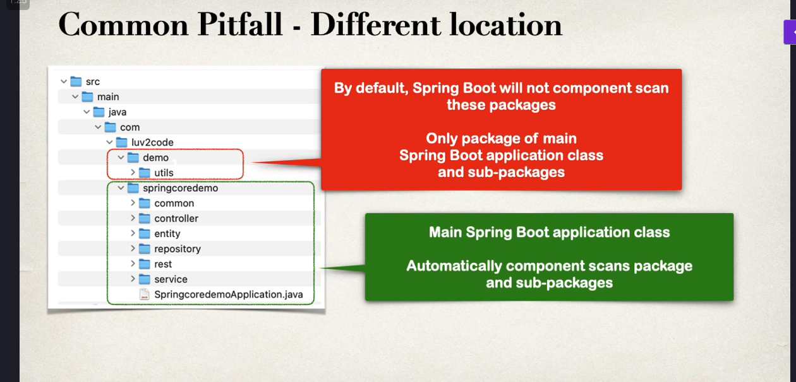
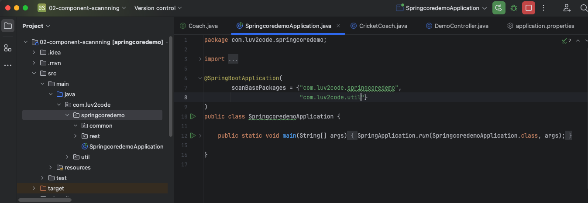

## 1章
- コースの時間→2008分（３３時間ほど）
- 一日30分ずつ消化で６６日。つまり2ヶ月ほどかかる。

- springBootではすぐ始められるようにHTサーバーは組み込まれている。なので別途Tomcatやundertowなどのサーバを別途インストールしなくていい。
- Mavenに買い物リストを渡しておくだけで、MavenはこれらのプロジェクトのJARファイルをダウンロードしてくれる｡
- 「依存関係A､ B､ C､ Dが必要だ｡ そしてMavenは､ これらのJARファイルを取得してクラスパスに追加し､コンパイルと実行時に利用できるようにする｡
- springイニシャライザーでスナップショット・バージョンはアルファ/ベータ版なので避けること｡
```txt
  .   ____          _            __ _ _
 /\\ / ___'_ __ _ _(_)_ __  __ _ \ \ \ \
( ( )\___ | '_ | '_| | '_ \/ _` | \ \ \ \
 \\/  ___)| |_)| | | | | || (_| |  ) ) ) )
  '  |____| .__|_| |_|_| |_\__, | / / / /
 =========|_|==============|___/=/_/_/_/

 :: Spring Boot ::                (v3.4.1)

2025-01-20T23:05:14.746+09:00  INFO 48177 --- [mycoolapp] [           main] c.l.s.d.mycoolapp.MycoolappApplication   : Starting MycoolappApplication using Java 22.0.2 with PID 48177 (/Users/k_tanaka/other_learn/spring/dev-spring-boot/mycoolapp/target/classes started by k_tanaka in /Users/k_tanaka/other_learn/spring/dev-spring-boot/mycoolapp)
2025-01-20T23:05:14.747+09:00  INFO 48177 --- [mycoolapp] [           main] c.l.s.d.mycoolapp.MycoolappApplication   : No active profile set, falling back to 1 default profile: "default"
2025-01-20T23:05:15.066+09:00  INFO 48177 --- [mycoolapp] [           main] o.s.b.w.embedded.tomcat.TomcatWebServer  : Tomcat initialized with port 8080 (http)
2025-01-20T23:05:15.071+09:00  INFO 48177 --- [mycoolapp] [           main] o.apache.catalina.core.StandardService   : Starting service [Tomcat]
2025-01-20T23:05:15.072+09:00  INFO 48177 --- [mycoolapp] [           main] o.apache.catalina.core.StandardEngine    : Starting Servlet engine: [Apache Tomcat/10.1.34]
2025-01-20T23:05:15.091+09:00  INFO 48177 --- [mycoolapp] [           main] o.a.c.c.C.[Tomcat].[localhost].[/]       : Initializing Spring embedded WebApplicationContext
2025-01-20T23:05:15.092+09:00  INFO 48177 --- [mycoolapp] [           main] w.s.c.ServletWebServerApplicationContext : Root WebApplicationContext: initialization completed in 324 ms
2025-01-20T23:05:15.220+09:00  INFO 48177 --- [mycoolapp] [           main] o.s.b.w.embedded.tomcat.TomcatWebServer  : Tomcat started on port 8080 (http) with context path '/'
2025-01-20T23:05:15.223+09:00  INFO 48177 --- [mycoolapp] [           main] c.l.s.d.mycoolapp.MycoolappApplication   : Started MycoolappApplication in 0.777 seconds (process running for 1.007)
```
    - 上記がSPRINGアプリケーションを起動した時のログ。
    - `Tomcat initialized with port 8080 (http)`は、これはspringではtomcatなどのサーバが埋め込まれていてアプリ実行時に勝手に立ち上がってくれる。

- いかのように@RestControllerのついたクラスと、その中にgetmappingを("/")で書くことで、http://localhost:8080にアクセス時にhello!が表示されるようになった。
```java
package com.luv2code.springboot.demo.mycoolapp.rest;

import org.springframework.web.bind.annotation.GetMapping;
import org.springframework.web.bind.annotation.RestController;

@RestController
public class FunRestController {
    @GetMapping("/")
    public String sayHello(){
        return "hello!";
    }
}
```

- Maven 
    - Mavenはプロジェクトmanagementツール。一番はビルド管理と依存関係の管理につかわれる
    - Mavenに依存関係を教えてあげるだけで勝手にインターネットからJARファイルをダウンロードしてくれル。
    - そしてMAvenはコンパイル時やランタイム時にそれらのJARファイルを利用できるようにしてくれル。
    - 買い物リスト(Spring, JSON, CommonLogging, Hibernate)を渡すだけで買ってきてくれる感じ。
    - pom.xmlがその買い物リスト
    - Project Object Model ファイルの略→つまりはプロジェクトの設定ファイル
    - POMファイル内は(project meta data, dependencies, plug ins)がある
    - POMファイルにはSpringinitializerで入寮したものが含まれている
        - meta dataは基本的にプロジェクトに関する情報。
            ```xml
            <groupId>4.0.0</groupId>
            <artifactId>mycoolapp</artifactId>
            <version>1.0.FINAL</version>
            <packaging>jar</packaging>

            <name>mycoolapp</name>
            ```
            - プロジェクト座標はプロジェクトを一位に識別する。緯度と軽度緯度と軽度のようなGPSみたいなもの(自分の家を見つける正確な情報、住所みたいなものだと思えばいい。)
            - groupId=市町村(あなたの会社名、グループ名、組織名。逆ドメインを書く)
            - artifactIDはstreet(プロジェクトの名前)
            - versionは部屋番号的な感じ
        - dependenceisは依存しているもののリスト
            ```xml
            <project ...>
                <dependencies>
                    <dependency>
                        <groupId>org.springframework</groupId>
                        <artifactId>spring-context</artifactId>
                        <version>6.0.0</version>
                    </dependency>

                    <dependency>
                        <groupId>org.hibernate.orm</groupId>
                        <artifactId>hibernate-core</artifactId>
                        <version>6.0.4.FINAL</version>
                    </dependency>

                    ...
                </dependencies>
            </project>
            ```
            - 依存関係を追加する際は依存セクションにそれらの依存関係を追加するだけ。
            - 依存関係を追加する際はGroupId,artifactIdが必要。バージョンは実際には任意ですが含めておくのがベスト
            - 上記３要素をGAVという。（このプロジェクトのGAVはなに？とか聞いたりするｓ）
            - じゃあ上記のGAVはどこで確認できるのかというと、SpringのwebサイトやHibernateのサイトを見れば、Mavenを使って依存関係を追加する際の必要な詳細が書いてある。
            - またはMaven central repositoryに行ってそれらの依存関係を検索する方法もある（こっちのが簡単）
        - plug ins は追加のカスタムタスク的な。

        - View　→ Tool Window → Maven → dependenciesから spring initializerで追加した依存関係が見れる

- spirng boot dev tools
    - pom.xmlに以下を追加
    ```xml
		<dependency>
			<groupId>org.springframework.boot</groupId>
			<artifactId>spring-boot-devtools</artifactId>
		</dependency>
    ```
    - 変更を保存時に自動でビルド、起動までやってくれる設定
        - settings→build,Execution,deployment→compiler → build project automaticallyをチェック
        - settings → advanced settings → Compiler → allow auto-make to...をチェック
        - https://support.samuraism.com/jetbrains/ide/idea-auto-compilation
        - https://qiita.com/IsaoTakahashi/items/f99d5f761d1d4190860d
    - pom.xmlを修正時には、ｐom.xmlファイル内の右上のリロードボタンを押すと更新される

- spring boot actuator
    - 実際にアプリケーションを管理監視するためのエンドポイントを公開するものです
    - だから簡単にdevopsの機能を手に入れられる
    - https://qiita.com/HiroyaEnd/items/f640a6cd2657c42c69a2

    - edit pom.xml and add spring-boot-starter-actuator
    - view actuator endpoints for: /health
    - edit applications.properties to customize /info

    - pom.xmlに以下を追加
    ```xml
		<dependency>
			<groupId>org.springframework.boot</groupId>
			<artifactId>spring-boot-starter-actuator</artifactId>
		</dependency>
    ```
    - エンドポイントを追加するにはapplications.propertiesファイルに以下を設定
        ```properties
            management.endpoints.web.exposure.include=health, info, bean
            management.info.env,enabled=true
        ```
        - https://spring.pleiades.io/spring-boot/reference/actuator/endpoints.html

    - あとは「http://localhost:8080/actuator/health」などにアクセスするだけ
        - healthはアプリケーションがUpかDownしてるかを見れる

    - 以下のようにinfo以下のパスに値を入れておくと「http://localhost:8080/actuator/info」アクセス時に画面にJSON形式で表示される
    ```properties
        info.app.name = mt super cool app
        info.app.description = yeahhhhhhhhhhhhhhhhh,nice toomeetyou
        info.app.version = 1.0.0
    ```
    - 以下のchromeプラグインで画面のJSONが綺麗に整形されて表示される
        「https://chromewebstore.google.com/detail/json-formatter/bcjindcccaagfpapjjmafapmmgkkhgoa?hl=ja&pli=1」
    
    - beansエンドポイントはアプリケーションに登録されているすべてのbeanが表示される
    - endpointsエンドピントはアクセス可能なエンドポイントが一覧で表示される

    - securityに関して。（上記のアクチュエータはエンドユーザからは見えないようにして管理者だけ見えるようにしないとまずい。）
        - pom.xmlに以下の依存関係を追加することで自動でRESTエンドポイントにセキュリティを持たせることができる
        ```xml

		<dependency>
			<groupId>org.springframework.boot</groupId>
			<artifactId>spring-boot-starter-security</artifactId>
		</dependency>
        ```

        - 上記を追加してアプリを起動するだけで、以下のように起動時のログに「パスワード」が生成される
        ```txt
        2025-02-15T18:13:05.080+09:00  WARN 73504 --- [mycoolapp] [  restartedMain] .s.s.UserDetailsServiceAutoConfiguration : 

        Using generated security password: a40bdcae-f742-4f09-97ee-3ec934aebb33

        This generated password is for development use only. Your security configuration must be updated before running your application in production.
        ```

        - ↑のパスワードをactuatorにアクセス時に求められるようになるので入力する

        - 以下のように書くことで、actuatorのパスを一部無効化できる
            - 以下の設定で「http://localhost:8080/actuator/health」「http://localhost:8080/actuator/info」
            のアクセス時に404が表示される。
            ```properties
            management.endpoints.web.exposure.exclude=health,info
            ```

- sprinbootアプリをコマンドラインで起動する
    - mvnwはMavenを手動でインストールすることなく、インターネットから正しいバージョンのMavenを自動的にダウンロードするための特別なラッパーコマンドである。
    - springbootプロジェクトの直下（mvnwとかpom.xmlとかあるディレクトリ）で以下コマンド打つとJarファイルを生成してくれる
        - 「./mvnw package」
        - Jarファイルはtargetのサブディレクトリに生成される
    
    - で、projectディレクトリ配下のtargetディレクトリ下にjarができたのでtagetに移り以下コマンドを打つ
    - 「java -jar mycoolapp-0.0.1-SNAPSHOT.jar」
    - これで「http://localhost:8080」niakusesudekiru

    ```txt
        .   ____          _            __ _ _
        /\\ / ___'_ __ _ _(_)_ __  __ _ \ \ \ \
        ( ( )\___ | '_ | '_| | '_ \/ _` | \ \ \ \
        \\/  ___)| |_)| | | | | || (_| |  ) ) ) )
        '  |____| .__|_| |_|_| |_\__, | / / / /
        =========|_|==============|___/=/_/_/_/

        :: Spring Boot ::                (v3.4.1)

        2025-02-15T18:37:01.752+09:00  INFO 81031 --- [mycoolapp] [           main] c.l.s.d.mycoolapp.MycoolappApplication   : Starting MycoolappApplication v0.0.1-SNAPSHOT using Java 22.0.2 with PID 81031 (/Users/k_tanaka/other_learn/spring/dev-spring-boot/01-spring-boot-overview/05-command-line-demo/target/mycoolapp-0.0.1-SNAPSHOT.jar started by k_tanaka in /Users/k_tanaka/other_learn/spring/dev-spring-boot/01-spring-boot-overview/05-command-line-demo/target)
        2025-02-15T18:37:01.753+09:00  INFO 81031 --- [mycoolapp] [           main] c.l.s.d.mycoolapp.MycoolappApplication   : No active profile set, falling back to 1 default profile: "default"
        2025-02-15T18:37:02.105+09:00  INFO 81031 --- [mycoolapp] [           main] o.s.b.w.embedded.tomcat.TomcatWebServer  : Tomcat initialized with port 8080 (http)
        2025-02-15T18:37:02.113+09:00  INFO 81031 --- [mycoolapp] [           main] o.apache.catalina.core.StandardService   : Starting service [Tomcat]
        2025-02-15T18:37:02.113+09:00  INFO 81031 --- [mycoolapp] [           main] o.apache.catalina.core.StandardEngine    : Starting Servlet engine: [Apache Tomcat/10.1.34]
        2025-02-15T18:37:02.127+09:00  INFO 81031 --- [mycoolapp] [           main] o.a.c.c.C.[Tomcat].[localhost].[/]       : Initializing Spring embedded WebApplicationContext
        2025-02-15T18:37:02.127+09:00  INFO 81031 --- [mycoolapp] [           main] w.s.c.ServletWebServerApplicationContext : Root WebApplicationContext: initialization completed in 350 ms
        2025-02-15T18:37:02.279+09:00  INFO 81031 --- [mycoolapp] [           main] o.s.b.w.embedded.tomcat.TomcatWebServer  : Tomcat started on port 8080 (http) with context path '/'
        2025-02-15T18:37:02.288+09:00  INFO 81031 --- [mycoolapp] [           main] c.l.s.d.mycoolapp.MycoolappApplication   : Started MycoolappApplication in 0.735 seconds (process running for 1.022)
    ```

    - プロジェクトディレクトリ直下で以下コマンド打つだけでもアプリを起動できる
        「./mvnw spring-boot:run」

- custom applications.properties

    - application.propertiesファイルで以下のようにじぶんでｈ円数を設定した場合、
        ```properties
        coach.name=Mickeymouse
        team.name=my club
        ```

    - @RestCOntrollerのクラスから読み込みたい時は以下のように書くだけで使える。
        - @Valueアノテーションを利用してこれらのプロパティを注入したのである
    ```java
    package com.luv2code.springboot.demo.mycoolapp.rest;

    import org.springframework.beans.factory.annotation.Value;
    import org.springframework.web.bind.annotation.GetMapping;
    import org.springframework.web.bind.annotation.RestController;

    @RestController
    public class FunRestController {
        @Value("${coach.name}")  // ←これ！！！！！！
        private String coachName;

        @Value("${team.name}")  // ←これ！！！！！！
        private String teamName;


        @GetMapping("/")
        public String sayHello(){
            return "hello!";
        }

        @GetMapping("/workout")
        public String getDailyWorkOut(){
            return "run 5 km !!!!!!!!!!";
        }

        @GetMapping("/fortune")
        public String getFortune(){
            return "fortune``````````!!";
        }

        @GetMapping("/coach")
        public String getCoachName(){
            return this.coachName;
        }

        @GetMapping("/team")
        public String getTeamName(){
            return teamName;
        }
    }

    ```

- spring boot properties
    - server port, context path, actuator, secutiry ,etc...
    - 1000を超えるプロパティがある
    - 以下にプロパティーの一覧が載ってる
        - https://spring.pleiades.io/spring-boot/appendix/application-properties/
    - １０００を超えるが、以下4つに分類されているので安心
        - Core
        - Web
        - Security
        - Data
        - Actuator
        - Integration
        - DevTools
        - Testing
    
    - 例えば「server.port= 7070」をapplication.propertiesに設定すると、サーバーのポートが7070で起動する
    - 「http://localhost:7070/」でアクセスできる
        ```txt
        2025-02-15T19:32:11.549+09:00  INFO 85850 --- [mycoolapp] [  restartedMain] c.l.s.d.mycoolapp.MycoolappApplication   : Starting MycoolappApplication using Java 22.0.2 with PID 85850 (/Users/k_tanaka/other_learn/spring/dev-spring-boot/01-spring-boot-overview/06-properties-demo/target/classes started by k_tanaka in /Users/k_tanaka/other_learn/spring/dev-spring-boot/01-spring-boot-overview/06-properties-demo)
        2025-02-15T19:32:11.549+09:00  INFO 85850 --- [mycoolapp] [  restartedMain] c.l.s.d.mycoolapp.MycoolappApplication   : No active profile set, falling back to 1 default profile: "default"
        2025-02-15T19:32:11.606+09:00  INFO 85850 --- [mycoolapp] [  restartedMain] o.s.b.w.embedded.tomcat.TomcatWebServer  : Tomcat initialized with port 7070 (http)
        2025-02-15T19:32:11.606+09:00  INFO 85850 --- [mycoolapp] [  restartedMain] o.apache.catalina.core.StandardService   : Starting service [Tomcat]
        2025-02-15T19:32:11.606+09:00  INFO 85850 --- [mycoolapp] [  restartedMain] o.apache.catalina.core.StandardEngine    : Starting Servlet engine: [Apache Tomcat/10.1.34]
        2025-02-15T19:32:11.609+09:00  INFO 85850 --- [mycoolapp] [  restartedMain] o.a.c.c.C.[Tomcat].[localhost].[/]       : Initializing Spring embedded WebApplicationContext
        2025-02-15T19:32:11.609+09:00  INFO 85850 --- [mycoolapp] [  restartedMain] w.s.c.ServletWebServerApplicationContext : Root WebApplicationContext: initialization completed in 59 ms
        2025-02-15T19:32:11.631+09:00  INFO 85850 --- [mycoolapp] [  restartedMain] o.s.b.d.a.OptionalLiveReloadServer       : LiveReload server is running on port 35729
        2025-02-15T19:32:11.634+09:00  INFO 85850 --- [mycoolapp] [  restartedMain] o.s.b.w.embedded.tomcat.TomcatWebServer  : Tomcat started on port 7070 (http) with context path '/' ←ここ！！！！！！！！！！！！！！！！！
        2025-02-15T19:32:11.635+09:00  INFO 85850 --- [mycoolapp] [  restartedMain] c.l.s.d.mycoolapp.MycoolappApplication   : Started MycoolappApplication in 0.094 seconds (process running for 2401.394)
        2025-02-15T19:32:11.635+09:00  INFO 85850 --- [mycoolapp] [  restartedMain] .ConditionEvaluationDeltaLoggingListener : Condition evaluation unchanged
        ```
    - 以下を設定すると、すべてのリクエスとのパスにmycoolappがプレフィックすがつけられる
        - 「server.servlet.contextpath=/mycoolapp」
        - よって「http://localhost:7070/mycoolapp/coach」な感じですべてのパスにmycoolappをつけることになる


## 2章（Spring Core）
- Inversion of control（DI-依存性の注入）
    - 俺たちがオブジェクトを生成はせず、アプリに作ってもらうこと。
    - インスタンスの生成と依存関係の注入をDIコンテナが提供する
    - DIコンテナの主な機能
        - インスタンスの生成と管理などライフサイクルを生業できる
        - 依存関係の注入ができる
    
    - injectionには2種類ある
        - Constructor Injection
        - Setter Injection
    
    - Auto Wiringとは
        - @Autowired
            - Springに依存関係を注入するように指示している。
    
    - @Componentアノテーション
        - これをクラスにつけるとSpring Beanとして認識される（依存性注入の候補になる）
        - つまり依存性注入に利用できるようにしてくれるアノテーション。
    
    - @Autowiredアノテーション
        - Autowiredは依存関係を注入するようにspringに命令する

- サンプル
    - 以下のように３ファイル用意した。
    - DemoController.java
    ```java
    package com.luv2code.springcoredemo;

    import org.springframework.beans.factory.annotation.Autowired;
    import org.springframework.boot.autoconfigure.AutoConfiguration;
    import org.springframework.web.bind.annotation.GetMapping;
    import org.springframework.web.bind.annotation.RestController;

    @RestController
    public class DemoController {
        private Coach myCoach;

        @Autowired
        public DemoController(Coach theCoach){
            myCoach = theCoach;
        }
        @GetMapping("dailyworkout")
        public String getDailyWorkout(){
            return myCoach.getDailyWorkout();
        }
    }
    ```

    - CricketCoach.java
    ```java
    package com.luv2code.springcoredemo;

    import org.springframework.stereotype.Component;

    @Component
    public class CricketCoach implements Coach{
        @Override
        public String getDailyWorkout() {
            return "practice fast bowling  for 1256 minutes";
        }
    }
    ```

    - Coach.java
    ```java
    package com.luv2code.springcoredemo;
    public interface Coach {
        String getDailyWorkout();
    }
    ```

    - 上記で画面にはpractice fast bowling  for 1256 minutesが表示される
    - 以下、自分で調べた裏側の動き
    ```txt
    public class DemoController {
        private Coach myCoach;

        @Autowired
        public DemoController(Coach theCoach){
            myCoach = theCoach;
        }
        @GetMapping("dailyworkout")
        public String getDailyWorkout(){
            return myCoach.getDailyWorkout();
        }
    }

    Q.なんでDemoControllerでインジェクトするのがCoachなのか（最初からCricketCoachとかBasebollCoachとかをAutowiredすればいいやないか）
    A.ダメじゃない。でも 将来の変更に弱いコード になっちゃう。
    小さいアプリなら CricketCoach 直指定でも問題ないけど、拡張性を考えると インターフェースを使う方がベストプラクティス なんだ。
    「後で変えたくなったら修正しなくちゃいけない」ってのを避けるために、最初から Coach を指定して、Spring に実装の選択を任せるのがスマートな方法ってこと！

    具体的な説明は以下⇩
    Spring の DI（依存性注入） の考え方は、「具体的な実装（CricketCoach）ではなく、抽象（Coach）に依存する」 という設計原則に基づいている。
    もし以下のように書くと
    @Autowired
    public DemoController(CricketCoach theCoach){
        myCoach = theCoach;
    }
    DemoController は CricketCoach にガチガチに依存する ことになる。

    これの何が問題なのか？？

    例えば、後で「やっぱ BaseballCoach に変えたいな」と思ったときに、この DemoController を 毎回変更しなきゃいけない。

    @Autowired
    public DemoController(BaseballCoach theCoach){
        myCoach = theCoach;
    }

    プロジェクト全体で 100個のクラスが BaseballCoach に依存していたら？
    → 100箇所の修正が必要 になるよね

    🟢 Coach を指定する場合
    @Autowired
    public DemoController(@Coach theCoach){
        myCoach = theCoach;
    }

    - @Primaryで、DemoController のコードは 一切変更しなくても、Spring が BaseballCoach を自動で選んでくれる。
    @Component
    @Primary  // これをつけた Coach がデフォルトで選ばれる
    public class BaseballCoach implements Coach {
        @Override
        public String getDailyWorkout() {
            return "Practice hitting for 30 minutes";
        }
    }

    その中で部分的に他のコートをdemoControllerで使いたいとなれば「@Qualifier」を使えばいい・
    @Autowired
    public DemoController(@Qualifier("baseballCoach") Coach theCoach){
        myCoach = theCoach;
    }
    ```

- コンポーネントScan
    - Springはjavaクラスや@Component裏酢などの特別なアノテーションをスキャンし自動でSpringコンテナにビーンズを登録します
    - コンポーネント Sキャンはメインのspringbootapplicationだけに行われる(要はアプリ起動時に実行する@springbootapplicationアノテーショんを持つクラスのこと)
    

    - デフォルトはプロジェクトの名前のディレクトリは以下だけが Sキャンされる。
    - ので以下のようにcom.luv2code配下にspringcoredemo(最初に作ったプロジェクト名)の他にディレクトリ追加してそこにインジェクトされていたクラスを写すとスキャンされないので、そのクラスをつ買っていたdemocontrolerでは見つけられませんとエラーが起こり機動に失敗する。
    - なので、@springBootApplicationアノテーションに以下の引数を追加してスキャンできるディレクトリを追加してあげる
    ```java
    @SpringBootApplication(
		scanBasePackages = {"com.luv2code.springcoredemo",
							"com.luv2code.util"}
    )
    ```
    

- setter Injection
    - クラスのセッターメソッドを呼び出すことで依存関係を注入すること。
    - @Autowiredのところで、さっきはインスタンスメソッドだったが、セッターメソッドでも良い。その場合、名前はなんでもいい。勝手にインジェクションしてくれる
    ```java
    package com.luv2code.springcoredemo.rest;

    import com.luv2code.springcoredemo.common.Coach;
    import org.springframework.beans.factory.annotation.Autowired;
    import org.springframework.web.bind.annotation.GetMapping;
    import org.springframework.web.bind.annotation.RestController;

    @RestController
    public class DemoController {
        private Coach myCoach;

    //    @Autowired
    //    public DemoController(Coach theCoach){
    //        myCoach = theCoach;
    //
    //    }

        @Autowired
        public  void setCoach(Coach theCoach){
            myCoach = theCoach;
        }


        @GetMapping("dailyworkout")
        public String getDailyWorkout(){
            return myCoach.getDailyWorkout();
        }


    }
    ```

- Field Injection
    - 最近は非推奨のインジェクション方法
    - コードのユニットテストが難しくなるから

- Qualifierアノテーション
    - Qualifierアノテーションでどのクラスをインジェクトするか指定できる
    - basebollCoach, tennisCOachなど、同じCoachk裏巣をimplementsし@component付きのCoachのクラスがたくさんいる場合は
    - 基本どれかに＠Primaryをつけて、例外的に他のCoachを使いたい場合に「Qualifier」を使う

    ```java
    package com.luv2code.springcoredemo.rest;

    import com.luv2code.springcoredemo.common.Coach;
    import org.springframework.beans.factory.annotation.Autowired;
    import org.springframework.beans.factory.annotation.Qualifier;
    import org.springframework.web.bind.annotation.GetMapping;
    import org.springframework.web.bind.annotation.RestController;

    @RestController
    public class DemoController {
        private Coach myCoach;

        @Autowired
        public DemoController(@Qualifier("trackCoach") Coach theCoach){
            myCoach = theCoach;
        }

        @GetMapping("dailyworkout")
        public String getDailyWorkout(){
            return myCoach.getDailyWorkout();
        }
    }
    ```

- Primaryアノテーション
    - 以下のようにコントローラでインタフェースのコーチをインジェクションしている場合、そのインタフェースをimplementsしているCoachが複数あってそれぞれにcomponentがついている場合、そのどれかに@Primaryを追加で付与すればそれがデフォルトでインジェクションされる。
    ```java
    package com.luv2code.springcoredemo.rest;

    import com.luv2code.springcoredemo.common.Coach;
    import org.springframework.beans.factory.annotation.Autowired;
    import org.springframework.beans.factory.annotation.Qualifier;
    import org.springframework.web.bind.annotation.GetMapping;
    import org.springframework.web.bind.annotation.RestController;

    @RestController
    public class DemoController {
        private Coach myCoach;

        @Autowired
        public DemoController(Coach theCoach){
            myCoach = theCoach;
        }

        @GetMapping("dailyworkout")
        public String getDailyWorkout(){
            return myCoach.getDailyWorkout();
        }
    }
    ```
    - TrackCoach.java
    ```java
    package com.luv2code.springcoredemo.common;
    import org.springframework.context.annotation.Primary;
    import org.springframework.stereotype.Component;

    @Component
    @Primary
    public class TrackCoach implements Coach{
        @Override
        public String getDailyWorkout() {
            return "RUn a hard 5 k";
        }
    }
    ```

- LazyInitialization(遅延初期化)
    - デフォルトではすべてのコンポーネントをスキャンし初期化する
    - 遅延初期化とは、そのフィールドが必要となるまで初期化を遅らせる行為のことを指します。遅延初期化を行う理由としては、初期化に多大なコストがかかるフィールドが存在した場合、遅延初期化を実装することによってパフォーマンスを向上させることができる点が挙げられます。
    - 「必要となるまで」というのは「依存性の注入に使われるとき」や「明示的に使われる時」である
    - @Lazyをつけるだけで遅延初期化が適用される
    - 「実際に必要とされない限り、私を作るな」ということになる

    - ただ全部のコンポーネントクラスに1つ1つ@Lazyをつけていくのはクソだるい
        - なので。propertiesファイルで「spring.main.lazy-initialization=true」を設定しておけばすべてのビーンズを遅延型にできる

    - DemoCOntroller.java
    ```java
    package com.luv2code.springcoredemo.rest;

    import com.luv2code.springcoredemo.common.Coach;
    import org.springframework.beans.factory.annotation.Autowired;
    import org.springframework.beans.factory.annotation.Qualifier;
    import org.springframework.web.bind.annotation.GetMapping;
    import org.springframework.web.bind.annotation.RestController;

    @RestController
    public class DemoController {
        private Coach myCoach;

        @Autowired
        public DemoController(@Qualifier("cricketCoach") Coach theCoach){
            System.out.println("In constructor :" + getClass().getSimpleName());
            myCoach = theCoach;
        }

        @GetMapping("dailyworkout")
        public String getDailyWorkout(){
            return myCoach.getDailyWorkout();
        }
    }
    ```

    - CricketCoach.java
    ```java
    package com.luv2code.springcoredemo.common;
    import org.springframework.context.annotation.Primary;
    import org.springframework.stereotype.Component;

    @Component
    public class CricketCoach implements Coach{
        public CricketCoach(){
            System.out.println("In constructor :" + getClass().getSimpleName());
        }
        @Override
        public String getDailyWorkout() {
            return "practice fast bowling  for 1256 minutes!!!!!!!!!!";
        }
    }
    ```

    - BasebollCoach.java
    ```java
    package com.luv2code.springcoredemo.common;
    import org.springframework.stereotype.Component;

    @Component
    public class BasebollCoach  implements Coach{

        public BasebollCoach(){
            System.out.println("In constructor :" + getClass().getSimpleName());
        }


        @Override
        public String getDailyWorkout() {
            return "Spring 30 minutes in batting practice ";
        }
    }
    ```

    - TennisCoach.java
    ```java
    package com.luv2code.springcoredemo.common;

    import org.springframework.stereotype.Component;

    @Component
    public class TennisCoach implements Coach{
        public TennisCoach(){
            System.out.println("In constructor :" + getClass().getSimpleName());
        }

        @Override
        public String getDailyWorkout() {
            return "Practice your backend volley";
        }
    }
    ```

    - TrackCoach.java
    ```java
    package com.luv2code.springcoredemo.common;

    import org.springframework.context.annotation.Lazy;
    import org.springframework.context.annotation.Primary;
    import org.springframework.stereotype.Component;

    @Component
    public class TrackCoach implements Coach{
        public TrackCoach(){
            System.out.println("In constructor :" + getClass().getSimpleName());
        }
        @Override
        public String getDailyWorkout() {
            return "RUn a hard 5 k";
        }
    }
    ```

    - 上記でアプリ起動時は以下のログが出る。すべてのコンポおー年とが初期化されている
    ```txt
    2025-02-16T21:27:26.618+09:00  INFO 54711 --- [springcoredemo] [  restartedMain] w.s.c.ServletWebServerApplicationContext : Root WebApplicationContext: initialization completed in 325 ms
    In constructor :BasebollCoach
    In constructor :CricketCoach
    In constructor :TennisCoach
    In constructor :TrackCoach
    In constructor :DemoController
    ```

    - TrackCoachだけに「＠Lazy」アノテーションを付与すると、アプリ起動時はログに出てこない、つまり初期化されてない
    - trackCoachは特にインジェクションなど必要とされていないので出番がないからだ。出番が来たら、その時に初期化される。
        ```java
        package com.luv2code.springcoredemo.common;

        import org.springframework.context.annotation.Lazy;
        import org.springframework.context.annotation.Primary;
        import org.springframework.stereotype.Component;

        @Component
        @Lazy
        public class TrackCoach implements Coach{
            public TrackCoach(){
                System.out.println("In constructor :" + getClass().getSimpleName());
            }
            @Override
            public String getDailyWorkout() {
                return "RUn a hard 5 k";
            }
        }
        ```
        ```txt
        2025-02-16T21:28:25.837+09:00  INFO 54711 --- [springcoredemo] [  restartedMain] w.s.c.ServletWebServerApplicationContext : Root WebApplicationContext: initialization completed in 78 ms
        In constructor :BasebollCoach
        In constructor :CricketCoach
        In constructor :TennisCoach
        In constructor :DemoController
        ```

        - propertiesファイルに以下のように書くと、すべてのビーンが遅延型になる
            ```properties
            spring.main.lazy-initialization=true
            ```
            - これでアプリ起動してみると何も初期化されていない
            - http://localhost:8080/dailyworkoutにアクセスして初めて以下のログが出ている。2つだけコンポーネントが初期化されている
            ```txt
            In constructor :CricketCoach
            In constructor :DemoController
            ```

- Bean Scopes
    - 「Spring コンテナが Bean をどのように管理・生成・共有するかを決める設定」のこと
    - 「どのタイミングでオブジェクトを作るべきか？」 によって選択するのが重要！
    - デフォルトスコープはsingleton

    - sngleton
        - アプリケーション全体で 1つのインスタンス だけを作る
        - そのBeanに対するすべての依存性注入は同じBeanを参照することになる。
        - 以下の場合は、特にBeanのスコープを指定していないので、すべてのBeanがsingletonになる
        - なので、theCoachとtheAnotherCoachは同じインスタンスになる。
        - 「http://localhost:8080/check」にアクセス時には「comparing beans : myCoach == anotherCoach true」が表示される。
        ```java
        package com.luv2code.springcoredemo.rest;

        import com.luv2code.springcoredemo.common.Coach;
        import org.springframework.beans.factory.annotation.Autowired;
        import org.springframework.beans.factory.annotation.Qualifier;
        import org.springframework.web.bind.annotation.GetMapping;
        import org.springframework.web.bind.annotation.RestController;

        @RestController
        public class DemoController {
            private Coach myCoach;
            private Coach anotherCoach;

            @Autowired
            public DemoController(@Qualifier("cricketCoach") Coach theCoach,
                                @Qualifier("cricketCoach") Coach theAnotherCoach){
                System.out.println("In constructor :" + getClass().getSimpleName());
                myCoach = theCoach;
                anotherCoach = theAnotherCoach;
            }

            @GetMapping("dailyworkout")
            public String getDailyWorkout(){
                return myCoach.getDailyWorkout();
            }

            @GetMapping("/check")
            public String check(){
                return "comparing beans : myCoach == anotherCoach"+(myCoach == anotherCoach);
            }
        }
        ```
    - prototype
        - @Autowiredするたびに新しいインスタンス を作る
        - 「@Scope(ConfigurableBeanFactory.SCOPE_PROTOTYPE)」でBeanのスコープを指定できる。
        ー今回はprototypeに設定し、「comparing beans : myCoach == anotherCoach false」が表示される。
        ```java
        package com.luv2code.springcoredemo.common;

        import org.springframework.beans.factory.config.ConfigurableBeanFactory;
        import org.springframework.context.annotation.Primary;
        import org.springframework.context.annotation.Scope;
        import org.springframework.stereotype.Component;

        @Component
        @Scope(ConfigurableBeanFactory.SCOPE_PROTOTYPE)
        public class CricketCoach implements Coach{
            public CricketCoach(){
                System.out.println("In constructor :" + getClass().getSimpleName());
            }
            @Override
            public String getDailyWorkout() {
                return "practice fast bowling  for 1256 minutes!!!!!!!!!!";
            }
        }

        ```
    - request
        - HTTPリクエストごとに新しいインスタンス
    - session
    - application
    - websocket

- Bean Lifecycle Methods
    - Spring Beanが生成されてから破棄されるまでの過程を指します
    - Beanのインスタンス化､ 依存関係の注入､ Spring内部の処理が行われ､
        その後､ 独自にカスタマイズした初期化メソッドを実行することができます｡
        そして､ その時点で､ 豆が使えるようになるのです｡
        そして､ コンテナがシャットダウンまたは停止されると､ 実際にカスタムのdestroyメソッドを呼び出すことになります｡

    - Beanの初期化時に独自のカスタムコードを追加することができます｡

    - @PostConstruct
        - Beanが初期化された直後に実行されるメソッドを定義するためのアノテーション」のことです。たとえば、Springアプリケーションが起動したときに「何か特別な処理を一度だけ行いたい！」という場面がありますよね。その場合に@PostConstructを使うと便利です。
        - 初期化処理を行うメソッドに付けるアノテーション
    - @PreDestroy
        - 終了処理を行うメソッドに付けるアノテーション

    - CricketCoahクラスを以下のようにした。
        ```java
        package com.luv2code.springcoredemo.common;
        import jakarta.annotation.PostConstruct;
        import jakarta.annotation.PreDestroy;
        import org.springframework.beans.factory.config.ConfigurableBeanFactory;
        import org.springframework.context.annotation.Primary;
        import org.springframework.context.annotation.Scope;
        import org.springframework.stereotype.Component;

        @Component
        public class CricketCoach implements Coach{
            public CricketCoach(){
                System.out.println("In constructor :" + getClass().getSimpleName());
            }

            @PostConstruct
            public  void domyStartUpStuf(){
                System.out.println("In doMyStartUpStuff(): "+ getClass().getSimpleName());
            }

            @PreDestroy
            public void doMyCleanUpStuff(){
                System.out.println("In doMyCleanUpStuff(): " + getClass().getSimpleName());
            }

            @Override
            public String getDailyWorkout() {
                return "practice fast bowling  for 1256 minutes!!!!!!!!!!";
            }
        }

        ```

        - アプリ起動時にはすべてのBeanが初期化され、
        ```txt
        2025-02-17T21:14:41.613+09:00  INFO 72210 --- [springcoredemo] [  restartedMain] w.s.c.ServletWebServerApplicationContext : Root WebApplicationContext: initialization completed in 353 ms
        In constructor :BasebollCoach
        In constructor :CricketCoach
        In doMyStartUpStuff(): CricketCoach ←　ここ！！　Bean初期化時に呼ばれている
        In constructor :TennisCoach
        In constructor :TrackCoach
        In constructor :DemoController
        ```

        - 逆にアプリを落とした時は@PreDestroyのメソッドが呼ばれているのがわかる
        ```txt
        2025-02-17T21:14:41.730+09:00  INFO 72210 --- [springcoredemo] [  restartedMain] o.s.b.d.a.OptionalLiveReloadServer       : LiveReload server is running on port 35729
        2025-02-17T21:14:41.738+09:00  INFO 72210 --- [springcoredemo] [  restartedMain] o.s.b.w.embedded.tomcat.TomcatWebServer  : Tomcat started on port 8080 (http) with context path '/'
        2025-02-17T21:14:41.742+09:00  INFO 72210 --- [springcoredemo] [  restartedMain] c.l.s.SpringcoredemoApplication          : Started SpringcoredemoApplication in 0.693 seconds (process running for 0.9)
        2025-02-17T21:18:05.455+09:00  INFO 72210 --- [springcoredemo] [ionShutdownHook] o.s.b.w.e.tomcat.GracefulShutdown        : Commencing graceful shutdown. Waiting for active requests to complete
        2025-02-17T21:18:05.460+09:00  INFO 72210 --- [springcoredemo] [tomcat-shutdown] o.s.b.w.e.tomcat.GracefulShutdown        : Graceful shutdown complete
        In doMyCleanUpStuff(): CricketCoach　　←ここ！！！

        Process finished with exit code 130 (interrupted by signal 2:SIGINT)
        ```
- java Config Bean
    - @Componentや@Autowiredを使わずにBeanを生成、管理する方法
    - Spring では通常、@Component や @Service などのアノテーションを使って Bean を自動登録するけど@Configuration + @Bean を使うことで、手動で Bean を定義することもできる。
    - この場合、Spring は swimCoach() を実行し、その戻り値（SwimCoach のインスタンス）を Spring コンテナ内の Bean として登録 する。
    ```java
    @Configuration
    public class AppConfig {

        @Bean
        public Coach swimCoach() {
            return new SwimCoach();
        }
    }
    ```

    - 1️⃣ @Configuration クラスで Bean を登録
        まずは DIコンテナ（Spring コンテナ）に Coach の Bean を登録 する。
        ```java
        @Configuration
        public class SportConfig {

            @Bean
            public Coach swimCoach() {
                return new SwimCoach();
            }

            @Bean
            public Coach baseballCoach() {
                return new BaseballCoach();
            }
        }
        ```
    
    - 2️⃣ Controller で Bean を Inject
        次に、別の場所（Controller）で @Autowired を使って Inject する。
        ```java
        @RestController
        public class DemoController {
            private final Coach myCoach;

            @Autowired
            public DemoController(@Qualifier("swimCoach") Coach theCoach) {
                this.myCoach = theCoach;
            }

            @GetMapping("/dailyworkout")
            public String getDailyWorkout() {
                return myCoach.getDailyWorkout();
            }
        }
        ```
        - 💡 @Configuration クラスで @Bean を定義し、DIコンテナに登録する
        - 💡 別のクラス（Controller など）で @Autowired して Inject する
        - 💡 @Qualifier("beanName") で特定の @Bean を指定できる

        - つまり 「設定クラスで Bean を作って、Controller で Inject して使う」 という流れで 合ってる！ 🚀

## 3章（Hibernate/JPA CRUD）
- Hiberante
    - JavaオブジェクトをDBに永続化または保存するためのフレームワーク
    - Java でデータベース操作を簡単にするための ORM（オブジェクト・リレーショナル・マッピング）フレームワーク。
    - 🔹 通常の JDBC（SQL を直接書く）(SQL を直接書く必要がある（面倒 & ミスしやすい）)
        ```java
        Connection conn = DriverManager.getConnection("jdbc:mysql://localhost:3306/mydb", "user", "pass");
        PreparedStatement stmt = conn.prepareStatement("SELECT * FROM users WHERE id = ?");
        stmt.setInt(1, userId);
        ResultSet rs = stmt.executeQuery();
        ```
   - 🛠 Spring + Hibernate（Spring Data JPA）の基本構成
        - 1️⃣ Entity クラスを作る（データベースのテーブルに対応するクラス）
        ```java
        @Entity
        @Table(name="users")
        public class User {
            @Id
            @GeneratedValue(strategy = GenerationType.IDENTITY)
            private Long id;

            private String name;

            // Getter & Setter
        }
        ```
        - 2️⃣ Repository インターフェースを作る
        ```java
            @Repository
            public interface UserRepository extends JpaRepository<User, Long> {
            }
            👆 この UserRepository を使えば、SQL を書かなくてもデータベース操作ができる！
        ```

        - 3️⃣ Service で UserRepository を使う
        ```java
            @Service
            public class UserService {
                @Autowired
                private UserRepository userRepository;

                public User getUserById(Long id) {
                    return userRepository.findById(id).orElse(null);
                }
            }
        ```
        - 4️⃣ Controller でデータ取得
        ```java
            @RestController
            @RequestMapping("/users")
            public class UserController {
                @Autowired
                private UserService userService;

                @GetMapping("/{id}")
                public User getUser(@PathVariable Long id) {
                    return userService.getUserById(id);
                }
            }
        ```
        - ✅ これで /users/1 にアクセスすると、ID=1 のユーザー情報が JSON で取得できる！

    - 1️⃣ JPA（Java Persistence API）の由来
        - Java Persistence API（Java の永続化 API） の略
        - 「Persistence（永続化）」= データを長期間保存する仕組み（＝データベースに保存すること）
        - Java で オブジェクトをデータベースに保存・管理するための標準仕様 として設計された
        - 👉 JPA は「Java のデータ永続化のための API」って意味！
    
    - 2️⃣ Hibernate の由来
        - Hibernate（ハイバネート）は、英語で 「冬眠」や「休眠」 の意味
        - Hibernate は データベースとオブジェクトの間で、不要なデータのロードを避けてリソースを節約する仕組み を持っている
        - 「データを必要なときだけ呼び出す（休眠してるデータを必要なときに目覚めさせる）」 という考えから、この名前が付いた
        - 👉 Hibernate は「不要なデータを Hibernate（冬眠）させて、パフォーマンスを最適化する ORM」！
    
    - 📌 ORM（Object-Relational Mapping）とは？
        - 1️⃣ ORM の定義
        - ORM（オブジェクト・リレーショナル・マッピング） は、
        - 「データベースのテーブル」と「Java のオブジェクト」を対応させて、SQL を直接書かずにデータを操作できる仕組み」 のこと。

    - 2️⃣ ORM がない場合（JDBC で SQL を直接書く）
        ```java
        Connection conn = DriverManager.getConnection("jdbc:mysql://localhost:3306/mydb", "user", "pass");
        PreparedStatement stmt = conn.prepareStatement("SELECT * FROM users WHERE id = ?");
        stmt.setInt(1, userId);
        ResultSet rs = stmt.executeQuery();
        ```
        👆 SQL を直書きしないとデータを取得できない！（めんどい & バグの原因になりやすい）

    - 3️⃣ ORM を使うと…（JPA / Hibernate の場合）
        ```java
            @Entity
            @Table(name="users")
            public class User {
                @Id
                @GeneratedValue(strategy = GenerationType.IDENTITY)
                private Long id;
                private String name;
            }
        ```
        ```java
            @Autowired
            private UserRepository userRepository;
            User user = userRepository.findById(1L).orElse(null);
        ```
        👆 SQL を書かずに、オブジェクトのメソッドだけでデータを取得できる！
    - ✅ ORM を使うと SQL を書かずにデータを扱える！
    - ✅ JPA は ORM の標準仕様で、Hibernate はその実装の1つ！ 
        - JPAはただのインタフェースで、その実装としてHibernateが最もポピュラー

    - 開発者としてはJavaクラスやオブジェクトとデータベースのデータとの対応づけをHibernateに伝えるだけで良い
        - 実際にはjavaクラスを所定のデータベーステーブルにマッピングすることになる
    

    - でも結局Hibernate/JPAは、実はすべてのデータベース通信にバックグラウンドでJDBCを使っている
        - つまりhibernate/jpaはJDBCの上にある抽象化の別レイヤーにすぎない

- MysqlWorkBench
    - MySQLにアクセスするためのGUIであることを忘れないでください。

- EntityManager
    - EntityManager は、JPA（Java Persistence API）(仕様)を使ってデータベースとやり取りするためのオブジェクト
        - クエリの作成などに使うメインコンポーネント。entity manager is from JPA

    - EntityManager を使った基本操作
        - 1️⃣ EntityManager の取得
            - 通常、Spring Boot では JpaRepository を使うことが多いが、
            - EntityManager を使えば、もっと細かい制御が可能になる。
            ```java
                @PersistenceContext
                private EntityManager entityManager;
            ```
            - 👆 @PersistenceContext を使うと、Spring が EntityManager を自動で Inject してくれる。
        - 2️⃣ エンティティを保存（persist()）
            - データベースに新しいエンティティを保存するには persist() を使う。
            ```java
                User user = new User();
                user.setName("John Doe");
                entityManager.persist(user);
            ```
            - 👆 データベースに user を登録！（INSERT 相当）

        - 3️⃣ エンティティを取得（find()）
            - ID を指定してデータを取得する場合。
            ```java
                User user = entityManager.find(User.class, 1L);
            ```
            - 👆 ID が 1 の User を取得！（SELECT 相当）

        - 4️⃣ エンティティを更新（merge()）
            - データを更新するときは merge() を使う。
            ```java
                User user = entityManager.find(User.class, 1L);
                user.setName("Jane Doe");
                entityManager.merge(user);
            ```
            - 👆 ID=1 のユーザー名を Jane Doe に変更！（UPDATE 相当）

        - 5️⃣ エンティティを削除（remove()）
            - データを削除するときは remove() を使う。
            ```java
                User user = entityManager.find(User.class, 1L);
                entityManager.remove(user);
            ```
            👆 ID=1 の User を削除！（DELETE 相当）
