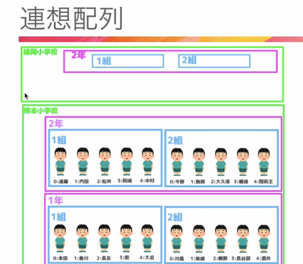
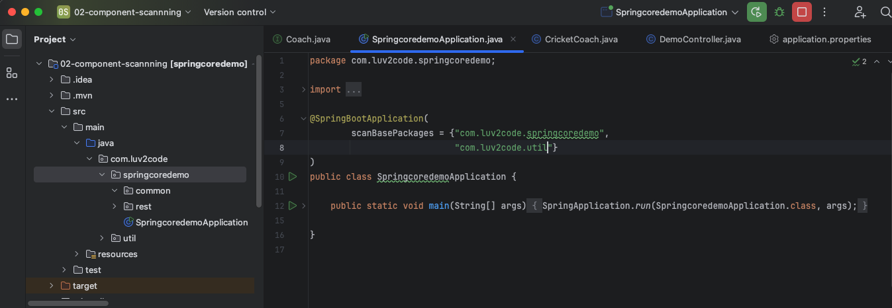

## 1章
- XAMPP(win)/MAMP(mac)
    - Apache/MySQL/PHPをまとめてインストールできるやつ

- Composer
    - PHPパッケージ管理ツール

- 「Applications/MAMP/htdocs」のディレクトリに実際に書いたプログラミングが収容されていく

- phpinfo()でphpnの情報を出力できる（phpのバージョンとか）
```php
<?php
echo('test');
phpinfo()

?>
```

- <?php ?>の後ろの「?>」は、phpだけのファイルなら省略できる。htmlも混ざっている場合は省略できない
```php
<?php
echo('test');
phpinfo()
```

- 
```php
<?php
$test=123; // 変数は$始まり
echo($test);

var_dump($test);// int(123)　と出力される
?>
```

- 結合は「.」でできる。結合すると文字列になる
```php
<?php
$test_1=123;
$test_2=456;

$test3=$test_1."うううう".$test_2;
echo($test3);

?>
```
- 基本的に定数は全て大文字

- 配列
```php
<?php
$arr=[1,2,3,4];
$arr2=[["aa","bb","cc"],[22,33,44],[99,88,77]];

echo $arr;
echo($arr[1]);// 2
var_dump($arr);// 2array(4) { [0]=> int(1) [1]=> int(2) [2]=> int(3) [3]=> int(4) }

echo('<pre>'); //preを使うと切れに表示される
var_dump($arr2);
echo('</pre>');
// array(3) {
//   [0]=>
//   array(3) {
//     [0]=>
//     string(2) "aa"
//     [1]=>
//     string(2) "bb"
//     [2]=>
//     string(2) "cc"
//   }
//   [1]=>
//   array(3) {
//     [0]=>
//     int(22)
//     [1]=>
//     int(33)
//     [2]=>
//     int(44)
//   }
//   [2]=>
//   array(3) {
//     [0]=>
//     int(99)
//     [1]=>
//     int(88)
//     [2]=>
//     int(77)
//   }
// }
?>
```

- 連想配列1
    - 先ほどの配列は値を出力するときに全部数字という時かインデックスで指定していたと思います
    - 連想配列は、キーと値がセット。
    ```php
    <?php
    $arr_member=[
        'name' =>'本田',
        'height' => 'サッカー',
        'age' => 22
    ];

    // echo($arr_member);
    echo($arr_member['name']);// 本田
    echo($arr_member['height']);// サッカー
    echo($arr_member['age']);// 22

    echo('<pre>'); //preを使うと切れに表示される
    var_dump($arr_member);
    echo('</pre>');
    // array(3) {
    //     ["name"]=>
    //     string(6) "本田"
    //     ["height"]=>
    //     string(12) "サッカー"
    //     ["age"]=>
    //     int(22)
    //   }
    ?>
    ```
- 連想配列2
    - 連想配列は以下画像のように、階層化された構造をデータ化す流のに大変便利



- 演算子


- 「===」は型一致も鑑みた比較
- if文のelseはできるだけ使わないほうがいい
- 空かどうかの半ちえはempty()メソッド
    ```php
    <?php
    $arr_member=[
    ];
    if(empty($arr_member)){
        echo("エンプティーーです");
    }
    ```
- かつ→＆＆　または→｜｜
- forEachはこんな感じで書く
```php
$arr_member=[
    'name' =>'本田',
    'height' => 'サッカー',
    'age' => 22
];

// 回す時の受け取り変数が1つだと、バリューの方が常に出る
foreach($arr_member as $val ){
    echo($val);//本田サッカー22
}

// キーとバリュー両方取りたい時は$key, $valみたいな感じで2つ書く
foreach($arr_member as $key=>$val ){
    echo($key).'は'.($val);// nameは本田heightはサッカーageは22
}


for($i =0; $i <10; $i++){// forは困難感じで書く
    echo($i);
}
```


- 関数
    - 組み込み関数（すでにphpに存在する関数）
        - mb_strlen(string $string, ?string $encoding = null): int
        - 上記だと?以降がオプションであってもなくてもいい。返り血が一番右側のint。
        - http://html2php.starrypages.net/php/array-funcs
    - ユーザ定義関数（自由に作れる関数）


- ファイルの読み込み
    - require(), require_once(); 読み込み失敗時にエラー表示
    - include(),include_once();読み込み失敗時に警告表示
    
    ```php
    <?php
    require 'common.php';

    commonTest();

    echo ($commonVariable) ;
    ?>
    ```

# 2章
- display_errors
    - 警告やエラーが表示するかどうかの設定
    - phpinfo()で画面に情報出る ONorOFFが書いてる
    - phpinfo画面で以下の通りパスが書いてあったりする
        - Configuration File (php.ini) Path	/Applications/MAMP/bin/php/php8.3.14/conf
        - confファイル内のdisplay_errors = Onをいじればいい。
    
    - exitで画面にはexit前までの処理が出る。
        ```php
        <?php
            echo("aaa");

            exit;
            echo("bbb");
            ?>
        ```
    
- リクエストの値は、phpでは$_GET, $_POSTで受け取る

- 今のページから同じページにPOSTして、同じページ内で受けとったPOSTリクエストの値によって憑依jを切り替えているサンプルコード
    - 画面読み込み時は毎回<?php ?>内の処理が走ってる
    ```php
    <?php
    if(!empty($_GET['your_name'])){
    echo $_GET['your_name'];

    echo '<pre>';
    var_dump($_GET);
    echo '</pre>';
    }

    $pageFlag = 0;

    if(!empty($_POST['btn_confirm'])){
    $pageFlag = 1;
    }
    if(!empty($_POST['btn_submit'])){
    $pageFlag = 2;
    }
    if(!empty($_POST['init'])){
    $pageFlag = 0;
    }

    ?>
    <!DOCTYPE html>
    <html lang="en">
    <head>
    <meta charset="UTF-8">
    <meta name="viewport" content="width=device-width, initial-scale=1.0">
    <title>Document</title>
    </head>
    <body>
        <?php if($pageFlag === 1) : ?>
            <form action="input.php" method="POST">
            氏名
            <?php echo $_POST['your_name']; ?>
            <br>
            メールアドレス
            <?php echo $_POST['email']; ?>
            <br>
            <input type="submit" name="btn_submit" value="送信する">
            <input type="hidden" name="your_name" value=" <?php echo $_POST['your_name']; ?>">
            <input type="hidden" name="your_name" value=" <?php echo $_POST['email']; ?>">
            </form>
        <?php endif; ?>

        <?php if($pageFlag === 2) : ?>
            送信が完了しました。
            <input type="submit" name="init" value="元に戻す">
        <?php endif; ?>

        <?php if($pageFlag === 0) : ?>　
            <form action="input.php" method="POST">
            氏名
            <input type="text" name="your_name">
            <br>
            メールアドレス
            <input type="email" name="email">
            <br>
            <input type="submit" name="btn_confirm" value="確認する">
            </form>
        <?php endif; ?>
    </body>
    </html>
    ```

    - ちなみに以下の書き方２通りしているが、下の方がifをそのまま<?php ?>で囲ったもの。
        - ただ、下の方の書き方だとifn大割がどこか見づらいので前者の方の書き方が好ましい
    ```php
        <?php if($pageFlag === 2) : ?>
            ・
            ・
        <?php endif; ?>

        <?php if($pageFlag === 0) {?>
            ・
            ・
            ・
        <?php }?>
    ```

    - 戻るボタンの実装
        - 属性値内でもそのまま「value="<?php echo $_POST['email']; ?>"」とかく。
        - 👆でif文を噛ませたいときでも、そのままechoの外に ifを噛ませればいい「value="<?php if(!empty($_POST['email'])){echo $_POST['email'];} ?>">←ここ追加」
        ```php
        <?php
            if(!empty($_GET['your_name'])){
            echo $_GET['your_name'];

            echo '<pre>';
            var_dump($_GET);
            echo '</pre>';
            }

            $pageFlag = 0;

            if(!empty($_POST['btn_confirm'])){
            $pageFlag = 1;
            }
            if(!empty($_POST['btn_submit'])){
            $pageFlag = 2;
            }
            if(!empty($_POST['init'])){
            $pageFlag = 0;
            }
            ?>
            <!DOCTYPE html>
            <html lang="en">
            <head>
            <meta charset="UTF-8">
            <meta name="viewport" content="width=device-width, initial-scale=1.0">
            <title>Document</title>
            </head>
            <body>
            <?php if($pageFlag === 1) : ?>
                <form action="input.php" method="POST">
                氏名
                <?php echo $_POST['your_name']; ?>
                <br>
                メールアドレス
                <?php echo $_POST['email']; ?>
                <br>
                <input type="submit" name="back" value="戻る"> ←ここ追加
                <input type="submit" name="btn_submit" value="送信する">
                <input type="hidden" name="your_name" value="<?php echo $_POST['your_name']; ?>">
                <input type="hidden" name="email" value="<?php echo $_POST['email']; ?>">
                </form>
            <?php endif; ?>

            <?php if($pageFlag === 2) : ?>
                送信が完了しました。
            <?php endif; ?>

            <?php if($pageFlag === 0) {?>
                <form action="input.php" method="POST">
                氏名
                <input type="text" name="your_name" value="<?php if(!empty($_POST['your_name'])){echo $_POST['your_name'];} ?>">←ここ追加
                <br>
                メールアドレス
                <input type="email" name="email" value="<?php if(!empty($_POST['email'])){echo $_POST['email'];} ?>">←ここ追加
                <br>
                <input type="submit" name="btn_confirm" value="確認する">
                </form>
            <?php }?>
            </body>
            </html>
        ```

- XSS, クリックジャッキング、CSRF、SQLインジェクション、
    - 対策はサニタイズ（消毒）やバリデーションなど

    - XSSとは
        - 上記のサンプルソースだと「<script>alert("攻撃されますよ！")</script>」といったｊｓを簡単に仕込めてしまう。
        - ブラウザがレンダリングするときに <script> タグが実行されてしまう ため、アラートが表示されてしまう。
        - 以下の部分でinputのvalue値の「<script>alert("攻撃されますよ！")</script>」が出力され、
        ```php
            <?php echo $_POST['your_name']; ?>
        ```
        - scriptタグとして認識されてしまい、アラートが上がるって仕組み。
        ```html
        氏名
        <script>alert("攻撃されますよ！")</script>
        ```

        - なのでくの字のカッコ<>とか、シングルクオぉーテーションを無効化（サニタイズ）する必要がある
            - これはhtmlspecialchars()ってメソッドを使ってできる。
            - つまりecho 以降の値をこれはhtmlspecialchars()に渡してから出力するようにすれば良い。
            - https://www.php.net/manual/ja/function.htmlspecialchars.php
            - こんな感じになる
            ```php
            <input type="hidden" name="your_name" value="<?php echo htmlspecialchars($_POST['your_name']); ?>">
            ```
    - クリックジャッキング
        - 透明なボタンを表示して気づかずにクリックさせること。
        - 仕組み
            - ① 正常なWebページ
                - 例えば、あるサイトに「購入ボタン」があるとします。
                ```html
                <button>購入する</button>
                ```

            - ② 攻撃者のサイト
                - 攻撃者は、この「購入ボタン」を透明なiframe に埋め込み、偽のボタンを重ねます。

                ```html
                <div style="position: relative;">
                    <button style="position: absolute; z-index: 2;">無害なボタン</button>
                    <iframe src="https://victim-site.com" 
                            style="opacity: 0; position: absolute; top: 0; left: 0; width: 100%; height: 100%; z-index: 1;">
                    </iframe>
                </div>
                ```
                - このコードのポイント：
                - iframe を透明にして、攻撃対象のサイトを表示
                - ユーザーが「無害なボタン」と思ってクリックすると、実際には iframe 内のボタンが押される

            - ③ ユーザーの誤操作
                - ユーザーが攻撃者のサイトで「無害なボタン」をクリックしたつもりが、実際には iframe 内の購入ボタンをクリックしてしまい、意図しない購入が行われる というのがクリックジャッキングの仕組みです。
        - 対策方法
            - phpの一番上に「header('X-FRAME-OPTIONS:DENY');」を書く
            - htmlの記述方法もありどちらでも良い。
            - httpヘッダーに盛り込まれて送信される

    - CSRF(ソーサーふ)
        - forgerires＝偽造という意味
        1. 被害者の状況（前提）
            - 被害者は 銀行のネットバンキングサイト https://bank.com にログイン していて、通常の振込フォームで送金できる。
            - 銀行の通常の振込フォーム
            ```html
                <form action="https://bank.com/transfer" method="POST">
                    <input type="hidden" name="to_account" value="1234567890">
                    <input type="hidden" name="amount" value="100000">
                    <input type="submit" value="送金する">
                </form>
            ```
            - ユーザーが「送金する」ボタンを押すと、銀行サイトにリクエストが送られ、振込が実行される。このとき、ログイン済みならブラウザが session_id などのCookieを自動で送信する。
        2. 攻撃者の操作（手元で何をやっているのか）
            - 攻撃者は、被害者に気づかれずに勝手に振込をさせるため、悪意のあるページを作成する。

            - 攻撃者の作業 ①（悪意のあるHTMLページを作る）
                - 攻撃者は、以下のような 偽のキャンペーンページ を作る。
                ```html
                    <!DOCTYPE html>
                    <html>
                    <head>
                        <title>無料ギフトをゲット！</title>
                    </head>
                    <body>
                        <h1>期間限定！無料で1万円ゲット！</h1>
                        <p>「今すぐ受け取る」ボタンを押してください。</p>

                        <!-- 実はこの画像がトラップで、裏で振込リクエストが発生する -->
                        

                        <button>今すぐ受け取る</button>
                    </body>
                    </html>
                ```
                - 攻撃者の手元では、これを https://attacker.com/campaign.html にアップロード。
                - URLを拡散して、被害者をこのページに誘導しようとする！

            - 攻撃者の作業 ②（被害者を誘導する）
                - 攻撃者は、この 悪意のあるURL (https://attacker.com/campaign.html) を拡散 する。
                - 具体的な方法
                    - メールやSNSで拡散
                    - 「おめでとうございます！無料で1万円プレゼント！」というメールを送る
                    - TwitterやFacebookで「超お得なキャンペーン！」と投稿する
                    - 広告を利用
                    - Google広告やSNS広告 で「無料ギフト！」のバナーを出す
                    - YouTubeの動画説明欄にURLを貼る
                    - フィッシングサイトと組み合わせる
                    - 例えば https://free-money-gift.com みたいなドメインを取得し、本物っぽく見せる
                    - 攻撃者は「被害者がそのページを開く」ことを狙っている！

            - 被害者が引っかかったとき（何が起こるか？）
                - 被害者は 普段どおり bank.com にログインしていた とする。（多くの銀行サイトはログイン状態を維持するので、開きっぱなしのことが多い）
                - その状態で、攻撃者のページ https://attacker.com/campaign.html を開いてしまうと…
                    - 被害者のブラウザが裏で勝手にリクエストを送る
                    - 攻撃者のページには 以下の img タグが仕込まれている。

                    ```html
                        
                    ```
                    - ブラウザは img を読み込もうとする
                    - https://bank.com/transfer?to_account=6666666666&amount=100000 にリクエストが発生する
                    - ブラウザはログイン済みなので、bank.com の Cookie（セッション情報）を送る
                    - 銀行のサーバーは「正規のユーザーからのリクエスト」と思い込み、送金を実行
                    - 被害者の口座から攻撃者の口座 6666666666 に10万円が送られる！
            - 被害者の視点
                - 「え？銀行サイトなんか開いてないのに…」
                - でも 振込履歴には「10万円送金済み」になっている
                - もう お金は戻らない…
        4. 攻撃者はどうやってお金を受け取る？
            - 攻撃者は、送金先として ダミーの口座 を用意しておく。
            - 海外の 仮想通貨口座 や マネーロンダリング用の銀行口座 を使う
            - 「受け子」や マネーミュール を使って現金を引き出す
            - ビットコインに変えて即時に追跡不可能にする
            📌 こうして攻撃者は利益を得る！

        - 振込ページ開く→サーバに飛ぶ→トークン作って処理戻す→画面が表示される→ブラウザにトークンを持たせる→サブミットした時に一緒にトークン送る→照合って流れ。
        だから、無料ギフトのページからリクエスト送っても、そのページにはトークンがないから、CSRFを防げるってこと。
        - 要は偽物のサイトからリクエスト来てるのか、本物から来てるのかサーバ側で区別できるんだねトークンで

        - 以下csrfTokenを使ったサンプルコード
            - session_start()後にtokenを作ること。
            - bin2hex(random_bytes(32))暗号化文字列を作って
            - それを画面側で受け取って
            - サーバ側で比較して確認をしてるだけ。
        ```php
        <?php
        // if(!empty($_GET['your_name'])){
        //   echo $_GET['your_name'];
        session_start();←追加!!!
        //   echo '<pre>';
        //   var_dump($_GET);
        //   echo '</pre>';
        // }
        header('X-FRAME-OPTIONS:DENY');

        $pageFlag = 0;

        if(!empty($_POST['btn_confirm'])){
        $pageFlag = 1;
        }
        if(!empty($_POST['btn_submit'])){
        $pageFlag = 2;
        }
        if(!empty($_POST['init'])){
        $pageFlag = 0;
        }
        ?>
        <!DOCTYPE html>
        <html lang="en">
        <head>
        <meta charset="UTF-8">
        <meta name="viewport" content="width=device-width, initial-scale=1.0">
        <title>Document</title>
        </head>
        <body>
        <?php if($pageFlag === 1) : ?>
            <?php if($_POST['csrf']=== $_SESSION['csrfToken']): ?>←追加!!!
            <form action="input.php" method="POST">
                氏名
                <?php echo htmlspecialchars($_POST['your_name']); ?>
                <br>
                メールアドレス
                <?php echo htmlspecialchars($_POST['email']); ?>
                <br>
                <input type="submit" name="back" value="戻る">
                <input type="submit" name="btn_submit" value="送信する">
                <input type="hidden" name="your_name" value="<?php echo htmlspecialchars($_POST['your_name']); ?>">
                <input type="hidden" name="email" value="<?php echo htmlspecialchars($_POST['email']); ?>">
                <input type="hidden" name="csrf" value="<?php echo $_POST['csrf']?>">←追加!!!
            </form>
            <?php endif; ?>←追加!!!
        <?php endif; ?>

        <?php if($pageFlag === 2) : ?>
            <?php if($_POST['csrf']=== $_SESSION['csrfToken']): ?>←追加!!!
            送信が完了しました。
            <?php unset($_SESSION['csrfToken'])?>←追加!!!
            <?php endif; ?>
        <?php endif; ?>

        <?php if($pageFlag === 0) {?>
            <?php
            if(!isset($_SESSION['csrfToken'])){ ←追加!!!
                $csrfToken = bin2hex(random_bytes(32));←追加!!!
                $_SESSION['csrfToken'] = $csrfToken;←追加!!!
            }
            $token = $_SESSION['csrfToken'];←追加!!!
            ?>
            <form action="input.php" method="POST">
            氏名
            <input type="text" name="your_name" value="<?php if(!empty($_POST['your_name'])){echo htmlspecialchars($_POST['your_name']);} ?>">
            <br>
            メールアドレス
            <input type="email" name="email" value="<?php if(!empty($_POST['email'])){echo htmlspecialchars($_POST['email']);} ?>">
            <br>
            <input type="submit" name="btn_confirm" value="確認する">
            <input type="hidden" name="csrf" value="<?php echo $token?>">←追加!!!
            </form>
        <?php }?>
        </body>
        </html>
        ```

- バリデーション
    - こんな感じで、radioをPOSTの値でONにするかOFFにするかは、タグ内に直接<?php ?>タグを書いて仕舞えばいい
    ```php
      <input type="radio" name="gender" value="0" <?php if(!empty($_POST['gender']) &&  $_POST['gender'] === '0'){echo 'checked';}?>>男性
      <input type="radio" name="gender" value="1" <?php if(!empty($_POST['gender']) &&  $_POST['gender'] === '1'){echo 'checked';}?>>女性
    ```
    ```php
    <?php
        if(!empty($_POST)){
        echo '<pre>';
        var_dump($_POST);
        echo '</pre>';
        }
        session_start();

        require 'validation.php';// ファイルを読み込む。下のvalidation()をつかえるようにするため。

        header('X-FRAME-OPTIONS:DENY');

        $pageFlag = 0;

        $errors = validation($_POST);// ここでバリデーションやる

        if(!empty($_POST['btn_confirm']) && empty($errors)){
        $pageFlag = 1;
        }
        if(!empty($_POST['btn_submit'])){
        $pageFlag = 2;
        }
        if(!empty($_POST['init'])){
        $pageFlag = 0;
        }
        ?>
        <!DOCTYPE html>
        <html lang="en">
        <head>
        <meta charset="UTF-8">
        <meta name="viewport" content="width=device-width, initial-scale=1.0">
        <title>Document</title>
        </head>
        <body>
        <?php if($pageFlag === 1) : ?>
            <?php if($_POST['csrf']=== $_SESSION['csrfToken']): ?>
            <form action="input.php" method="POST">
                氏名
                <?php echo htmlspecialchars($_POST['your_name']); ?>
                <br>
                メールアドレス
                <?php echo htmlspecialchars($_POST['email']); ?>
                <br>
                ホームページ
                <?php echo htmlspecialchars($_POST['url']); ?>
                <br>
                性別
                <?php
                if($_POST['gender']=== '0'){echo '男性';}
                if($_POST['gender']==='1'){echo '女性';}
                ?>
                <br>
                年齢
                <?php
                if($_POST['age']=== '1'){echo '~19歳';}
                if($_POST['age']=== '2'){echo '20~29歳';}
                if($_POST['age']=== '3'){echo '30~39歳';}
                if($_POST['age']=== '4'){echo '40~49歳';}
                if($_POST['age']=== '5'){echo '50~59歳';}
                if($_POST['age']=== '6'){echo '60~';}
                ?>
                <br>
                お問い合わせ内容
                <?php echo htmlspecialchars($_POST['contact']); ?>
                <input type="submit" name="back" value="戻る">
                <input type="submit" name="btn_submit" value="送信する">
                <input type="hidden" name="your_name" value="<?php echo htmlspecialchars($_POST['your_name']); ?>">
                <input type="hidden" name="email" value="<?php echo htmlspecialchars($_POST['email']); ?>">

                <input type="hidden" name="url" value="<?php echo htmlspecialchars($_POST['url']); ?>">
                <input type="hidden" name="gender" value="<?php echo htmlspecialchars($_POST['gender']); ?>">
                <input type="hidden" name="age" value="<?php echo htmlspecialchars($_POST['age']); ?>">
                <input type="hidden" name="contact" value="<?php echo htmlspecialchars($_POST['contact']); ?>">
                <input type="hidden" name="csrf" value="<?php echo $_POST['csrf']?>">
            </form>
            <?php endif; ?>
        <?php endif; ?>

        <?php if($pageFlag === 2) : ?>
            
            <?php if($_POST['csrf']=== $_SESSION['csrfToken']): ?>
            送信が完了しました。
            
            <?php unset($_SESSION['csrfToken'])?>
            <?php endif; ?>
        <?php endif; ?>

        <?php if($pageFlag === 0) {?>
            <?php
            if(!isset($_SESSION['csrfToken'])){
                $csrfToken = bin2hex(random_bytes(32));
                $_SESSION['csrfToken'] = $csrfToken;
            }
            $token = $_SESSION['csrfToken'];
            ?>

            <?php if(!empty($errors) && !empty($_POST['btn_confirm'])): ?>
            <?php echo '<ul>' ;?>
                
                <?php 
                foreach($errors as $error){
                    echo '<li>'.$error.'</li>';
                }
                ?>
            <?php echo '</ul>' ;?>
            <?php endif; ?>
            <form action="input.php" method="POST">
            氏名
            <input type="text" name="your_name" value="<?php if(!empty($_POST['your_name'])){echo htmlspecialchars($_POST['your_name']);} ?>">
            <br>
            メールアドレス
            <input type="email" name="email" value="<?php if(!empty($_POST['email'])){echo htmlspecialchars($_POST['email']);} ?>">
            <br>
            ホームページ
            <input type="url" name="url" value="<?php if(!empty($_POST['url'])){echo htmlspecialchars($_POST['url']);} ?>">
            <br>
            性別
            <input type="radio" name="gender" value="0" <?php if(!empty($_POST['gender']) &&  $_POST['gender'] === '0'){echo 'checked';}?>>男性
            <input type="radio" name="gender" value="1" <?php if(!empty($_POST['gender']) &&  $_POST['gender'] === '1'){echo 'checked';}?>>女性
            <br>
            年齢
            <select name="age">
                <option value="">選択してください</option>
                <option value="1">~19歳</option>
                <option value="2">20~29歳</option>
                <option value="3">30~39歳</option>
                <option value="4">40~49歳</option>
                <option value="5">50~59歳</option>
                <option value="6">60~</option>
            </select>
            <br>
            お問い合わせの内容
            <textarea name="contact">
                <?php if(!empty($_POST['contact'])){echo htmlspecialchars($_POST['contact']);} ?>
            </textarea>
            <br>
            注意事項のチェック
            <input type="checkbox" name="caution" value="1">
            <br>
            <input type="submit" name="btn_confirm" value="確認する">
            <input type="hidden" name="csrf" value="<?php echo $token?>">
            </form>
        <?php }?>
        </body>
        </html>
    ```

- Basic認証
    - ベーシく区の他、ダイジェスト、セッション、DBを使ったもの。、JWT,OAuth
    - ファイル名の頭にドットをつけると隠しファイルになる

    - echo __FILE__;
        - 「/Applications/MAMP/htdocs/php_test/mainte/test.php」←現在のファイルの場所パスが出る
    - cryptというパスワード暗号化メソッドと、password_hashという暗号化メソッドがああっる・php8からはoウシャが水晶冴えている

    - .htaccessファイル
        - ディレクトリごとに動作を変える（このアドレスに来たらこっちに飛ばす、PCからきたらこっち、スマホからならこっち、特定のアドレスブロックとかとか）
    - 以下３ファイルを同じディレクトリに置くと、そのディレクトリのphp画面にアクセスした際に、jsのアラートでidとパスワードの入力を求められっる
    - test.php
    ```php
    <?php
        echo __FILE__;
        echo'<pre>';
        echo (password_hash('passsword1223', PASSWORD_BCRYPT));// PASSWORD_BCRYPTは暗号化の仕方の種類
        echo'</pre>';
    ```
    - .htaccess
        ```txt
            AuthType Basic
            AuthName "IDとパスワードを入力してください"
            AuthUserFile /Applications/MAMP/htdocs/php_test/mainte/.htpassword
            require valid-user
        ```
    - .htpassword
        ```txt
            admin:$2y$10$UJrNa4S9p5eUZ8bR/cV8muB3LyE3uQKYd5KWHkocywHyJ9G/x10xu
        ```

- ファイルの操作①
    - file_get_contents
    - file_put_contents
        ```php
        <?php
        // ファイル丸ごと読み込み
        $contactFile = '.contact.dat';// 同じディレクトリのファイル読み込み
        $fileContents = file_get_contents($contactFile); //　中身丸ごと読み込み

        echo $fileContents;


        // ファイルに書き込み
        file_put_contents($contactFile, 'テストです〜〜ぷっと'."\n");// 既存の内容全部消して上書きで左記の文字列のみふぁいる内に入る
        file_put_contents($contactFile, 'テストです〜〜ぷっと'. FILE_APPEND);//既存の内容の最後尾に追加で追記する
        ```
    - fopen,fclose,fgets,fwrite
    - SqlFileObject

## 3章
- MAMPのアプリから「web start」を押下して　ToolsからphpMyAdminを選択
- INSERT分でテーブル名やカラム名を囲むときはバッククォーテーション
    - 以下のphpファイルを作っておき、(db_connection.php)この画面をブラウザで読み込めば、ファイルにアクセスし、DB接続できるやつ
    ```php
    <?php
    const DB_HOST = 'mysql:dbname=udemy;host=localhost;charset=utf8';
    const DB_USER = 'userphp';
    const DB_PASSWORD = 'password123';

    try{
    $pdo = new PDO(DB_HOST,DB_USER,DB_PASSWORD,[
        PDO::ATTR_DEFAULT_FETCH_MODE => PDO::FETCH_ASSOC,// DBと接続して帰ってくる値を連想配列としてる
        PDO::ATTR_DEFAULT_FETCH_MODE => PDO::ERRMODE_EXCEPTION,// 例外を表示する
        PDO::ATTR_EMULATE_PREPARES => false,// SQLインジェクションを防ぐ

    ]);
    echo '接続成功';
    }
    catch(PDOException $e){
        echo '接続失敗'.$e->getMessage()."\n";
        exit();
    }
    ```

- 上記のファイルとは別に以下のファイルindex.phpを作って、ブラウザからindex.phpファイルにアクセスすれば、DBアクセスし、DBから値をとってこれるやつ
    ```php
    <?php
    require 'db_connection.php';

    // ユーザ入力なし query
    // $sql = 'select * from contacts where id =1';// sqlを書く
    // $stmt = $pdo ->query($sql);// pdoインスタンスのquery()を使う　 stmt=ステートメンと

    // $result = $stmt->fetchall();

    // var_dump($result);


    // ユーザ入力あり
    $sql = 'select * from contacts where id = :id';// プレースホルダー　「?」もしくは「:id」など「コロン＋変数」のものがプレースホルダー。特に後者は名前付きプレースホルダーという・
    $stmt = $pdo->prepare($sql);
    $stmt->bindValue('id', 1,PDO::PARAM_INT);
    $stmt->execute();

    $result = $stmt->fetchall();

    echo'<pre>';
    var_dump($result);
    echo'</pre>';


    ```
- トランザクションとは
    - まとまった処理
    - ex) 銀行　残高を確認 -> Aさんから引き落とし　-> Bさんに振込
    - SQLとしてはAさんの残高を-1000->Bに+1000
    - しかし万が一残高減らしたのち、何らかの原因で通信遮断したりしたら、残高へてるのに振り込まれてないって事件が起こる、なので途中で終われば全部無かったことにするっていうま泊まりとしてるのがトランザクション
    - beginTransactionが、トランザクション開始しますよ〜てやつ
    - commit がまとめて処理します
    - rollbackが途中で死んだら全部元に戻すよってやつ


## 4章

- GETやPOSTはリクエストごとに消えてしまう。
- SESSIONは残り続ける

- セッションはサーバ側で情報を管理している
- クッキーの方はブラウザごとの情報が保存される。ブラウザを変えるとログイン状態がリセットされる。
- クッキーはブラウザ上にあり、情報を見ようと思えば見れるので、使う人が見ようと思えば見える場所にパスワード保存などは絶対にNG

    - 以下のソースでは画面読み込みするたびにインクリメントされ値がセッションい保辞されており、画面読み込みごとに１ずつ表示数値が上がっていく。
    ```php
    <?php
    session_start();
    ?>

    <?php
    if(!isset($_SESSION['visited'])){
        echo '初回訪問です';

        $_SESSION['visited'] = 1;
        $_SESSION['date'] = date('c');

    }else{
        $visited = $_SESSION['visited'];
        $visited++;
        $_SESSION['visited'] = $visited;

        echo $_SESSION['visited'].'かいめの訪問です<br>';

        if(isset($_SESSION['date'])){
            echo '前回訪問は'.$_SESSION['date'].'です';
            $_SESSION['date'] = date('c');
        }

        echo '<pre>';
        var_dump($_SESSION);
        echo '</pre>';

        echo '<pre>';
        var_dump($_COOKIE);
        echo '</pre>';
    }
    ?>
    ```

    - 上記ソースの$_SESSIONと$_COOKIEの出力は以下の通り
        - セッションが作られた瞬間に自動的にクッキーも作られる。
    ```txt
    array(2) {
        ["visited"]=>
        int(12)
        ["date"]=>
        string(25) "2025-02-28T16:49:56+00:00"
    }
    array(2) {
        ["csrftoken"]=>
        string(32) "nMMal6lo2MfdPEy3yH6d2QnPxYUyatud"
        ["PHPSESSID"]=>
        string(26) "kksuvvvm5a74c3qj1t4s29i86p"
    }
    ```

    - セッションを破棄するときは session_destroy()
    ```php
    <?php
        session_start();
        ?>


        <?php
        echo 'セッションを破棄しました';

        $_SESSION =[];

        if(isset($_COOKIE['PHPSESSID'])){
        setcookie('PHPSESSID', '', time() - 1800, '/');
        }
        session_destroy();
        echo '<pre>';
        var_dump($_SESSION);
        echo '</pre>';

        echo '<pre>';
        var_dump($_COOKIE);
        echo '</pre>';


        ?>
    ```

- 継承に関して
    ```php
    <?php

        // 親クラス・スーパークラス・基底クラスなどと呼ぶ。ｓ
        class BaseProduct{

        public function echoProduct(){
            echo '親クラス';
        }

        public function getProduct(){
            echo '親の関数です';
        }


        }

        // 子クラスは、派生クラスやサブクラスと呼ばれる
        class Product extends BaseProduct{// extendsを使って継承

        private $product =[];

        // コンストラクタ。クラスを呼び出した初回に起動する関数
        function __construct($product){
            $this -> product = $product;// $thisは「このクラス」という意味。つまりProductになる。　このとき$this内の変数には「＄」をつけない
        }

        public function getProduct(){// 親クラスと同じ名前のメソッドを定義したとき、それハオバーライドとなり、子クラスの方のメソッドが優先される

            // parent:: // を使うと親クラスとメソッド名が被ってい他時に
            echo $this->product;// $thisは「このクラス」という意味。つまりProductになる。　このとき$this内の変数には「＄」をつけない
        }

        public function addProduct($item){
            $this->product .=$item;// $thisは「このクラス」という意味。つまりProductになる。　このとき$this内の変数には「＄」をつけない
        }

        public static function getStaticProduct($str){
            echo $str;
        }

        }


        $instance = new Product('テスト');

        $instance -> getProduct();
        echo '<br>';
        $instance->addProduct('追加分');
        echo '<br>';
        $instance->getProduct();
        echo '<br>';

        $instance->echoProduct();// 親クラスを継承しているので親クラスのメソッドも呼べる
        echo '<br>';

        // クラスの静的関数には、クラス名::関数名というふうに呼ぶ
        $instance::getStaticProduct('静的');
        echo '<br>';
    ```

- モダンPHP
    - autoload
        - どのファイルに関してもプロジェクト内のファイル読み込みに「require」を使って書くと大変なので、autoloadという仕組みで自動でファイルを読み込むというやつがある
        - autoload使うとrequireの出番はなくなる
    - composer
        - composerにはautoloadとnamespaceの仕組みが備わっている。PHPライブラリ＋autoload
    - namespace
        - 同じファイル名？でもnamespaceが違えば異なるものとして識別できるって感じ
        - これはPCのフォルダに似ていて、同じ階層に同じファイル名って置けないじゃん？で、test.txtがあるとしてこれが同じ階層に2つ置けない場合、
        名前の異なるフォルダを用意すればそれぞれに同じファイル名をいれらレルのと一緒で、namespaceが違えばそれぞれのスペースに同じファイルが置けるって感じ
    - composer
        - composerを使うにはcomposer.jsonを作る必要がある
            - composer init　コマンドで作れる
            - 以下のファイルができる。キーバリューのオブジェクトができていて、最後のやつには「、」をつけないのは注意。
            ```php
            {
                "name": "k_tanaka/composertest",
                "autoload": {
                    "psr-4": {
                        "KTanaka\\Composertest\\": "src/"
                        "App\\":"app/" //右側が、実際のフォルダ、左がネームスペースになる。
                                       // この設定だと、このファイルと同じ階層のappフォルダからがオートロードの対象になる. 名前空間としてはAPpから始まる、
                    }
                },
                "authors": [
                    {
                        "name": "kenya6111",
                        "email": "kenyanke6111@gmail.com"
                    }
                ],
                "require": {}
            }

            ```

            - composer install で実行。　conmosertest配下に「vendor」フォルダができている
            - composer.jsonに設定した内容に従って、vendorフォルダ内が作成される
            - composer.jsonファイル内を更新した場合は、
            「composer update」「composer dump-autoload」コマンドで更新がかかってvendorフォルダ内も更新される


            
            - 上記のようなフォルダ構成で、
            - TestModel.php
            ```php
            <?php
            namespace App\Models; // さっきcomposer.jsonで　App\\ : appと設定した通り、頭がAPP、次がフォルダ名なので、Modelsになる
                                // ネームスペースの記述はバックスラッシュで書くこと！！

            class TestModel{// クラスメイはファイル名
                private $text ='hello world';

                public function getHello(){
                    return $this -> text;
                }
            }
            ```

            - TestController.php
            ```php
            <?php
                namespace App\Controllers;

                use App\Models\TestModel;// traitのuseとは違うので注意。testModelを読み込みたい。requireではなくuseを使うやり方がある

            class TestController{
                public function run() {
                    $model = new TestModel();
                    echo $model->getHello();// Modelのgethello()を呼び出している
                }
            }
            ```

            - index.php
            ```php
            <?php
                require_once __DIR__.'/vendor/autoload.php';// 一度だけautoloadファイルを読み込む必要があるので、require_onceを使っている

                use App\Controllers\TestController;

                $app = new TestController();
                $app->run();
            ```

            - よく新たにnamespace作ってcomposer.jsonに追記修正したのに、composer dump-autoloadしてなくてエラー出てること多いので注意。
        
    - composerライブラリ Carbonを使えるようにしてみる
        - composer ライブラリとかで検索でcomposerで使えるライブラリが出てくる
        - 「composer require nesbot/carbon」でインストール
        - すると、composer.jsonにrequire欄にインストールしたライブラリが出てくる←書いてあるバージョンはざっくり２桁までの最新のバージョンが書いてあるだけ。実際にインストールしたものはｌockに書いてある
            ```php
            {
                "name": "k_tanaka/composertest",
                "autoload": {
                    "psr-4": {
                        "KTanaka\\Composertest\\": "src/",
                        "App\\":"app/",
                        "testDIR\\":"app2/"
                    }
                },
                "authors": [
                    {
                        "name": "kenya6111",
                        "email": "kenyanke6111@gmail.com"
                    }
                ],
                "require": {
                    "nesbot/carbon": "^3.8"←ここ！！！！追加したライブラリ！！！
                }
            }
            ```
        - composer.json　 イメージ:  「使いたいパッケージの指定」「このプロジェクトで使うべきパッケージとそのバージョン範囲を定義するリスト」
        - composer.lockには、「実際にインストールされたパッケージの記録」「composer install を実行したときに、実際にインストールされたパッケージの詳細情報を記録するファイル」

        - .lock の由来は 「lock（ロック）」＝「固定する」 という意味から来ています。

        - 目的:
            - composer.lock は 依存関係のバージョンを「固定（lock）」するためのファイル。
            - チームメンバー全員が 同じバージョンのライブラリを使えるようにする ため、意図せずバージョンが変わるのを防ぐ。

        - composer installしたとき
            - lockファイルがあれば.lock の内容（固定されたバージョン）がインストールされる
            - lockファイルがなければcomposer.json のバージョン指定 ("^3.8" など) に基づき、最新の適用可能なバージョン を取得し、composer.lock を新しく作成
        
        - phpファイルの最後の方で以下でつかってる。 useでライブラリを呼び出せる。autoloadしてるから？
        ```php
        <?php
        require_once __DIR__.'/vendor/autoload.php';// 一度だけautoloadファイルを読み込む必要があるので、require_onceを使っている

        use App\Controllers\TestController;
        use testDIR\Controllers\TestController2;

        $app = new TestController();
        $app->run();
        $app2 = new TestController2();
        $app2->run();


        use Carbon\Carbon;
        echo Carbon::now();
        ```

        - use Carbon\Carbon; の use は require とは異なり、namespace を指定してクラスを使いやすくするためのもの です。
        - 左の Carbon → namespace（名前空間） , 右の Carbon → クラス名