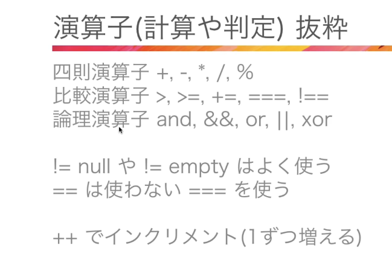

## 1章
- XAMPP(win)/MAMP(mac)
    - Apache/MySQL/PHPをまとめてインストールできるやつ

- Composer
    - PHPパッケージ管理ツール

- 「Applications/MAMP/htdocs」のディレクトリに実際に書いたプログラミングが収容されていく

- phpinfo()でphpnの情報を出力できる（phpのバージョンとか）
```php
<?php
echo('test');
phpinfo()

?>
```

- <?php ?>の後ろの「?>」は、phpだけのファイルなら省略できる。htmlも混ざっている場合は省略できない
```php
<?php
echo('test');
phpinfo()
```

- 
```php
<?php
$test=123; // 変数は$始まり
echo($test);

var_dump($test);// int(123)　と出力される
?>
```

- 結合は「.」でできる。結合すると文字列になる
```php
<?php
$test_1=123;
$test_2=456;

$test3=$test_1."うううう".$test_2;
echo($test3);

?>
```
- 基本的に定数は全て大文字

- 配列
```php
<?php
$arr=[1,2,3,4];
$arr2=[["aa","bb","cc"],[22,33,44],[99,88,77]];

echo $arr;
echo($arr[1]);// 2
var_dump($arr);// 2array(4) { [0]=> int(1) [1]=> int(2) [2]=> int(3) [3]=> int(4) }

echo('<pre>'); //preを使うと切れに表示される
var_dump($arr2);
echo('</pre>');
// array(3) {
//   [0]=>
//   array(3) {
//     [0]=>
//     string(2) "aa"
//     [1]=>
//     string(2) "bb"
//     [2]=>
//     string(2) "cc"
//   }
//   [1]=>
//   array(3) {
//     [0]=>
//     int(22)
//     [1]=>
//     int(33)
//     [2]=>
//     int(44)
//   }
//   [2]=>
//   array(3) {
//     [0]=>
//     int(99)
//     [1]=>
//     int(88)
//     [2]=>
//     int(77)
//   }
// }
?>
```

- 連想配列1
    - 先ほどの配列は値を出力するときに全部数字という時かインデックスで指定していたと思います
    - 連想配列は、キーと値がセット。
    ```php
    <?php
    $arr_member=[
        'name' =>'本田',
        'height' => 'サッカー',
        'age' => 22
    ];

    // echo($arr_member);
    echo($arr_member['name']);// 本田
    echo($arr_member['height']);// サッカー
    echo($arr_member['age']);// 22

    echo('<pre>'); //preを使うと切れに表示される
    var_dump($arr_member);
    echo('</pre>');
    // array(3) {
    //     ["name"]=>
    //     string(6) "本田"
    //     ["height"]=>
    //     string(12) "サッカー"
    //     ["age"]=>
    //     int(22)
    //   }
    ?>
    ```
- 連想配列2
    - 連想配列は以下画像のように、階層化された構造をデータ化す流のに大変便利


- 演算子


- 「===」は型一致も鑑みた比較
- if文のelseはできるだけ使わないほうがいい
- 空かどうかの半ちえはempty()メソッド
    ```php
    <?php
    $arr_member=[
    ];
    if(empty($arr_member)){
        echo("エンプティーーです");
    }
    ```
- かつ→＆＆　または→｜｜
- forEachはこんな感じで書く
```php
$arr_member=[
    'name' =>'本田',
    'height' => 'サッカー',
    'age' => 22
];

// 回す時の受け取り変数が1つだと、バリューの方が常に出る
foreach($arr_member as $val ){
    echo($val);//本田サッカー22
}

// キーとバリュー両方取りたい時は$key, $valみたいな感じで2つ書く
foreach($arr_member as $key=>$val ){
    echo($key).'は'.($val);// nameは本田heightはサッカーageは22
}


for($i =0; $i <10; $i++){// forは困難感じで書く
    echo($i);
}
```


- 関数
    - 組み込み関数（すでにphpに存在する関数）
        - mb_strlen(string $string, ?string $encoding = null): int
        - 上記だと?以降がオプションであってもなくてもいい。返り血が一番右側のint。
        - http://html2php.starrypages.net/php/array-funcs
    - ユーザ定義関数（自由に作れる関数）


- ファイルの読み込み
    - require(), require_once(); 読み込み失敗時にエラー表示
    - include(),include_once();読み込み失敗時に警告表示
    
    ```php
    <?php
    require 'common.php';

    commonTest();

    echo ($commonVariable) ;
    ?>
    ```