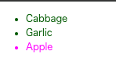
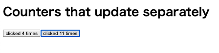
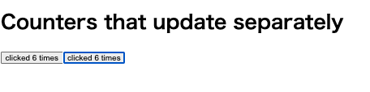

## クイックスタート
- reactはコンポーネントで構成されている
- `MyButton` `MyButton2` を宣言したら、別のコンポーネントにネストできます。
- <MyButton /> が大文字で始まっていることに注意してください。こうすることで、React のコンポーネントであるということを示しています。React のコンポーネント名は常に大文字で始める必要があり、HTML タグは小文字でなければなりません。
- コンポーネントは複数の JSX タグを return することはできません。`<div>...</div>` や空の `<>...</>` ラッパのような共通の親要素で囲む必要があります。
- React の名前は、「反応する（React）」という意味から来ている。ユーザーの操作やデータの変化に「リアクティブ（Reactive）」に反応する UI を作るためのライブラリ だから、React という名前になった。
    ```html
    <!DOCTYPE html>
    <html>
    <head>
        <meta charset="UTF-8" />
        <title>Hello World</title>
        <script src="https://unpkg.com/react@18/umd/react.development.js"></script>
        <script src="https://unpkg.com/react-dom@18/umd/react-dom.development.js"></script>

        <!-- Don't use this in production: -->
        <script src="https://unpkg.com/@babel/standalone/babel.min.js"></script>
    </head>
    <body>
        <div id="root"></div>
        <script type="text/babel">
        function MyButton() {
            return (
                <button>I'm a button</button>
            );
        }
        function MyButton2() {
            return (
                <button>I'm a button2!!</button>
            );
        }
        function MyApp() {
                return (
                    <div>
                        <h1>Hello, world!</h1>
                        <MyButton />
                        <MyButton2 />
                    </div>
            );
        }

        const container = document.getElementById('root');
        const root = ReactDOM.createRoot(container);
        root.render(<MyApp />);

        </script>
    </body>
    </html>
    ```

    

- 下記の例では、`style={{}}` は特別な構文ではなく、`style={ }` という JSX の波括弧内にある通常の `{} オブジェクト`です。スタイルが JavaScript 変数に依存する場合は、style 属性を使うことができます。

    ```html
    <!DOCTYPE html>
    <html>
    <head>
        <meta charset="UTF-8" />
        <title>Hello World</title>
        <script src="https://unpkg.com/react@18/umd/react.development.js"></script>
        <script src="https://unpkg.com/react-dom@18/umd/react-dom.development.js"></script>

        <!-- Don't use this in production: -->
        <script src="https://unpkg.com/@babel/standalone/babel.min.js"></script>
    </head>
    <body>
        <div id="root"></div>
        <script type="text/babel">
            const user = {
                name: 'Hedy Lamarr',
                imageUrl: '/image.png',
                imageSize: 90,
            };
            function MyButton() {
                return (
                    <button>I'm a button</button>
                );
            }
            function MyButton2() {
                return (
                    <button>I'm a button2!!</button>
                );
            }
            function MyApp() {
                    return (
                        <div>
                            <h1>Hello, world!</h1>
                            <MyButton />
                            <MyButton2 />
                            <h1>{user.name}</h1>
                            
                        </div>
                );
            }

            const container = document.getElementById('root');
            const root = ReactDOM.createRoot(container);
            root.render(<MyApp />);
        </script>
        </body>
    </html>
    ```


- 条件付きレンダリング
    - React には、条件分岐を書くための特別な構文は存在しません。代わりに、通常の JavaScript コードを書くときに使うのと同じ手法を使います
    ```html

        <div id="root"></div>
        <script type="text/babel">
            function MyButton() {
                return (
                    <button>I'm a button</button>
                );
            }
            function MyButton2() {
                return (
                    <button>I'm a button2!!</button>
                );
            }
            let content;
            let isLoggedIn =false
            if (isLoggedIn) {
                content = <MyButton />;
            } else {
                content = <MyButton2 />;
            }
        function MyApp() {
                return (
                    <div>
                        <h1>Hello, world!</h1>
                        {content}

                        // コンパクトなコードをお望みの場合は、条件 ? 演算子を使用できます
                        {isLoggedIn ? (
                            <MyButton />
                        ) : (
                            <MyButton2 />
                        )}

                        // else 側の分岐が不要な場合は、短い論理 && 構文を使用することもできる
                        {isLoggedIn && <MyButton2 />}// true のとき <AdminPanel />、false のとき何も表示しない
                    </div>
            );
        }
        const container = document.getElementById('root');
        const root = ReactDOM.createRoot(container);
        root.render(<MyApp />);
        </script>
    ```

- リストのレンダリング
    - コンポーネントのリストをレンダーする場合は、for ループ や 配列の map() 関数 といった JavaScript の機能を使って行います
    - `<li>` に `key` 属性があることに注意してください。リスト内の各項目には、兄弟の中でそれを一意に識別するための文字列または数値を渡す必要があります。通常、`key` はデータから来るはずで、データベース上の ID などが該当します。
    React は、後でアイテムを挿入、削除、並べ替えることがあった際に、何が起こったかを key を使って把握します。
    - 中括弧を使用することで変数を埋め込める

    ```html
        <div id="root"></div>
        <script type="text/babel">
            const products = [
                { title: 'Cabbage', isFruit: false, id: 1 },
                { title: 'Garlic', isFruit: false, id: 2 },
                { title: 'Apple', isFruit: true, id: 3 },
            ];
                                        // mapの書き方注意
            const listItems = products.map(product =>
                <li
                key={product.id}
                style={{
                    color: product.isFruit ? 'magenta' : 'darkgreen'　
                }}
                >
                {product.title}
                </li>
            );
        function MyApp() {
            return (
                <ul>{listItems}</ul>
            );
        }
        const container = document.getElementById('root');
        const root = ReactDOM.createRoot(container);
        root.render(<MyApp />);
        </script>
    ```



- イベントに応答する
    - コンポーネントの中でイベントハンドラ関数を宣言することで、イベントに応答できます
    - onClick={handleClick} の末尾に括弧がないことに注意してください！ そこでイベントハンドラ関数を呼び出すわけではありません。渡すだけです。ユーザがボタンをクリックしたときに、React がイベントハンドラを呼び出します。
```html
    <div id="root"></div>
    <script type="text/babel">
        function handleClick() {
            alert('You clicked me!');
        }
    function MyApp() {
        return (
            <button onClick={handleClick}>　// ここは関数を渡すだけなので（）で呼び出さないこと。
            Click me
            </button>
        );
    }
    const container = document.getElementById('root');
    const root = ReactDOM.createRoot(container);
    root.render(<MyApp />);
    </script>
```

- 画面更新
    - しばしば、コンポーネントに情報を「記憶」させて表示したいことがあります。例えば、ボタンがクリックされた回数を数えて覚えておきたい場合です。これを行うには、コンポーネントに state を追加します。

    - まず、React から useState をインポートします。
    - useで始まる関数はフック(hook)と呼ばれます。

    ```html
    import { useState } from 'react';
    ```

    - これでコンポーネント内にstate変数を設定できる
        - useState からは 2 つのものが得られます。現在の state (count) と、それを更新するための関数 (setCount) です。名前は何でも構いませんが、慣習的には [something, setSomething] のように記述します。
        - ボタンが初めて表示されるとき、count は 0 になります。これは useState() に 0 を渡したからです。state を変更したいときは、setCount() を呼び出し、新しい値を渡します。このボタンをクリックすると、カウンタが増加します
        - 各ボタンがそれぞれ count という state を「記憶」し、他のボタンに影響を与えないことに注意してください。
        - use で始まる関数は、フック (Hook) と呼ばれます。useState は React が提供する組み込みのフックです

    ```html
    function MyButton() {
        const [count, setCount] = useState(0);
    // ...
    }
    ```


    - useState(0) の意味は：
        count → 今の状態（変数）
        setCount → 状態を更新する関数
        useState(0) → count の初期値を 0 にする

    - useState とは？
        - useState は React の「状態（state）」を管理するためのフック（hook） です。
        - React のコンポーネントの中で、変数を持ち続けるための関数
        - ボタンをクリックしたらカウントを増やす みたいな動作に必要
        - コンポーネントが再描画されても値を保持できる！

    - 以下、上記の実装例
    ```html
    <!DOCTYPE html>
    <html>
    <head>
        <meta charset="UTF-8" />
        <title>Hello World</title>
        <script src="https://unpkg.com/react@18/umd/react.development.js"></script>
        <script src="https://unpkg.com/react-dom@18/umd/react-dom.development.js"></script>

        <!-- Don't use this in production: -->
        <script src="https://unpkg.com/@babel/standalone/babel.min.js"></script>
        </head>
        <body>
            <div id="root"></div>
            <script type="text/babel">

            function MyButton() {
                const [count, setCount] = React.useState(0)

                function handleClick() {
                    setCount(count + 1)
                }

                return (
                    <button onClick={handleClick}>
                        clicked {count} times
                    </button>
                );
            }

            function MyApp() {
                return (
                    <div>
                        <h1>Counters that update separately</h1>
                        <MyButton />
                        <MyButton />
                    </div>
                );
            }
            const container = document.getElementById('root');
            const root = ReactDOM.createRoot(container);
            root.render(<MyApp />);
            </script>
        </body>
        </html>
    ```
    

    - 以下は`useState`を2ボタン共通で管理するように修正したもの。
        - どちらのボタンを押しても、両方のボタンのカウントがカウントアップされる。
        - `MyApp` から各 `MyButton` に `state` を渡し、共有のクリックハンドラも一緒に渡します。以前に `` のような組み込みタグで行ったときと同様、JSX の波括弧を使うことで `MyButton` に情報を渡すことができます。
        - このように渡される情報は `props` と呼ばれます。`MyApp` コンポーネントは `count` 状態と `handleClick` イベントハンドラを保持しており、それらをどちらも `props` として各ボタンに渡します。
        - ボタンをクリックすると、onClick ハンドラが発火します。各ボタンの onClick プロパティは MyApp 内の handleClick 関数となっているので、その中のコードが実行されます。そのコードは setCount(count + 1) を呼び出し、count という state 変数をインクリメントします。新しい count の値が各ボタンに props として渡されるため、すべてのボタンに新しい値が表示されます。この手法は「state のリフトアップ（持ち上げ）」と呼ばれています。リフトアップすることで、state をコンポーネント間で共有できました
    - コンポーネントタグの属性が、実際のコンポーネントで受け取る引数とリンクしている
    ```html
    <!DOCTYPE html>
    <html>
    <head>
        <meta charset="UTF-8" />
        <title>Hello World</title>
        <script src="https://unpkg.com/react@18/umd/react.development.js"></script>
        <script src="https://unpkg.com/react-dom@18/umd/react-dom.development.js"></script>

        <!-- Don't use this in production: -->
        <script src="https://unpkg.com/@babel/standalone/babel.min.js"></script>
    </head>
    <body>
        <div id="root"></div>
        <script type="text/babel">

        function MyButton({count,onClick }) {
            return (
                <button onClick={onClick}>
                    clicked {count} times
                </button>
            );
        }

        function MyApp() {
            const [count, setCount] = React.useState(0);

            function handleClick() {
                setCount(count + 1);
            }
            return (
                <div>
                    <h1>Counters that update separately</h1>
                    <MyButton count={count} onClick={handleClick}/>
                    <MyButton count={count} onClick={handleClick}/>
                </div>
            );
        }
        const container = document.getElementById('root');
        const root = ReactDOM.createRoot(container);
        root.render(<MyApp />);
        </script>
    </body>
    </html>
    ```
    


## チュートリアル : 三目並べ

- コンポネントタグに属性みたいに引数をかける value="0"とかで渡して子コンポーネントで受け取る
- 変数は{ }を使って画面に表示できる
```html
<!DOCTYPE html>
<html>
<head>
    <meta charset="UTF-8" />
    <title>Hello World</title>
    <link rel="stylesheet" href="./style.css">
    <script src="https://unpkg.com/react@18/umd/react.development.js"></script>
    <script src="https://unpkg.com/react-dom@18/umd/react-dom.development.js"></script>

    <!-- Don't use this in production: -->
    <script src="https://unpkg.com/@babel/standalone/babel.min.js"></script>
</head>
<body>
    <div id="root"></div>
    <script type="text/babel">

    function Square({value}) {
        return (
            <button
                className="square"
        >
        {value}
        </button>
        );
    }

    function MyApp() {
        return (
            <>
            <div className="board-row">
                <Square value="0"/>
                <Square value="1"/>
                <Square value="2"/>
            </div>
            <div className="board-row">
                <Square value="3"/>
                <Square value="4"/>
                <Square value="5"/>
            </div>
            <div className="board-row">
                <Square value="6"/>
                <Square value="7"/>
                <Square value="8"/>
            </div>
            </>
        );
    }
    const container = document.getElementById('root');
    const root = ReactDOM.createRoot(container);
    root.render(<MyApp />);
    </script>
</body>
</html>
```

- 子コンポーネントにクリック時のメソッドとonClickを付与。クリック時にアラートがなる
```html
<!DOCTYPE html>
<html>
  <head>
    <meta charset="UTF-8" />
    <title>Hello World</title>
    <link rel="stylesheet" href="./style.css">
    <script src="https://unpkg.com/react@18/umd/react.development.js"></script>
    <script src="https://unpkg.com/react-dom@18/umd/react-dom.development.js"></script>

    <!-- Don't use this in production: -->
    <script src="https://unpkg.com/@babel/standalone/babel.min.js"></script>
</head>
<body>
    <div id="root"></div>
    <script type="text/babel">

    function MyButton({value}) {
        function handleClick(){ // 追加！！！
            alert("clicked!")
        }

        return <button
            className="square"
            onClick={handleClick}// 追加！！！
            >
                {value}
            </button>;
    }

    function MyApp() {
        return (
            <>
            <div className="board-row">
                <MyButton value="0"/>
                <MyButton value="1"/>
                <MyButton value="2"/>
            </div>
            <div className="board-row">
                <MyButton value="3"/>
                <MyButton value="4"/>
                <MyButton value="5"/>
            </div>
            <div className="board-row">
                <MyButton value="6"/>
                <MyButton value="7"/>
                <MyButton value="8"/>
            </div>
            </>
        );
    }
    const container = document.getElementById('root');
    const root = ReactDOM.createRoot(container);
    root.render(<MyApp />);
    </script>
</body>
</html>
```

- 子コンポーネント内にuseStateで「value」を設定する。（子コンポーネントにclick時の関数があり、クリック時にsetValue()でセット。）
- ますクリック時にXが表示されるようになる。各マスはそれぞれ独立している
```html
<!DOCTYPE html>
<html>
  <head>
    <meta charset="UTF-8" />
    <title>Hello World</title>
    <link rel="stylesheet" href="./style.css">
    <script src="https://unpkg.com/react@18/umd/react.development.js"></script>
    <script src="https://unpkg.com/react-dom@18/umd/react-dom.development.js"></script>

    <!-- Don't use this in production: -->
    <script src="https://unpkg.com/@babel/standalone/babel.min.js"></script>
</head>
<body>
    <div id="root"></div>
    <script type="text/babel">

    function Square() {

        const [value, setValue] = React.useState(null);
        function handleClick(){
            setValue('X')
        }

        return <button
            className="square"
            onClick={handleClick}
            >
                {value}
            </button>;
    }

    function MyApp() {
        return (
            <>
            <div className="board-row">
                <Square />
                <Square />
                <Square />
            </div>
            <div className="board-row">
                <Square />
                <Square />
                <Square />
            </div>
            <div className="board-row">
                <Square />
                <Square />
                <Square />
            </div>
            </>
        );
    }
    const container = document.getElementById('root');
    const root = ReactDOM.createRoot(container);
    root.render(<MyApp />);
    </script>
</body>
</html>
```

- 親コンポーネントで共有状態を宣言します。
- 親コンポーネントは、その状態を props を介して子に渡す
- React コンポーネントをリファクタリングするときに、状態を親コンポーネントに持ち上げることはよくあります。
```html
<!DOCTYPE html>
<html>
  <head>
    <meta charset="UTF-8" />
    <title>Hello World</title>
    <link rel="stylesheet" href="./style.css">
    <script src="https://unpkg.com/react@18/umd/react.development.js"></script>
    <script src="https://unpkg.com/react-dom@18/umd/react-dom.development.js"></script>

    <!-- Don't use this in production: -->
    <script src="https://unpkg.com/@babel/standalone/babel.min.js"></script>
</head>
<body>
    <div id="root"></div>
    <script type="text/babel">

    function Square({value,onSquareClick}) {
        return <button className="square" onClick={onSquareClick}>{value}</button>;
    }

    function MyApp() {
        const [squares, setSquares] = React.useState(Array(9).fill(null));// 親コンポネントに状態を上げる
        function handleClick(i){
            const nextSquares = squares.slice();
            nextSquares[i] = "x"
            setSquares(nextSquares)
        }
        return (
            <>
            <div className="board-row">
                <Square value={squares[0] onSquareClick={ ()=>{handleClick(0)} }}/>
                <Square value={squares[1]}/>
                <Square value={squares[2]}/>
            </div>
            <div className="board-row">
                <Square value={squares[3]}/>
                <Square value={squares[4]}/>
                <Square value={squares[5]}/>
            </div>
            <div className="board-row">
                <Square value={squares[6]}/>
                <Square value={squares[7]}/>
                <Square value={squares[8]}/>
            </div>
            </>
        );
    }
    const container = document.getElementById('root');
    const root = ReactDOM.createRoot(container);
    root.render(<MyApp />);
    </script>
</body>
</html>
```


- 以下のソースで任意のマスをクリック時に「✖︎」をつけれるようになtった。
- 親コンポーネント側では渡す引数（prop）てか属性？は受け取る時と同じ名前にする
```html
<!DOCTYPE html>
<html>
  <head>
    <meta charset="UTF-8" />
    <title>Hello World</title>
    <link rel="stylesheet" href="./style.css">
    <script src="https://unpkg.com/react@18/umd/react.development.js"></script>
    <script src="https://unpkg.com/react-dom@18/umd/react-dom.development.js"></script>

    <!-- Don't use this in production: -->
    <script src="https://unpkg.com/@babel/standalone/babel.min.js"></script>
</head>
<body>
    <div id="root"></div>
    <script type="text/babel">

    function Square({value, onSquareClick}) {// 追加
        return <button className="square" onClick={onSquareClick}>{value}</button>;// 追加
    }

    function MyApp() {
        const [squares, setSquares] = React.useState(Array(9).fill(null));// 親コンポネントに状態を上げる// 追加
        function handleClick(i){// 追加
            const nextSquares = squares.slice();
            nextSquares[i] = "x"
            setSquares(nextSquares)
        }
        return (
            <>
            <div className="board-row">
                <Square value={squares[0]} onSquareClick={() => handleClick(0)} />// 追加
                <Square value={squares[1]} onSquareClick={() => handleClick(1)} />
                <Square value={squares[2]} onSquareClick={() => handleClick(2)} />
            </div>
            <div className="board-row">
                <Square value={squares[3]} onSquareClick={() => handleClick(3)} />
                <Square value={squares[4]} onSquareClick={() => handleClick(4)} />
                <Square value={squares[5]} onSquareClick={() => handleClick(5)} />
            </div>
            <div className="board-row">
                <Square value={squares[6]} onSquareClick={() => handleClick(6)} />
                <Square value={squares[7]} onSquareClick={() => handleClick(7)} />
                <Square value={squares[8]} onSquareClick={() => handleClick(8)} />
            </div>
            </>
        );
    }
    const container = document.getElementById('root');
    const root = ReactDOM.createRoot(container);
    root.render(<MyApp />);
    </script>
</body>
</html>
```

- ✅ なぜ slice() を使うのか？
    - React では、useState で管理している 状態（state）を直接変更してはいけない というルールがあります。
    - 例えば、もし squares[i] = "x" を直接変更すると：

    ```js
        squares[i] = "x"; // ❌ 直接変更 → Reactが変更を検知しない！
        setSquares(squares); // ❌ 直接変更しただけではうまく動かない
    ```
    - React が「状態が変わった」と認識しないため、再レンダリングされない！バグの原因になる！
    - → これを防ぐために、配列のコピーを作成してから更新する。

- ✅ slice() の役割
    - slice() を使うと、元の squares を変更せずに 新しい配列を作れる。
    - 直接部分を修正するのではなく、新たな入れ物用意してそこに修正部分含めた全部を入れ直して、丸ごと入れ替える感じ

    ```js
        const nextSquares = squares.slice();
    ```
    - その後、新しい配列 nextSquares に "x" を入れて、React に新しい配列を渡す：

    ```js
        nextSquares[i] = "x";
        setSquares(nextSquares);
    ```
    これで React は「状態が変わった！」と認識し、画面を更新 してくれる。


- これで交互に⚪︎と✖︎をますに打てるようになった。
```html
<!DOCTYPE html>
<html>
  <head>
    <meta charset="UTF-8" />
    <title>Hello World</title>
    <link rel="stylesheet" href="./style.css">
    <script src="https://unpkg.com/react@18/umd/react.development.js"></script>
    <script src="https://unpkg.com/react-dom@18/umd/react-dom.development.js"></script>

    <!-- Don't use this in production: -->
    <script src="https://unpkg.com/@babel/standalone/babel.min.js"></script>
</head>
<body>
    <div id="root"></div>
    <script type="text/babel">

    function Square({value, onSquareClick}) {
        return <button className="square" onClick={onSquareClick}>{value}</button>;
    }

    function MyApp() {
        const [xIsNext, setXIsNext] = React.useState(true);// 親コンポネントに状態を上げる
        const [squares, setSquares] = React.useState(Array(9).fill(null));// 親コンポネントに状態を上げる
        function handleClick(i){
            if(squares[i]){
                return;
            }
            const nextSquares = squares.slice();
            if(xIsNext){
                nextSquares[i] = "x"
            }else{
                nextSquares[i] = "⚪︎"
            }
            setSquares(nextSquares)
            setXIsNext(!xIsNext)
        }
        return (
            <>
            <div className="board-row">
                <Square value={squares[0]} onSquareClick={() => handleClick(0)} />
                <Square value={squares[1]} onSquareClick={() => handleClick(1)} />
                <Square value={squares[2]} onSquareClick={() => handleClick(2)} />
            </div>
            <div className="board-row">
                <Square value={squares[3]} onSquareClick={() => handleClick(3)} />
                <Square value={squares[4]} onSquareClick={() => handleClick(4)} />
                <Square value={squares[5]} onSquareClick={() => handleClick(5)} />
            </div>
            <div className="board-row">
                <Square value={squares[6]} onSquareClick={() => handleClick(6)} />
                <Square value={squares[7]} onSquareClick={() => handleClick(7)} />
                <Square value={squares[8]} onSquareClick={() => handleClick(8)} />
            </div>
            </>
        );
    }
    const container = document.getElementById('root');
    const root = ReactDOM.createRoot(container);
    root.render(<MyApp />);
    </script>
</body>
</html>
```

- calculateWinnerで勝者の判定をする
- calculateWinnerで返り値の値があれば、勝負ついてるのでそこでreturnして終わり
- useStateの値が書き変わると、Reactはサイレンダリングされる。よってクリックするごとにstatusの判定が毎回走る
```html
<!DOCTYPE html>
<html>
  <head>
    <meta charset="UTF-8" />
    <title>Hello World</title>
    <link rel="stylesheet" href="./style.css">
    <script src="https://unpkg.com/react@18/umd/react.development.js"></script>
    <script src="https://unpkg.com/react-dom@18/umd/react-dom.development.js"></script>

    <!-- Don't use this in production: -->
    <script src="https://unpkg.com/@babel/standalone/babel.min.js"></script>
</head>
<body>
    <div id="root"></div>
    <script type="text/babel">
        function calculateWinner(squares) {// 追加
            const lines = [
                [0, 1, 2],
                [3, 4, 5],
                [6, 7, 8],
                [0, 3, 6],
                [1, 4, 7],
                [2, 5, 8],
                [0, 4, 8],
                [2, 4, 6]
            ];
            for (let i = 0; i < lines.length; i++) {
                const [a, b, c] = lines[i];
                if (squares[a] && squares[a] === squares[b] && squares[a] === squares[c]) {
                return squares[a];
                }
            }
            return null;
        }

    function Square({value, onSquareClick}) {
        return <button className="square" onClick={onSquareClick}>{value}</button>;
    }

    function MyApp() {
        const [xIsNext, setXIsNext] = React.useState(true);// 親コンポネントに状態を上げる
        const [squares, setSquares] = React.useState(Array(9).fill(null));// 親コンポネントに状態を上げる
        function handleClick(i){
            if(squares[i] || calculateWinner(squares)){// 追加
                return;
            }

            const nextSquares = squares.slice();
            if(xIsNext){
                nextSquares[i] = "x"
            }else{
                nextSquares[i] = "⚪︎"
            }
            setSquares(nextSquares)
            setXIsNext(!xIsNext)
        }
        const winner = calculateWinner(squares);// 追加
        let status;// 追加
        if (winner) {// 追加
            status = "Winner: " + winner;// 追加
        } else {// 追加
            status = "Next player: " + (xIsNext ? "X" : "O");// 追加
        }// 追加
        return (
            <>
            <div className="status">{status}</div>// 追加
            <div className="board-row">
                <Square value={squares[0]} onSquareClick={() => handleClick(0)} />
                <Square value={squares[1]} onSquareClick={() => handleClick(1)} />
                <Square value={squares[2]} onSquareClick={() => handleClick(2)} />
            </div>
            <div className="board-row">
                <Square value={squares[3]} onSquareClick={() => handleClick(3)} />
                <Square value={squares[4]} onSquareClick={() => handleClick(4)} />
                <Square value={squares[5]} onSquareClick={() => handleClick(5)} />
            </div>
            <div className="board-row">
                <Square value={squares[6]} onSquareClick={() => handleClick(6)} />
                <Square value={squares[7]} onSquareClick={() => handleClick(7)} />
                <Square value={squares[8]} onSquareClick={() => handleClick(8)} />
            </div>
            </>
        );
    }
    const container = document.getElementById('root');
    const root = ReactDOM.createRoot(container);
    root.render(<MyApp />);
    </script>
</body>
</html>
```
- 🚀 クリックするたびに status の計算が走る理由
クリックするたびに status の計算 (calculateWinner(squares)) が走るのは、React の「再レンダリング」の仕組みのせい です。

- ✅ React の再レンダリングとは？
React では、useState を使って状態 (state) を更新すると コンポーネント全体が再レンダリング（再描画）される 仕組みになっています。

✅ props とは？
親コンポーネントが、子コンポーネントにデータを渡す仕組み のこと。
props という名前は、「properties（プロパティ）」の略 です。
英語の "properties" は「特性」や「属性」という意味。
親コンポーネントから子コンポーネントへ渡す	データを一方向に流す（トップダウン）。
変更できない（読み取り専用）	props は子コンポーネントの中では変更できない。
関数やオブジェクトも渡せる	文字列だけじゃなく、関数や配列も渡せる。


- React では setState で配列を更新するときは、スプレッド構文 ... でコピーを作るのが基本！

- 新たにGameというトップレベルコンポーネントを作った。
```html
<!DOCTYPE html>
<html>
  <head>
    <meta charset="UTF-8" />
    <title>Hello World</title>
    <link rel="stylesheet" href="./style.css">
    <script src="https://unpkg.com/react@18/umd/react.development.js"></script>
    <script src="https://unpkg.com/react-dom@18/umd/react-dom.development.js"></script>

    <!-- Don't use this in production: -->
    <script src="https://unpkg.com/@babel/standalone/babel.min.js"></script>
</head>
<body>
    <div id="root"></div>
    <script type="text/babel">
    function calculateWinner(squares) {
        const lines = [
            [0, 1, 2],
            [3, 4, 5],
            [6, 7, 8],
            [0, 3, 6],
            [1, 4, 7],
            [2, 5, 8],
            [0, 4, 8],
            [2, 4, 6]
        ];
        for (let i = 0; i < lines.length; i++) {
            const [a, b, c] = lines[i];
            if (squares[a] && squares[a] === squares[b] && squares[a] === squares[c]) {
            return squares[a];
            }
        }
        return null;
    }

    function Square({value, onSquareClick}) {
        return <button className="square" onClick={onSquareClick}>{value}</button>;
    }

    function Board({ xIsNext, squares, onPlay }) {
        function handleClick(i){
            if(squares[i] || calculateWinner(squares)){
                return;
            }

            const nextSquares = squares.slice();
            if(xIsNext){
                nextSquares[i] = "x"
            }else{
                nextSquares[i] = "⚪︎"
            }
            onPlay(nextSquares);
        }

        const winner = calculateWinner(squares);
        let status;
        if (winner) {
            status = "Winner: " + winner;
        } else {
            status = "Next player: " + (xIsNext ? "X" : "O");
        }
        return (
            <>
            <div className="status">{status}</div>
            <div className="board-row">
                <Square value={squares[0]} onSquareClick={() => handleClick(0)} />
                <Square value={squares[1]} onSquareClick={() => handleClick(1)} />
                <Square value={squares[2]} onSquareClick={() => handleClick(2)} />
            </div>
            <div className="board-row">
                <Square value={squares[3]} onSquareClick={() => handleClick(3)} />
                <Square value={squares[4]} onSquareClick={() => handleClick(4)} />
                <Square value={squares[5]} onSquareClick={() => handleClick(5)} />
            </div>
            <div className="board-row">
                <Square value={squares[6]} onSquareClick={() => handleClick(6)} />
                <Square value={squares[7]} onSquareClick={() => handleClick(7)} />
                <Square value={squares[8]} onSquareClick={() => handleClick(8)} />
            </div>
            </>
        );
    }

    function Game(){
        const [xIsNext, setXIsNext] = React.useState(true);
        const [history, setHistory] = React.useState([Array(9).fill(null)]);
        const currentSquares = history[history.length - 1];

        function handlePlay(nextSquares) {
            setHistory([...history, nextSquares]);
            console.log(history)
            setXIsNext(!xIsNext);
        }
        return (
            <div className="game">
            <div className="game-board">
                <Board  xIsNext={xIsNext} squares={currentSquares} onPlay={handlePlay}/>
            </div>
            <div className="game-info">
                <ol>{/*TODO*/}</ol>
            </div>
            </div>
        );

    }
    const container = document.getElementById('root');
    const root = ReactDOM.createRoot(container);
    root.render(<Game />);
    </script>
</body>
</html>
```

- mapの使い方。
```js
const array = [1,2,3,4,5]
const map1 = array.map((val)=>val*2)
const map2 = array.map((val)=>{val*2})// 失敗例。returnし忘れてる。ブロック内に return がないと、undefined を返す。
                                      // map() で {} を使う場合は、return を書くのを忘れない！
const map3 = array.map((val)=>{
  return val*2})
console.log(map1)
console.log(map2)
console.log(map3)
```


- 完成版
```html
<!DOCTYPE html>
<html>
  <head>
    <meta charset="UTF-8" />
    <title>Hello World</title>
    <link rel="stylesheet" href="./style.css">
    <script src="https://unpkg.com/react@18/umd/react.development.js"></script>
    <script src="https://unpkg.com/react-dom@18/umd/react-dom.development.js"></script>

    <!-- Don't use this in production: -->
    <script src="https://unpkg.com/@babel/standalone/babel.min.js"></script>
</head>
<body>
    <div id="root"></div>
    <script type="text/babel">
    function calculateWinner(squares) {
        const lines = [
            [0, 1, 2],
            [3, 4, 5],
            [6, 7, 8],
            [0, 3, 6],
            [1, 4, 7],
            [2, 5, 8],
            [0, 4, 8],
            [2, 4, 6]
        ];
        for (let i = 0; i < lines.length; i++) {
            const [a, b, c] = lines[i];
            if (squares[a] && squares[a] === squares[b] && squares[a] === squares[c]) {
            return squares[a];
            }
        }
        return null;
    }

    function Square({value, onSquareClick}) {
        return <button className="square" onClick={onSquareClick}>{value}</button>;
    }

    function Board({ xIsNext, squares, onPlay }) {
        function handleClick(i){
            if(squares[i] || calculateWinner(squares)){
                return;
            }

            const nextSquares = squares.slice();
            if(xIsNext){
                nextSquares[i] = "x"
            }else{
                nextSquares[i] = "⚪︎"
            }
            onPlay(nextSquares);
        }

        const winner = calculateWinner(squares);
        let status;
        if (winner) {
            status = "Winner: " + winner;
        } else {
            status = "Next player: " + (xIsNext ? "X" : "O");
        }
        return (
            <>
            <div className="status">{status}</div>
            <div className="board-row">
                <Square value={squares[0]} onSquareClick={() => handleClick(0)} />
                <Square value={squares[1]} onSquareClick={() => handleClick(1)} />
                <Square value={squares[2]} onSquareClick={() => handleClick(2)} />
            </div>
            <div className="board-row">
                <Square value={squares[3]} onSquareClick={() => handleClick(3)} />
                <Square value={squares[4]} onSquareClick={() => handleClick(4)} />
                <Square value={squares[5]} onSquareClick={() => handleClick(5)} />
            </div>
            <div className="board-row">
                <Square value={squares[6]} onSquareClick={() => handleClick(6)} />
                <Square value={squares[7]} onSquareClick={() => handleClick(7)} />
                <Square value={squares[8]} onSquareClick={() => handleClick(8)} />
            </div>
            </>
        );
    }

    function Game(){
        const [xIsNext, setXIsNext] = React.useState(true);
        const [history, setHistory] = React.useState([Array(9).fill(null)]);
        const [currentMove, setCurrentMove] = React.useState(0);// ユーザーが現在どのステップを表示しているか
        const currentSquares = history[currentMove];

        function handlePlay(nextSquares) {
            // setHistory([...history, nextSquares]);
            // console.log(history)
            const nextHistory = [...history.slice(0, currentMove + 1), nextSquares];
            setHistory(nextHistory);
            setCurrentMove(nextHistory.length - 1);
            setXIsNext(!xIsNext);
        }
        function jumpTo(nextMove) {
            setCurrentMove(nextMove);
            setXIsNext(nextMove % 2 === 0);
        }

        const moves = history.map((squares, move) => {
            let description;
            if (move > 0) {
            description = 'Go to move #' + move;
            } else {
            description = 'Go to game start';
            }
            return (
            <li key={move}>
                <button onClick={() => jumpTo(move)}>{description}</button>
            </li>
            );
        });

        return (
            <div className="game">
            <div className="game-board">
                <Board  xIsNext={xIsNext} squares={currentSquares} onPlay={handlePlay}/>
            </div>
            <div className="game-info">
                <ol>{moves}</ol>
            </div>
            </div>
        );

    }
    const container = document.getElementById('root');
    const root = ReactDOM.createRoot(container);
    root.render(<Game />);
    </script>
</body>
</html>
```