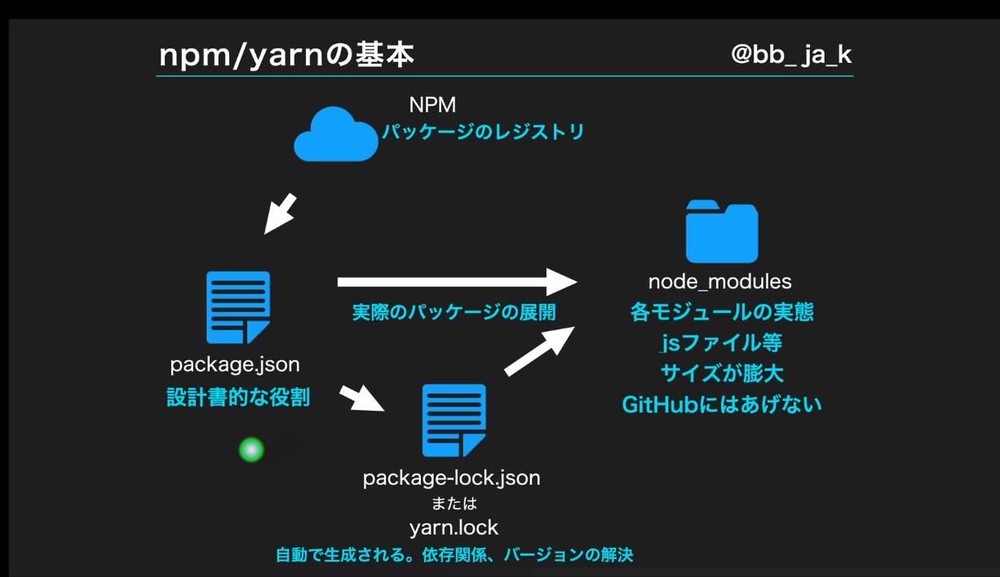

## 1章
- Reactで挫折する人はjavascriptの基礎知識が足りていない
- 

## 3章
- まずは概念を理解

- webpack,Vite などのモジュールバンドラーを使用
- Babel,SWCなどのトランスパイラを使用

- DOM
  - document object model
  - htmlを解釈して木構造で表現したもの。階層構造
  - これまでは画面の表示変えたり追加したりする際はjavascriptやJqueryでDOMを直接操作していた
    - 素のjsやjqueryなどがまさにそれをしている

  - この従来のDOM操作の何が問題なのかというとレンダリングコスト高い（画面お表示が遅くなったり）、コードが複雑化してどこで何してるか意味不明になる（レンダリングコスト高、コードの複雑化）
  - この解決のために作られたのが仮想DOM
    - jsのオブジェクトで仮想的に作られたDOMのこと
    - いきなりDOMを操作するのではなく、仮想DOMのバージョンの前後で差分を検出して差分だけを実際のDOMに反映する
    - よってレンダリングコスト削減や高速化が実現できている
    - ReactやVueの裏側でそういう仕組みが動いていて、開発yさは意識しないで良いようになっている。
- パッケージマネージャーについて
  - かつての古いjavascript開発では単一のｊｓファイルに処理を全て記述していた。
    - 処理が複雑化するにつれコードがカオスか
    - コードの再利用ができなくなっていく
  - そこから改善され、jsファイルを大きなまとまりの処理ごとに作り、それを読み込んで使うように改善されていった
    - これによってコードの再利用や共通化ができるようになっていった。以下のように処理ごとにjsファイルを作って読み込む形
    ```js
      <script src="js/vendor/jquery.min.js"></script>
      <script src="js/vendor/jquery.cookie.js"></script>
      <script src="js/vendor/jquery.easing.1.3.js"></script>
      <script src="js/common.js"></script>
      <script src="js/util.js"></script>
      <script src="js/app.js"></script>
    ```
    - しかし以前として問題はあった。
      - jsファイルの読み込み順を意識しないとエラーが起きてしまったり
      - 特定のファイルで使用している変数や関数がどのファイルで使用してるのかわからない
      - って感じでまだまだ厳しーーーーって面あった
      ```txt
      具体的には
      common.js で「〇〇という関数」を作った
      app.js が「〇〇という関数」を使う
      とします。
      このとき app.js を先に読み込んでしまうと、「〇〇」っていう関数がまだ存在しない状態なので 「そんな関数ないよ」 とエラーが出てしまうんです。
      順番を変えて
      common.js (関数が定義される)
      app.js (関数が実際に使われる)
      のように読み込むのが正解になります。
      ```

      ```txt
      JavaScript でも同様に、複数のファイルにいろんな変数や関数が点在していて、それぞれがお互いを参照しあう と、「どこから呼び出されているか」や「このファイルで作った関数は、どこで使われているんだろう？」と把握しづらくなります。
      さらに 全部が「グローバル空間」(いわば全員が同じ大部屋で作業) にある感じなので、余計にゴチャゴチャしやすい。
      こうなると、
      使いたい機能が存在するはずなのに、どのファイルを読み込めば呼び出せるのか…
      ファイルを一つでも削除すると、どこかで壊れるかも…
      みたいな不安が大きくなるわけです。
      ```

  - そこから試行錯誤ありモダンjavascriptではnpmやyarnなどのパッケージマネージャーを使っている
    - こいつを使うとこれまでの問題を解決してくれる
    - 読み込み順でエラーが起きないように依存関係を依存関係を勝手に解決してくれたり
    - import先が明示的にわかる
    - 世界中で公開されているパッケージをコマンド1つで利用可能だったり
    - チーム内の共有も簡単に似合ったり


  
  - NPM
    - オンライン上にさまざまなパッケージが公開されている場所がある。そこからコマンド使って自分のPCにモジュールをインストールする
  - package.json
    - 何をどのバージョンでインストールしたかが記録されるファイル
  - lock
    - インストールしたモジュールが裏で使っている他のモジュールやそのバージョンなど。ここは直接編集しない
  - node_modules
    - 各モジュールの実態
    - サイズが膨大。
    - githubにはあげない

- ECMAjavascriptとは
  - European Computer Manufactures Association(欧州電子計算機工業会)
  - jsはこんなルールで書くぜ！っていう標準規格のこと。
  - 標準規格は毎年一回発表される
  - ES5=ES2014, ES6=ES2015
  - ややこしいので西暦の方の呼び方を一般化しましょうという流れになっている
  - バージョンのよびかた ES5と西暦での呼び方 ES2014が同じだったりして明らかにややこしいので西暦での呼び方が推奨されている
  - ES2015で機能追加が多くあり近代JSの大きな転換期と言える
  ```txt
  ES2015で追加された規格
  ・let,constを用いた変数宣言
  ・アロー関数
  ・Class構文
  ・分割代入
  ・テンプレート文字列
  ・スプレッド構文
  ・Promise
  ・etc...
  ```

- モジュールバンドラー
  - 複数のファイルを1つにまとめるためのもの。(Webpack,Viteなどがある)
  - js,css,imageなどを1つにまとめる
  - この技術が生まれた経緯は、
  - 「開発時にjsファイルを細かく機能ごとにわけて開発したほうがいいね！」
  - 「再利用性も開発効率も上がるしね！」
  - でも本番環境でファイル分かれてる必要なくね？？「確かに。あくまで開発効率を上げて管理しやすくするための方法だもんね」
  - 「別れてると読み込み数に増えてパフォーマンス的に悪そう」
  - じゃあ本番にビルドするときに1つにまとめてくれるもの作るか！
  - ただファイル同士の依存関係はどうしましょう？
  - それも判定していい感じにまとめてくれるものにしよう！
- トランスパイラ
  - javascriptの新しい記をを古い記法に変えてくれる（Babel,SWCなどある）
  - ES6でめっちゃ新しい記法増えたやん！！
  - どんどん使おう！
  - 待て！対応してないブラウザがいっぱいあるみたいや、、
  - I Eとか。。
  - くそ〜。じゃあ諦めて古い記法でかくかー
  - いや、開発は新しい記法でやって、実行時は古い記法でやればいいのでは？？
  - それだ！

- SPA
  - モダンjavascriptはSPAが基本
  - HTMLは1つのみでJavaScriptで画面を書き換える
  ```txt
  ページ遷移時のチラツキがなくなる（画面遷移時の一瞬画面が白くなるアレのこと）
  表示速度アップによるユーザ大変の向上
  コンポネント分割が用意になることでの開発効率アップ
  ```
## 4章
- テンプレート文字列
  - 従来のjsでは文字列結合が「＋」でしかできなかった。結構めんどくさい。
  ```js
  const name="ジャケ"
  const age=31
  const message = "私の名前は"+name+"です"+"年齢は"+age+"です。"
  console.log(message) // 👆これだるすぎる
  ```
  - これを簡単にできるようにしたのがテンプレート文字列
- アロー関数
  - ES2015で追加された新しい関数の定義方法
- 分割代入
  - ES2015で追加
  - 以下のようにオブジェクト内のものをそれぞれの変数に抜き出して、そのまま使えるやつ。
  ```js
  const myProfile ={
    name:"ジャケえ",
    age:31
  }

  const message1=`名前は${myProfile.name}です。年齢は${myProfile.age}です`
  console.log(message1)

  // おb８右ジェクトの分割代入は{}でやる
  const {name, age} = myProfile // 分割代入！！
  const message2=`名前は${name}です。年齢は${age}です`
  console.log(message2)
  ```

  - 配列の場合はこんか書き方でやる。
  ```js
  const myProfile2 =[222,333,444]

  const [val1,val2,val3]= myProfile2 // 分割代入！！！！！
  console.log(val1)// 222
  console.log(val2)// 333
  console.log(val3)// 444
  ```
- デフォルト値
  ```js
  const sayHello = (name = "デフォルト") => console.log(`こんにちは${name}さん!`);

  sayHello("謙也");//こんにちは謙也さん!
  sayHello();//こんにちはデフォルトさん!

  ```
  - 分割代入の時もデフォルト値を設定する
  ```js
  const myProfile = {
    age: 31,
  };

  const { age, name = "ゲスト" } = myProfile;
  console.log(age);
  console.log(name);
  ```


- オブジェクトの省略記法
  - オブジェクト内のキーとバリューが同じ場合は省略できる。
  ```js
  const name3="kenya"
  const age3=21
  // 以下のような感じでキーとヴァリューが同じ名前の時に省略気泡が発動する
  //const myProfile3={
  //  name3:name3,
  //  age3:age3
  //}

  // 上記の場合はわざわざname3:name3のように書かなくても良くなる⇩
  const myProfile3 ={
    name3,
    age3
  }
  const myProfile4={name3, age3}

  console.log(name3)
  console.log(age3)
  ```

  - スプレッド構文（配列の展開）
  ```js
  const arr1=[1,2,3,4]
  console.log(arr1)// [ 1, 2, 3, 4 ]
  console.log(...arr1)// 1 2 3 4   配列の中身を順番に処理してくれる


  const sumFunc = (num1 , num2)=> console.log(num1+num2)
  sumFunc(arr1[0], arr1[1]) //3
  sumFunc(...arr1) //3
  ```


  - スプレッド構文（まとめて受け取る）
  ```js
  const arr2 =[1,2,3,4,5]
  const [num1,num2,...num3]=arr2// num1に1, num2に2, num3に残りを配列として分割代入するってやつ
  console.log(num1)// 1
  console.log(num2)// 2
  console.log(num3)// [3,4,5] ←arr2の残りの要素がまとまって入ったり。。
  ```

  - スプレッド構文（配列のコピー、結合）
  ```js
  const arr4=[10,20]
  const arr5=[30,40]

  const arr6 = [...arr4]
  const arr7 = [...arr4, ...arr5]
  const arr8 = arr4

  console.log(arr6)//[ 10, 20 ]
  console.log(arr7)// [ 10, 20, 30, 40 ]
  console.log(arr8)//[ 10, 20 ] arr6と出力結果は変わらないが、こちらはarr4の参照を引き継いでいるので、結果同じ場所を参照していることにあんる
  ```

  - mapやfilterを使った配列の処理
    ```js
    const arr2 = [1, 2, 3, 4, 5];
    for (let index = 0; index < arr2.length; index++) {
      const element = arr2[index];
      console.log(element);
    }

    // ループの度に返却された値で新しい配列を生成することができる
    const arr3 = arr2.map((element) => {
      return element * 2;
    });
    console.log(arr3); // [2, 4, 6, 8, 10]

    // もちろん単に配列の値を表示したいだけです〜って時はルーオプの機能だけを使って以下のようにかける
    const arr4 = arr2.map((element) => console.log(element));

    const arr5 = arr2.filter((element) => {
      return element % 2 === 1; //filterではreturnの後に条件式を書く。
    });

    console.log(arr5); //[1, 3, 5]

    // mapの第２引数はindexを指定できる
    const arr4 = arr2.map((element, index) => console.log(index));

    const arr6 = ["田中", "更科", "勝山"];
    const arr7 = arr6.map((name) => {
      if (name === "ああん") {
        return name;
      } else {
        return name + "さん";
      }
    });
    console.log(arr7);// ['田中さん', '更科さん', '勝山さん']

  ```
  - 自分で書いてみる、仮説検証ができる

## 5章
  - 指定した要素の1つ上隣の要素を取得
  previousElementSibling

  - 指定した要素の1つした隣の要素を取得
  nextElementSibling

  - 指定した要素を親要素の中から一番近いものを取得
  closest

  - 子要素の中で１番目のものを取得
  firstElementChild

  - 子要素を削除
  removeChild

## 6章

- とりあえず以下で画面に「こんにちは」」と表示される
  ```js
    import { StrictMode, strictMode } from "react";
    import { createRoot } from "react-dom/client";

    const rootElement = document.getElementById("root");
    const root = createRoot(rootElement);

    root.render(
      <StrictMode> // strictモードで開発。基本これを使うことが推奨されている
        <h1>こんにちは</h1>;
      </StrictMode>
    );

  ```

- 以下のように関数の中で表示したい内容をreturnして結果を表示するというやり方がJSX
- コンポーネントは大文字から始める
- ※👆はファイル名は大文字始まりでなくてもいい。定義するコンポーネントの変数は大文字始まりじゃないと上手く動いてくれない！！！
  ```js
  import { StrictMode, strictMode } from "react";
  import { createRoot } from "react-dom/client";

  const rootElement = document.getElementById("root");
  const root = createRoot(rootElement);

  const App = () => {

    return (
      <h1>!!!!</h1>
    )
    
  };
  root.render(
    <StrictMode>
      <App/>
    </StrictMode>
  );
  ```

- JSXのreturnは1つの要素として返すこと(単一の要素をreturnすること。)

  ```js
    import { StrictMode, strictMode } from "react";
    import { createRoot } from "react-dom/client";

    const rootElement = document.getElementById("root");
    const root = createRoot(rootElement);

    const App = () => {
      return (
        <>
          <h1>!!!!</h1>
          <h1>!!!!</h1>
        </>
      );
    };

    root.render(
      <StrictMode>
        <App />
      </StrictMode>
    );
  ```


- 1つの関数単位でコンポーネントを定義していくと良い。１コンポーネント作る時は１関数で分けて書くといい!!!!!
- 別ファイルでexportされた関数を読み込むときは、基本パスを書くことはなくて、コンポーネントタグを書いたときに自動でおパスを書く仕組みがあるのでそれ使う
- jsでもjsxでもどっちでも動くが、jsならjsだけ書いてある、jsxならコンポーネントが書いてあると判別できるので、分けて書くのが吉
- .jsxファイルは「Reactのコンポーネント用の拡張子」
  - プロジェクトによって異なるが、ファイルの拡張子を見ただけでコンポーネントかどうか、が一発でわかるので推奨
  - ファイルのアイコンも変わるし、ｊsx用の保管などもあるのでリアクトのコンポーネントを書くのであればjsxの拡張子にするのがおすすめ
- Reactのコンポーネント名は大文字始まりだが、ファイル名は小文字始まりでも良い。
- reactでは属性名はキャメルケースで書く。小文字始まり大文字つなぎ
- jsxの中でｊｓを書いていくよ〜って意味を表すのが「{}」。{}部分はjsとして認識される
  - 以下のように「」
  ```js
  export const App = () => {
    return (
      <>
        <h1>!!!!</h1>
        <h1>!!!!</h1>
        {console.log(1111)}
        <button onClick={() => alert(111)}>ボタン</button>
      </>
    );
  };
  ```

  - ただ毎回「onClick={() => alert(111)}」のように{}内にゴリゴリ処理書いてると可読性低いので、外に切り出してあげると良い
  ```jsx
  export const App = () => {
    function onClickButton() {
      alert(111);
    }
    return (
      <>
        <h1>!!!!</h1>
        <h1>!!!!</h1>
        <p>{console.log(1111)}</p>
        <button onClick={onClickButton}>ボタン</button>
      </>
    );
  };
  ```

  - styleを当てる時はオブジェクトでスタイルを定義するルール
     - jsのオブジェクトでスタイルは定義する。なので一見二重カッコで描いてるようにも見える
     - 本来のｃｓｓでは「font-size」と書くが、jsnおオブジェクトではハイフンは許容してないので、キャメルケースで書くのがreactルール
     - 数値のものはそのまま書く
  ```jsx
  export const App = () => {
    function onClickButton() {
      alert(111);
    }

    const contenetStyle = {
      color: "red",
      fontSize: "22px",
      margin: 100,
    };
    return (
      <>
        <h1 style={{ color: "blue" }}>こんにちは</h1>
        <h1 style={contenetStyle}>こんにちは</h1>
        <h1>!!!!</h1>
        <h1>!!!!</h1>
        <p>{console.log(1111)}</p>
        <button onClick={onClickButton}>ボタン</button>
      </>
    );
  };
  ```
  - 「styleはjs武ジェクトで適応する」ここ大事
  ```jsx
  export default App = () => {
    const styleObject = {
      color: "red",
      fontSize: 111,
      border: "1px solid red",
    };
    return (
      <>
        <p>aaaa</p>
        <p style={{ color: "red" }}>test</p>
        <p style={{ color: "red", fontSize: 110 }}>test</p>
        <p style={styleObject}>test</p>
        <button onClick={console.log(11)}>button</button>
      </>
    );
  };
  ```

- Props
  - コンポーネントに対して渡す引数のようなもの
  - いろんな条件によってそのコンポーネントの振る舞いはもちろん変わるので、そこをpropsで異なる変数を渡す。振る舞いごとにコンポーネントを作るのではなく状態を渡して変化させる。
  - App2.jsx
  ```jsx
  import { ColorfulMessage } from "./components/ColorfulMessage";

  export const App2 = () => {
    function onClickButton() {
      alert(111);
    }

    const contenetStyle = {
      color: "red",
      fontSize: "22px",
      margin: 100,
    };
    return (
      <>
        <h1 style={{ color: "red" }}>こんにちは</h1>
        <ColorfulMessage color="blue" message="お元気ですか" />
      </>
    );
  };

  ```

  - 上記のソースで色だけ変える場合、スタイルオブジェクト量産しなくちゃいけなくて大変。煩雑。
  ```jsx
  export default App = () => {
    const styleObject = {
      color: "red",
      fontSize: 111,
      border: "1px solid red",
    };
    const styleObject2 = {
      color: "green",
      fontSize: 111,
      border: "1px solid green",
    };
    const styleObject3 = {
      color: "blue",
      fontSize: 111,
      border: "1px solid blue",
    };
    return (
      <>
        <p>aaaa</p>
        <p style={{ color: "red" }}>test</p>
        <p style={{ color: "red", fontSize: 110 }}>test</p>
        <p style={styleObject}>test</p>
        <p style={styleObject2}>test</p>
        <p style={styleObject3}>test</p>
        <button onClick={console.log(11)}>button</button>
      </>
    );
  };
  ```
  

  - この問題をpropsを使って解決する⇩
  - ColorfulMessage.jsx
    - コンポーネントへの引数はまとめてpropsで受け取れる。この時受け取る引数を{}で囲わなくていい。（1つ1つの引数を明示する時はオブジェクトで引数を囲う）
    - 1つ1つで受け取ってるのは分割代入てやつ
    - propsももちろんjsオブジェクトなので{props.message}って感じで書く
  - スタイルのcolorとmessageをコンポーネントに渡して、動的にメッセージを変更して表示することができる。
  - さっきはstyle部ジェクトを何個も何個も書かなきゃいけなかったが、今回はColorfulMessageに渡す引数さえ変えれば生成できる仕組みになった

  ```jsx
  export const ColorfulMessage = (props) => {
    console.log(props.color);
    const contenetStyle = {
      color: props.color,
      fontSize: "19px",
    };
    return <h1 style={contenetStyle}>{props.message}</h1>;
  };
  ```
  - コンポーネントタグの中身をコンポーネント内で受け取る
  - App2.jsx
  ```jsx
  import { ColorfulMessage } from "./components/ColorfulMessage";

  export const App2 = () => {
    function onClickButton() {
      alert(111);
    }

    const contenetStyle = {
      color: "red",
      fontSize: "22px",
      margin: 100,
    };
    return (
      <>
        <h1 style={{ color: "red" }}>こんにちは</h1>
        <ColorfulMessage color="blue" message="お元気ですか" />
        <ColorfulMessage color="blue" message="お元気ですか！！！！！" />
        <ColorfulMessage
          color="blue"
          message="お元気ですか！！！！！？？？？？"
        />
        <ColorfulMessage color="blue" message="お元気ですか">
          チルドレン要素
        </ColorfulMessage>
      </>
    );
  };
  ```
  - 上記で共通のコンポーネントを使うことでスッキリ書くことができました。めでたしめでたし。

  - propsの中には特に定義していなくても,親ファイルのタグで囲ったものをchildrenで受け取る仕組みがある
    ```jsx
    export const ColorfulMessage = (props) => {
      console.log(props.color);
      const contenetStyle = {
        color: props.color,
        fontSize: "19px",
      };
      return <h1 style={contenetStyle}>{props.children}</h1>;
    };
    ```

    - 以下のよう分割代入してpropsの中身を取り出す
    - propsを分割代入することでpropsをいちいち書かなくて良くなるのでお薦め。
    ```jsx
    export const ColorfulMessage = (props) => {
      const  {color, children} = props
      console.log(color);
      const contenetStyle = {
        color: color,
        fontSize: "19px",
      };
      return <h1 style={contenetStyle}>{children}</h1>;
    };
    ```

    - 引数の時点で分割代入しちゃう書き方もある
    ```jsx
    export const ColorfulMessage = ({color, children}) => {
      console.log(color);
      const contenetStyle = { 
        color: color,
        fontSize: "19px",
      };
      return <h1 style={contenetStyle}>{children}</h1>;
    };
    ```
    - さらに、jsではオブジェクト内でキーとバリューが同じ名前なら省略してかけるので
    ```jsx
    export const ColorfulMessage = (props) => {
      const  {color, children} = props
      console.log(color);
      const contenetStyle = {
        color,
        fontSize: "19px",
      };
      return <h1 style={contenetStyle}>{children}</h1>;
    };
    ```
    - オブジェクトとの省略記法→オブジェクト内のキーとバリュー名がいっしょのの名前入ればいいね

- State
  - それぞれのコンポネントが持ってる状態を管理するもの
  - stateを定義するにはreactが定義しているuseStateと呼ばれるhookを使う
  - useStateは配列返却するもの配列返却するもの
  - 以下のソースでは、カウントボタン押しても１ずつ増える。読んだ瞬間に更新されるわけではない
  - Stateの更新を検知して、そこでコンポーネントが上から評価されているながれ。stateの変数が更新されたな。もう一回画面見直そう〜。numが+1なったのでここも+1の表示やなって感じでreactが修正してくれている。
  setNumを呼ばれた瞬間に画面更新処理をしてしまうと、set関数が他にもたくさんあった時に、更新が何回もかかってパフォーマンスがクソになる。
  なので特定の関数の中で呼ばれているset関数に関してはまとめてみて、どれか1つが変更されてれば画面更新みたいなことをしている。
  ```jsx
  import { ColorfulMessage } from "./components/ColorfulMessage";
  import { useState } from "react";

  export const App2 = () => {
    const [num, setNum] = useState(0);
    function onClickCountUp() {
      setNum(num + 1); //
      setNum(num + 1);
    }

    const contenetStyle = {
      color: "red",
      fontSize: "22px",
      margin: 100,
    };
    return (
      <>
        <ColorfulMessage
          color="blue"
          message="お元気ですか！！！！！？？？？？"
        />
        <ColorfulMessage color="blue" message="お元気ですか">
          チルドレン要素
        </ColorfulMessage>
        <p>{num}</p>
        <button onClick={onClickCountUp}>カウントアップ</button>
      </>
    );
  };
  ```

  - 以下の例ではsetNum実行時にnumを更新してくれる。なので２回書いてるので一回カウントアップで2増えることになる
  ```jsx
  import { ColorfulMessage } from "./components/ColorfulMessage";
  import { useState } from "react";

  export const App2 = () => {
    const [num, setNum] = useState(0);
    function onClickCountUp() {
      setNum((prev) => { // 関数入れて引数受け取れば良い。prevでもなんでも名前はいい。
        return prev + 1;
      });
      setNum((prev) => {
        return prev + 1;
      });
    }

    const contenetStyle = {
      color: "red",
      fontSize: "22px",
      margin: 100,
    };
    return (
      <>
        <ColorfulMessage
          color="blue"
          message="お元気ですか！！！！！？？？？？"
        />
        <ColorfulMessage color="blue" message="お元気ですか">
          チルドレン要素
        </ColorfulMessage>
        <p>{num}</p>
        <button onClick={onClickCountUp}>カウントアップ</button>
      </>
    );
  };

  ```

  - useStateに限らず、すべてのuse〇〇のフック系は、関数コンポーネントの一番上の階層（コンポーネント内のｂグローバル領域？）に書く

- useEffect
  - 際レンダリングを制すものがリアクト開発を制す
  - useEffectは際レンダリング周りものも　 
  - ボタン押下してstate更新してカウントアップされたり、顔文字が表示されたり非表示になったり、するのはstateの変奥検知してReactが際レンダリングしているから
  - Stateの更新が検知されるとAppコンポネントが際レンダリングされstateが変わってるっってところも判定されて顔文字が出たり消えたりする
  - StrictModeを使っていて開発時のみ、Stateなど更新するたびに2回App()が呼ばれる
  ```jsx
  root.render(
    <StrictMode>
      <App2 />
    </StrictMode>
  );
  ```

  - あと、受けとっているpropsの値が変わった時も再レンダリングの対象となる(そりゃpropsの値が変わったら動的にコンポ年との中身変えたいから当然だよね。)
  - あと、そもそも親のコンポーネントが際レンダリングされたら、子コンポーネントも無条件で際レンダリングされる
  - Appが際レンダリングされたら、ColorfulMessageも際レンダリングされる
  - ステートが更新された時、propsが更新された時、親が際レンダリングされた時

  - 以下のソースでは①の箇所で無限際レンダリングが大きる。レンダリング→ステート変わる→際レンダリング→ステート変わる
  ```jsx
  import { ColorfulMessage } from "./components/ColorfulMessage";
  import { useState } from "react";

  export const App2 = () => {
    console.log("---APP---");
    const [num, setNum] = useState(0);
    const [isShowFace, setIsShowFace] = useState(true);
    function onClickCountUp() {
      setNum((prev) => {
        return prev + 1;
      }); // ここ読んだ瞬間に更新されるわけではない
      setNum((prev) => {
        return prev + 1;
      });
    }

    const contenetStyle = {
      color: "red",
      fontSize: "22px",
      margin: 100,
    };
    const onClickToggle = () => {
      setIsShowFace(!isShowFace);
    };

    if (num % 3 === 0) {　　←　①
      setIsShowFace(true);
    } else {
      setIsShowFace(false);
    }
    return (
      <>
        <ColorfulMessage
          color="blue"
          message="お元気ですか！！！！！？？？？？"
        />
        <ColorfulMessage color="blue" message="お元気ですか">
          チルドレン要素
        </ColorfulMessage>
        <p>{num}</p>
        <br />
        <button onClick={onClickCountUp}>カウントアップ</button>
        <br />
        <button onClick={onClickToggle}>on off</button>

        {isShowFace && <p>（＾＞＾）</p>}// これ、アンパサンド2つでisShowFaceがtrueなら、右の値が返されて表示されるお決まりのロジック
      </>
    );
  };

  ```

  - useEffectの第二引数が空配列なら、最初のマウント時のみuseEffectの第一引数の関数が実行される

  - 第二引数にnumを入れるとnumに変更があった場合のみuseEffectの関数が実行される
  - というわけで、第二引数に設定した変数に変更があった時だけ、そのuseEffectの第一引数内の処理が実行される
  - 
  ```jsx
  import { ColorfulMessage } from "./components/ColorfulMessage";
  import { useEffect, useState } from "react";

  export const App2 = () => {
    console.log("---APP---");
    const [num, setNum] = useState(0);
    const [isShowFace, setIsShowFace] = useState(true);
    function onClickCountUp() {
      setNum((prev) => {
        return prev + 1;
      }); // ここ読んだ瞬間に更新されるわけではない
      // setNum((prev) => {
      //   return prev + 1;
      // });
    }

    const contenetStyle = {
      color: "red",
      fontSize: "22px",
      margin: 100,
    };
    const onClickToggle = () => {
      setIsShowFace(!isShowFace);
    };

    useEffect(() => {　　←ここ！！！
      if (num > 0) {
        if (num % 3 === 0) {
          isShowFace || setIsShowFace(true);
        } else {
          isShowFace && setIsShowFace(false);
        }
      }
    }, [num]);
    return (
      <>
        <ColorfulMessage
          color="blue"
          message="お元気ですか！！！！！？？？？？"
        />
        <ColorfulMessage color="blue" message="お元気ですか">
          チルドレン要素
        </ColorfulMessage>
        <p>{num}</p>
        <br />
        <button onClick={onClickCountUp}>カウントアップ</button>
        <br />
        <button onClick={onClickToggle}>on off</button>

        {isShowFace && <p>（＾＞＾）</p>}
      </>
    );
  };

  ```
  - できるだけuseEffectは使わないように実装をするのが推奨されている。複雑になるので、。使うケースは吟味すること、
  - 基本的にはnamed export使ったほうが良さげ
  - ライブラリ
    - 開発コストが下がる
    - 一定の動きをする枠組みをすでに誰かが鵜tくってくれてるので、それをPJに導入するだけである程度の機能が出来上がる
    - 何百行になるコードを数十行でかけたりシンプルになる。
    - ライブラリ側が更新してくれるのでこっちはアップデートするだけで楽
    - Githubのスターの数(1k以上がライン)。更新頻度と遅すぎないか
  

  - jsx出クラス付与→ｃlassではなく、className
  - アロー関数でreturn の内容が単一行もしくはひと括りの場合はreturnと括弧を省略できる
  ```jsx
  import { useState } from "react";
  import "./styles.css";

  export const Todo = () => {
    const [incompleteTodos, setIncompleteTodo] = useState([
      "Todoです1",
      "Todoです2",
    ]);
    return (
      <>
        <div className="input-area">
          <input type="text" placeholder="todoを入力" />
          <button>追加</button>
        </div>
        <div className="incomplete-area">
          <p className="title">未完了のTodo</p>
          <ul>
            {incompleteTodos.map((todo) => {//ここから incompleteTodosの要素分だけ、未完了タスクのレコードを生成・表示する
              return (
                <li key={todo}>
                  <div className="list-row">
                    <p className="todo-item">{todo}</p>
                    <button>完了</button>
                    <button>削除</button>
                  </div>
                </li>
              );
            })}// ここまで
          </ul>
        </div>
        <div className="complete-area">
          <p className="title">完了のTodo</p>
          <ul>
            <li>
              <div className="list-row">
                <p className="todo-item">Todoでした</p>
                <button>戻す</button>
              </div>
            </li>
          </ul>
        </div>
      </>
    );
  };

  ```

  - こんな感じで省略でkる（アロー関数でreturn の内容が単一行もしくはひと括りの場合はreturnと括弧を省略できる）。この時ｍap=>()って書き方をするべし
  ```jsx
  <ul>
    {incompleteTodos.map((todo) => (
      <li key={todo}>
        <div className="list-row">
          <p className="todo-item">{todo}</p>
          <button>完了</button>
          <button>削除</button>
        </div>
      </li>)
    )}
  </ul>
  ```


  - 追加ボタン押下時に未完了TODOを追加する
  ```jsx
  import { useState } from "react";
  import "./styles.css";

  export const Todo = () => {
    const [todoText, setTodoText] = useState("");
    const [incompleteTodos, setIncompleteTodo] = useState([
      "Todoです1",
      "Todoです2",
    ]);
    const [completeTodos, setCompleteTodo] = useState([
      "Todoでした1",
      "Todoでした2",
    ]);

    const onChangeTodoText = (event) => {
      setTodoText(event.target.value); // これで入力された文字が取得できる!!!!!
      console.log(event.target.value);
    };
    const onClickAdd = () => {// ←追加
      if (todoText === "") return;
      const newTodos = [...incompleteTodos, todoText]; // スプレッド構文を使うことで中身が同じ配列だが参照が全く違う配列（コピーが作れる）
      setIncompleteTodo(newTodos);
    };
    return (
      <>
        <div className="input-area">
          <input
            type="text"
            placeholder="todoを入力"
            onChange={onChangeTodoText}
            value={todoText}
          />
          <button onClick={onClickAdd}>追加</button>// ←追加
        </div>
        <div className="incomplete-area">
          <p className="title">未完了のTodo</p>
          <ul>
            {incompleteTodos.map((todo) => (
              <li key={todo}>
                <div className="list-row">
                  <p className="todo-item">{todo}</p>
                  <button>完了</button>
                  <button>削除</button>
                </div>
              </li>
            ))}
          </ul>
        </div>
        <div className="complete-area">
          <p className="title">完了のTodo</p>
          <ul>
            {completeTodos.map((todo) => (
              <li key={todo}>
                <div className="list-row">
                  <p className="todo-item">{todo}</p>
                  <button>戻す</button>
                </div>
              </li>
            ))}
          </ul>
        </div>
      </>
    );
  };

  ```

  - タスク削除機能
    - クリック→onClickの関数発火。引数にインデックスを持たせる→indexをもとにincompleteTodosからindex番目から1文字削除→setImcompleteTodosにセット
  ```jsx
  import { useState } from "react";
  import "./styles.css";

  export const Todo = () => {
    const [todoText, setTodoText] = useState("");
    const [incompleteTodos, setIncompleteTodo] = useState([
      "Todoです1",
      "Todoです2",
    ]);
    const [completeTodos, setCompleteTodo] = useState([
      "Todoでした1",
      "Todoでした2",
    ]);

    const onChangeTodoText = (event) => {
      setTodoText(event.target.value);
      console.log(event.target.value);
    };
    const onClickAdd = () => {
      if (todoText === "") return;
      console.log(incompleteTodos);
      const newTodos = [...incompleteTodos, todoText];

      console.log(newTodos);
      setIncompleteTodo(newTodos);
      setTodoText("");
    };
    const onClickDelete = (index) => { // ここ追加！！！！！！！！
      const newTodos = [...incompleteTodos];////配列自体に処理をせず、コピーしてそれを加工する!!!!
      newTodos.splice(index, 1);
      setIncompleteTodo(newTodos);
      console.log(index);
    };
    return (
      <>
        <div className="input-area">
          <input
            type="text"
            placeholder="todoを入力"
            onChange={onChangeTodoText}
            value={todoText}
          />
          <button onClick={onClickAdd}>追加</button>
        </div>
        <div className="incomplete-area">
          <p className="title">未完了のTodo</p>
          <ul>
            {incompleteTodos.map((todo, index) => (
              <li key={todo}>
                <div className="list-row">
                  <p className="todo-item">{todo}</p>
                  <button>完了</button>
                  <button
                    onClick={() => {
                      onClickDelete(index);// ここ追加！！！！！！！！
                    }}
                  >
                    削除
                  </button>
                </div>
              </li>
            ))}
          </ul>
        </div>
        <div className="complete-area">
          <p className="title">完了のTodo</p>
          <ul>
            {completeTodos.map((todo) => (
              <li key={todo}>
                <div className="list-row">
                  <p className="todo-item">{todo}</p>
                  <button>戻す</button>
                </div>
              </li>
            ))}
          </ul>
        </div>
      </>
    );
  };

  ```

  - タスク完了機能
    - 未完了タスクの完了ボタン押す
    - 未完了タスクから完了したタスクを消す(newIncompleteTodos取得→完了したタスクのindexを用いてそこだけ配列から削除→)
    - 完了タスクに完了したタスクを追加する
    - どこもstateを撮る際に...でコピー作ってから変更してセットする
  ```jsx
  import { useState } from "react";
  import "./styles.css";

  export const Todo = () => {
    const [todoText, setTodoText] = useState("");
    const [incompleteTodos, setIncompleteTodo] = useState([
      "Todoです1",
      "Todoです2",
    ]);
    const [completeTodos, setCompleteTodo] = useState([
      "Todoでした1",
      "Todoでした2",
    ]);

    const onChangeTodoText = (event) => {
      setTodoText(event.target.value); // これで入力された文字が取得できる
      console.log(event.target.value);
    };
    const onClickAdd = () => {
      if (todoText === "") return;
      console.log(incompleteTodos);
      const newTodos = [...incompleteTodos, todoText]; // スプレッド構文を使うことで中身が同じ配列だが参照が全く違う配列（コピーが作れる）

      console.log(newTodos);
      setIncompleteTodo(newTodos);
      setTodoText("");
    };
    const onClickDelete = (index) => {
      const newTodos = [...incompleteTodos];
      newTodos.splice(index, 1); // index番目の文字から何文字削除するか
      setIncompleteTodo(newTodos);
      console.log(index);
    };
    const onClickComplete = (index) => {
      const newIncompleteTodos = [...incompleteTodos];
      newIncompleteTodos.splice(index, 1); // index番目の文字から何文字削除するか
      setIncompleteTodo(newIncompleteTodos);//未完了タスクから削除ボタンを押したタスクを無くしたリストを再設定

      const newCompleteTodos = [...completeTodos, incompleteTodos[index]];// 未完了タスクから消したタスクを完了タスクに追加
      setCompleteTodo(newCompleteTodos);
    };
    return (
      <>
        <div className="input-area">
          <input
            type="text"
            placeholder="todoを入力"
            onChange={onChangeTodoText}
            value={todoText}
          />
          <button onClick={onClickAdd}>追加</button>
        </div>
        <div className="incomplete-area">
          <p className="title">未完了のTodo</p>
          <ul>
            {incompleteTodos.map((todo, index) => (
              <li key={todo}>
                <div className="list-row">
                  <p className="todo-item">{todo}</p>
                  <button
                    onClick={() => {
                      onClickComplete(index);
                    }}
                  >
                    完了
                  </button>
                  <button
                    onClick={() => {
                      onClickDelete(index);
                    }}
                  >
                    削除
                  </button>
                </div>
              </li>
            ))}
          </ul>
        </div>
        <div className="complete-area">
          <p className="title">完了のTodo</p>
          <ul>
            {completeTodos.map((todo) => (
              <li key={todo}>
                <div className="list-row">
                  <p className="todo-item">{todo}</p>
                  <button>戻す</button>
                </div>
              </li>
            ))}
          </ul>
        </div>
      </>
    );
  };

  ```

  - コンポーネント化したのにスタイルに関してはコンポーネント化されてない。スタイルだけグローバルにある状態。
  - 本来コンポーネント化したらそのコンポーネントの情報はコンポ年とないだけに閉じておきたい
  - なのでグローバルにstyle.cssにまとめてあるｃｓｓをコンポーネントに持ってきてあげる