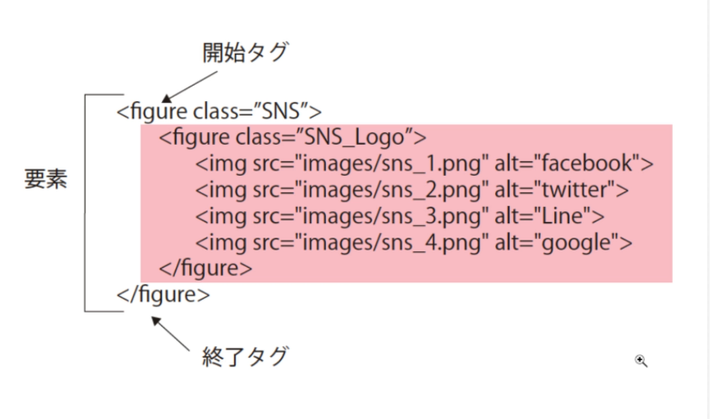

## section1 
- htmlとcssが分かれている理由
    - cssをhtmlの中に書くこともできるが、実際の開発現場では、WEB-INFフォルダ配下のようにフォルダが枝分かれしてhtml,cssが配置されているので、いろんなhtmlからqつのcssを呼び出すようにするのが良い。その方がcssを修正するとなったと気にcssファイル1つをしゅうせいすれば事足りるから。

- 

## section1 
- htmlとcssが分かれている理由
    - cssをhtmlの中に書くこともできるが、実際の開発現場では、WEB-INFフォルダ配下のようにフォルダが枝分かれしてhtml,cssが配置されているので、いろんなhtmlからqつのcssを呼び出すようにするのが良い。その方がcssを修正するとなったと気にcssファイル1つをしゅうせいすれば事足りるから。

- 

## section2
- 以下のh1をセレクターという。
- 以下の波ブロックを宣言ブロックという。
- font-sizeはプロパティ値
- 24pxはプロパティ値
```css
h1{
    font-size:24px;
    color:blue
}
```

- ボックスモデル
    - 一つ一つの要素を囲む箱のこと。marginとpaddingの境界線のアレのこと。
    - よってcssは、ボックスの大きさを決めて、どこに置くかを決めってって感じでパズルをするイメージ。
    - 

## section3
- html5以前では、クラス名やid名でよく使われていた名前が（headerやfooterやnavなど）がhtml5では
直接タグとして使えるよう新田。こうすることでタグを直接読み意味をコンピュータが理解でき分類できる。
- 画面の各要素にそれぞれwidthをつけて書くのではなくて一段上の全てを包む要素（container）を作ってそれにだけwidthをつければ中の要素もそのwidthに収まるし、その親コンテンを真ん中に寄せれば中のようそも真ん中に寄せられるよね
- cssではブロック内ではお案じプロパティは後ろに書いたものが優先される
```css
.cls1{
    height: 120px;
    background-color: #fff1ac;
    margin-bottom: 5px;
    margin-bottom: 50px;
}
```

- floatは古い方法。今はグリッドレイアウトなど使う。

ー 以下のように空白区切りでセレクタ指定すると .cls3クラス配下のp要素のみに適用できる
    - このやり方でないと、以下のｐ要素に新たにクラス名などつけて＝ってするのでcssに書くセレクタふえて見づらくなっちゃう。だからこれ便利
```css
.cls3 p{
    font-size:10px;
}
```

- 以下のように複数クラスにおんなじプロパティと値がある場合はまとめたい。そんな時は以下のように書く
    - カンマで区切レバ複数に適用可能
```css
.cls3, .cls4{
    background-color: crimson;
}
```
## 4章
- グリッドレイアウトではページを縦横のラインで区切って、その中のラインで囲まれた長方形の中に要素を配置します。
    - 区切った線には縦横それぞれ左と上から１、２、３と番号がついている
    - この区切られた区画をセルという
    - 区切って複数セルを合体させたりして要素を配置します
    - これはほぼエクセルで作業している感じ。グリッドレイアウトはエクセルの２次元の配置と同じ
    - グリッドレイアウトでは縦横線を引くその一面を一つの要素で囲む

- とりあえず親要素のcssを書く。これは大枠を決める感じの段階
```html
<body>

<div class="container">
  <header class="itemA">itemA</header>
  <aside  class="itemB" >itemB</aside>
  <main   class="itemC"  >itemC</main>
</div>

</body>
```
```css
.container{
    /* この要素の中身がgridレイアウトになりますよという宣言 */
    display:grid;

    width:800px;
    /* 縦に180と残りのスペースを1つとして区切るの意 */
    grid-template-columns: 180px 1fr;

    /* 横に120と90と区切るの意 */
    grid-template-rows: 120px 90px;
}
```

- 中のitemらをグリッドアイテムという。
    - 以下のように書く。基本的に、どの線とどの線の間に位置付けるかの記述をする
    ```css
        .itemA{
        /* 縦線の1番目をgrid-column-startという */
        /* 縦線の最後をgrid-column-endという */
        /*  以下では1と2の縦線の間を指定しているということになる */
        grid-column-start:1 ;
        grid-column-end: 2;
        /* ↑は省略してgrid-column: 1/2　； とかける */

        /* 横線も上記と同じ感じ。 */
        grid-row-start:1 ;
        grid-row-end: 3;
        /* ↑は省略してgrid-row: 1/3　； とかける */
        background-color: aqua;
        }
        .itemB{
            grid-column: 2/3;
            grid-row: 1/2;
            background-color:bisque;
        }
        .itemC{
            grid-column: 2/3;
            grid-row: 2/3;
            background-color:blue
        }
    ```
    

