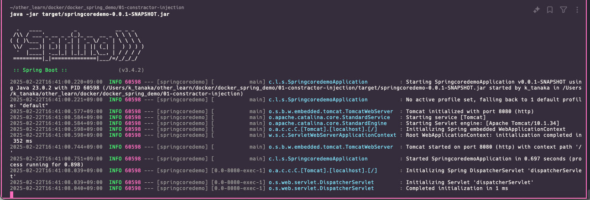

## まずシンプルなspringbootプロジェクトを作成

- http://localhost:8080/hello にアクセス時に画面位「helloworld」と返すような簡単なもの


    - これで、Docker コンテナーなしで (つまり、ホスト OS で) アプリケーションを実行できることを確認

- 「./mvnw package」を実行しプロジェクトのjarファイルを作成する
    - 「java -jar target/springcoredemo-0.0.1-SNAPSHOT.jar」で👆で作ったjarファイルを実行する(jarファイル名はそれぞれ修正なら修正してください)
        - これで、jarを使ってアプリケーションを実行できることを確認
        


## Dockerfileを作成
- project直下にDockerfileを作成

```txt
# ベースイメージとしてOpenJDK 23のslimバージョンを使用
FROM openjdk:23-jdk-slim

# 作成したアプリケーションのJarファイルをイメージ内にコピー
COPY target/springcoredemo-0.0.1-SNAPSHOT.jar /app.jar

ENTRYPOINT ["java","-jar","/app.jar"]
```

- 「docker build -t springdemo .」でDockerfileからimageを作成
    - -tオプションはイメージに名前をつけるだけなのでなくても良い。
    - docker build . とかでも良い。
    - 以下生成されたイメージ
    ```txt
    $ docker images
    REPOSITORY               TAG         IMAGE ID       CREATED         SIZE
    springdemo               latest      4b85372522da   4 minutes ago   488MB
    ```

## docker imageからコンテナを生成・起動
- 「docker run -p 8080:8080 springdemo」でコンテナ生成・起動
    - -p オプションはホスト側とコンテナ側のポートを繋げるってイメージ。
    - ブラウザでhttp://localhost:8080にアクセスすれば、コンテナの8080にアクセスしますよって設定をしている
    - http://localhost:8080/hello にアクセスし意図した通りの画面が表示されればOK
- 


- ここまで参考にしたサイト
    - https://spring.pleiades.io/guides/gs/spring-boot-docker

## docker composeを使って起動してみる
- Dockerfileと同じディレクトリにdocker-compose.ymlファイルを作成
- ファイル内に以下を記載
    ```yml
    version: '3'
    services:
    web:
        build: .                              #カレントディレクトリのDockerfileをビルド
        container_name: springdemo_compose
        tty: true
        ports:
        - "8080:8080"
    ```
- 「docker compose up -d」で起動
- http://localhost:8080/hello にアクセスし意図通りの画面描画がされればOK


## DBコンテナを立ててみる
- MySQL をダウンロードし、インストールし、設定し、MySQL データベースをサービスとして実行する代わりに、MySQL 用の Docker 公式イメージを使い、コンテナとして実行できるようしてみる


``` docker pull mysql:latestでイメージをdockerhubからｐullする
$ docker images
REPOSITORY                      TAG         IMAGE ID       CREATED             SIZE
springdemo                      latest      4b85372522da   About an hour ago   488MB
01-constractor-injection-web    latest      9c0ae05cf030   About an hour ago   488MB
01-constractor-injection-java   latest      64fa53c56d29   About an hour ago   488MB
rails-test2                     latest      a5b078e82af3   19 hours ago        953MB
twitter_clone-web               latest      9461f7dd1d50   47 hours ago        1.17GB
my-spring-app3                  latest      43c62558ac8d   2 days ago          488MB
my-spring-app2                  latest      e50fa9cd1d2a   2 days ago          483MB
my-spring-app                   latest      de2815855700   2 days ago          423MB
mysql                           8.0         23b013c7c67d   7 months ago        572MB
```

- 続いてmysqlコンテナの起動
    - 起動コマンドについては、Docker HubのMySQLのページに雛形が載っています。
    - https://hub.docker.com/_/mysql

    ```txt
    $ docker run --name test-mysql -p 10000:3306 -e MYSQL_ROOT_PASSWORD=root -d mysql
    609fda8696e65ddaa6aafbcbbc4f5bc531de9b492efe26db2502a6c82bb74972
    ```

    - コンテナが起動していることを確認
    ```txt
    $ docker ps
    CONTAINER ID   IMAGE                          COMMAND                  CREATED          STATUS          PORTS                                NAMES
    609fda8696e6   mysql                          "docker-entrypoint.s…"   3 seconds ago    Up 3 seconds    33060/tcp, 0.0.0.0:10000->3306/tcp   test-mysql
    ```

- コンテナの中に入る
    - docker exec -it test-mysql bash
        - コンテナのNAMESの値を指定すること
    - bash-5.1#と表示されればOK

- コンテナ内からｓｑｌに接続
```
bash-5.1# mysql -u root -p
Enter password: #ここは左悪鬼のdocker run のコマンドで-eオプションでk環境変数として指定したMYSQL_ROOT_PASSWORDを入力
Welcome to the MySQL monitor.  Commands end with ; or \g.
Your MySQL connection id is 9
Server version: 9.2.0 MySQL Community Server - GPL

Copyright (c) 2000, 2025, Oracle and/or its affiliates.

Oracle is a registered trademark of Oracle Corporation and/or its
affiliates. Other names may be trademarks of their respective
owners.

Type 'help;' or '\h' for help. Type '\c' to clear the current input statement.

mysql> show tables
    -> ;
```

- DDLなど実行してみる
```txt
mysql> show tables
    -> ;
ERROR 1046 (3D000): No database selected
mysql> show databases;
+--------------------+
| Database           |
+--------------------+
| information_schema |
| mysql              |
| performance_schema |
| sys                |
+--------------------+
4 rows in set (0.01 sec)

mysql> create database student_tracker
    -> ;
Query OK, 1 row affected (0.01 sec)

mysql> show databases;
+--------------------+
| Database           |
+--------------------+
| information_schema |
| mysql              |
| performance_schema |
| student_tracker    |
| sys                |
+--------------------+
5 rows in set (0.00 sec)

mysql> use student_tracker;
Database changed
mysql> CREATE TABLE `student` (
    ->   `id` int NOT NULL AUTO_INCREMENT,
    ->   `first_name` varchar(45) DEFAULT NULL,
    ->   `last_name` varchar(45) DEFAULT NULL,
    ->   `email` varchar(45) DEFAULT NULL,
    ->   PRIMARY KEY (`id`)
    -> ) ENGINE=InnoDB AUTO_INCREMENT=4 DEFAULT CHARSET=latin1;
Query OK, 0 rows affected (0.02 sec)

mysql> show tables;
+---------------------------+
| Tables_in_student_tracker |
+---------------------------+
| student                   |
+---------------------------+
1 row in set (0.00 sec)

mysql> select * from student;
Empty set (0.01 sec)

mysql>
```
- https://masayun.com/2024/08/31/docker-2/
- https://hub.docker.com/_/mysql

## ローカルのアプリからDBコンテナに接続してみる
- springbootアプリケーション（単にローカルで実行しているだけのもの）のDBの接続先を変える
- 修正点はspring.datasource.urlのlocalhostのポートを10000に変えるだけ。
    - 先ほど「$ docker run --name test-mysql -p 10000:3306 -e MYSQL_ROOT_PASSWORD=root -d mysql」
    したと思うが、このコマンドのーpオプションで、ローカルの10000ポートに接続したら、コンテナの3306に自動で行ってくれるって設定をしたよね、
```txt
spring.datasource.url=jdbc:mysql://localhost:3306/student_tracker
spring.datasource.username=root
spring.datasource.password=root
```
⇩
```txt
spring.datasource.url=jdbc:mysql://localhost:10000/student_tracker
spring.datasource.username=root
spring.datasource.password=root
```
- ちなみに今回使ったspringアプリは「アプリ起動直後にDBテーブルにデータを入れる処理をしています
    ```java
    package com.luv2code.cruddemo;

    import com.luv2code.cruddemo.dao.StudentDAO;
    import com.luv2code.cruddemo.entity.Student;
    import org.springframework.boot.CommandLineRunner;
    import org.springframework.boot.SpringApplication;
    import org.springframework.boot.autoconfigure.SpringBootApplication;
    import org.springframework.context.annotation.Bean;

    @SpringBootApplication
    public class CruddemoApplication {

        public static void main(String[] args) {
            SpringApplication.run(CruddemoApplication.class, args);
        }

        @Bean
        public CommandLineRunner commandLineRunner(StudentDAO studentDAO){
            return runner ->{
    //			createStudent(studentDAO);
                createMultipleStudent(studentDAO);
            };
        }

        private void createMultipleStudent(StudentDAO studentDAO) {

            System.out.println("creating a new student object");
            Student tempStudent1 = new Student("sasaki","rei","kenya6111@gmail.com");
            Student tempStudent2 = new Student("nakasima","moo","kreirei@gmail.com");
            Student tempStudent3 = new Student("yamada","hoge","ryoutya@gmail.com");

            System.out.println("saving the students...");
            studentDAO.save(tempStudent1);
            studentDAO.save(tempStudent2);
            studentDAO.save(tempStudent3);

            System.out.println("saved student. generated id: "+ tempStudent1.getId());
            System.out.println("saved student. generated id: "+ tempStudent2.getId());
            System.out.println("saved student. generated id: "+ tempStudent3.getId());
        }
    }
    ```

- 無事DBとの通信ができたことを確認
``txt
mysql> select * from student;
+----+------------+-----------+---------------------+
| id | first_name | last_name | email               |
+----+------------+-----------+---------------------+
|  4 | sasaki     | rei       | kenya6111@gmail.com |
|  5 | nakasima   | moo       | kreirei@gmail.com   |
|  6 | yamada     | hoge      | ryoutya@gmail.com   |
+----+------------+-----------+---------------------+
3 rows in set (0.00 sec)
``
## DBコンテナをdocker compsose起動する

- docker compose.ymlに以下を記載
```yml
version: '3'

services:
  database:
    image: mysql:latest
    container_name: mysql-container
    ports:
      - '10000:3306'
    environment:
      MYSQL_DATABASE: student_tracker
      MYSQL_USER: user
      MYSQL_PASSWORD: password
      MYSQL_ROOT_PASSWORD: root
```
- 「## ローカルのアプリからDBコンテナに接続してみる」で使ったローカルのアプリを起動実行

- 
```txt
$ docker exec -it mysql-container bash
bash-5.1# mysql -u root -p
Enter password:
Welcome to the MySQL monitor.  Commands end with ; or \g.
Your MySQL connection id is 23
Server version: 9.2.0 MySQL Community Server - GPL

Copyright (c) 2000, 2025, Oracle and/or its affiliates.

Oracle is a registered trademark of Oracle Corporation and/or its
affiliates. Other names may be trademarks of their respective
owners.

Type 'help;' or '\h' for help. Type '\c' to clear the current input statement.

mysql> show tables
    -> ;
ERROR 1046 (3D000): No database selected
mysql> show databases;
+--------------------+
| Database           |
+--------------------+
| information_schema |
| mysql              |
| performance_schema |
| student_tracker    |
| sys                |
+--------------------+
5 rows in set (0.02 sec)

mysql> CREATE TABLE `student_tracker`.`student` (
    ->     `id` int NOT NULL AUTO_INCREMENT,
    ->     `first_name` varchar(45) DEFAULT NULL,
    ->     `last_name` varchar(45) DEFAULT NULL,
    ->     `email` varchar(45) DEFAULT NULL,
    ->     PRIMARY KEY (`id`)
    -> ) ENGINE=InnoDB AUTO_INCREMENT=4 DEFAULT CHARSET=latin1;
Query OK, 0 rows affected (0.02 sec)

mysql> show databases;
+--------------------+
| Database           |
+--------------------+
| information_schema |
| mysql              |
| performance_schema |
| student_tracker    |
| sys                |
+--------------------+
5 rows in set (0.00 sec)

mysql> use student_tracker;
Reading table information for completion of table and column names
You can turn off this feature to get a quicker startup with -A

Database changed
mysql> select * from student;
Empty set (0.00 sec)
                                    ←（このタイミングでspringアプリケーションを起動）
mysql> select * from student;
+----+------------+-----------+---------------------+
| id | first_name | last_name | email               |
+----+------------+-----------+---------------------+
|  4 | sasaki     | rei       | kenya6111@gmail.com |
|  5 | nakasima   | moo       | kreirei@gmail.com   |
|  6 | yamada     | hoge      | ryoutya@gmail.com   |
+----+------------+-----------+---------------------+
3 rows in set (0.00 sec)

mysql>
```
- 無事DBと通信できていることが確認できた。

- 

##   
- 10000:3306 というポートマッピングは 「ホストマシンのポート10000をMySQLの3306に転送する」 という設定。
コンテナ同士はホストマシンを経由せず、直接3306で通信するため、10000を指定する必要はない。

$ docker network ls
NETWORK ID     NAME                               DRIVER    SCOPE
aa30321da21c   01-constractor-injection_default   bridge    local
e0bc5024c29c   01-cruddemo-student_default        bridge    local
06e8e1fc0abb   app_default                        bridge    local
9a77ec339370   bridge                             bridge    local
f334f8e9f44f   compose_rails_default              bridge    local
2b767b131874   cruddemo2_default                  bridge    local
26024ca69e75   demo_default                       bridge    local
5ee25bb51702   django_ec_default                  bridge    local
f523d7420118   docker_db_demo_default             bridge    local
5130a5f97316   host                               host      local
e9d88013bc86   none                               null      local
08f7964daa87   rails_docker_default               bridge    local
3699ac108931   todo-app                           bridge    local
c65295dc3950   twitter_clone_default              bridge    local

$ docker network create mynetwork
592125e90b7d38ae915f07ac3e35b27617d3bf53c493c461b66d78d8443cb9e4
docker network ls
NETWORK ID     NAME                               DRIVER    SCOPE
aa30321da21c   01-constractor-injection_default   bridge    local
e0bc5024c29c   01-cruddemo-student_default        bridge    local
06e8e1fc0abb   app_default                        bridge    local
9a77ec339370   bridge                             bridge    local
f334f8e9f44f   compose_rails_default              bridge    local
2b767b131874   cruddemo2_default                  bridge    local
26024ca69e75   demo_default                       bridge    local
5ee25bb51702   django_ec_default                  bridge    local
f523d7420118   docker_db_demo_default             bridge    local
5130a5f97316   host                               host      local
592125e90b7d   mynetwork                          bridge    local
e9d88013bc86   none                               null      local
08f7964daa87   rails_docker_default               bridge    local
3699ac108931   todo-app                           bridge    local
c65295dc3950   twitter_clone_default              bridge    local

$ docker network connect mynetwork mysql-container

$ docker network inspect mynetwork
[
    {
        "Name": "mynetwork",
        "Id": "592125e90b7d38ae915f07ac3e35b27617d3bf53c493c461b66d78d8443cb9e4",
        "Created": "2025-02-22T13:00:06.355976922Z",
        "Scope": "local",
        "Driver": "bridge",
        "EnableIPv6": false,
        "IPAM": {
            "Driver": "default",
            "Options": {},
            "Config": [
                {
                    "Subnet": "172.29.0.0/16",
                    "Gateway": "172.29.0.1"
                }
            ]
        },
        "Internal": false,
        "Attachable": false,
        "Ingress": false,
        "ConfigFrom": {
            "Network": ""
        },
        "ConfigOnly": false,
        "Containers": {
            "5badd43a7423393245c0409bf77773cffea977e1c926aa2ae608d83ed9e0edc9": {
                "Name": "mysql-container",
                "EndpointID": "86b412582f4000547db553f8b2ba8b70ac13f8c5267b3114432d26db8f466347",
                "MacAddress": "02:42:ac:1d:00:02",
                "IPv4Address": "172.29.0.2/16",
                "IPv6Address": ""
            }
        },
        "Options": {},
        "Labels": {}
    }
]

一般的に ping は ネットワーク接続をテストするコマンド で、あるホストが到達可能かどうかを確認できます。
sh
コピーする
編集する
ping google.com
応答が返ってくる → 通信ができている
応答が返ってこない → ネットワークの問題がある


まず、 MySQL コンテナの IP アドレスを取得 します。

sh
コピーする
編集する
docker inspect -f '{{range.NetworkSettings.Networks}}{{.IPAddress}}{{end}}' mysql-container