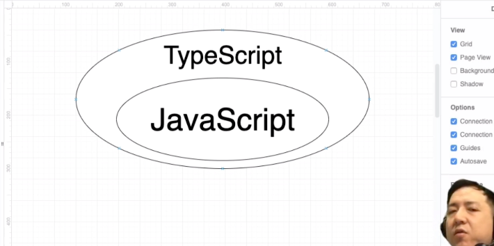

## 1章
- https://www.udemy.com/course/ts-for-js-developers/learn/lecture/17754234#overview
    - TypeScript is a superset of JavaScript that compiles to clean JavaScript output.
        - superset = A set which includes another set or sets
        - 1つの集合あるイワ複数の集合を含む大きな集合

    
    - javascriptでもできることはtypescriptでもできる
    - typescriptの開発元はマイクロソフト
    - 「:」はtypescriptの世界では型を指定するときに用いるもの
## 2章
- nodejsはjavascriptの実行環境のこと
- なぜnodejsがいるのか
    - typescriptのコードは素のtypescriptのコードのままで実行できない
    - なのでtsコードをjsに変換する・これをコンパイル・トランスパイルという。
    - これには専用のコンパイラのライブラリが必要。
    - そのライブラリの実行にnodejsの環境が必要

    - あとtsからjsに変換されたjsのコードを実行するためにも必要

    - LTS=「ｌong time support」といって、長期間サポートが付いてますよって、動作保証してますよって意味。推奨版。
    - 開発現場でCurrent使うことはほぼない

## 3章
- gitリポジトリ作成

## 4章