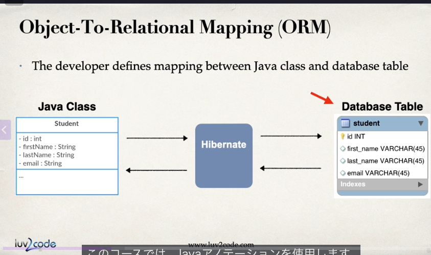
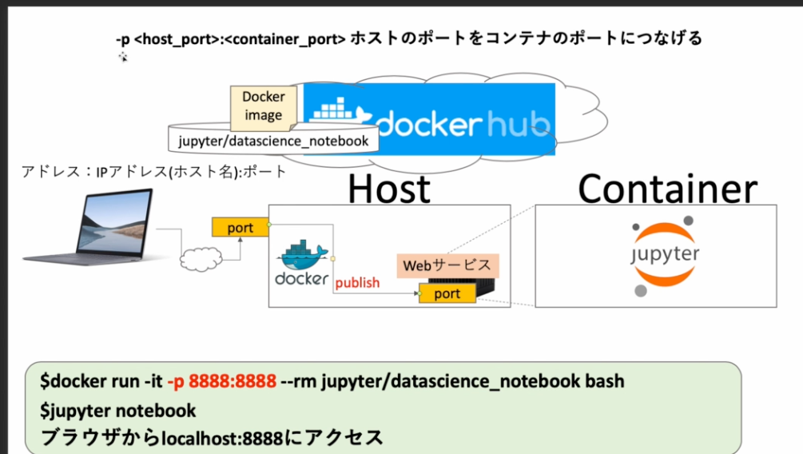
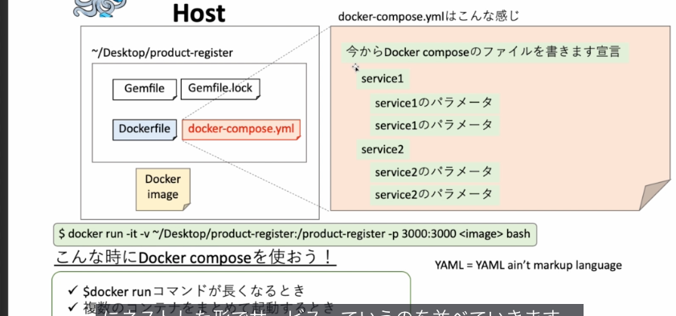
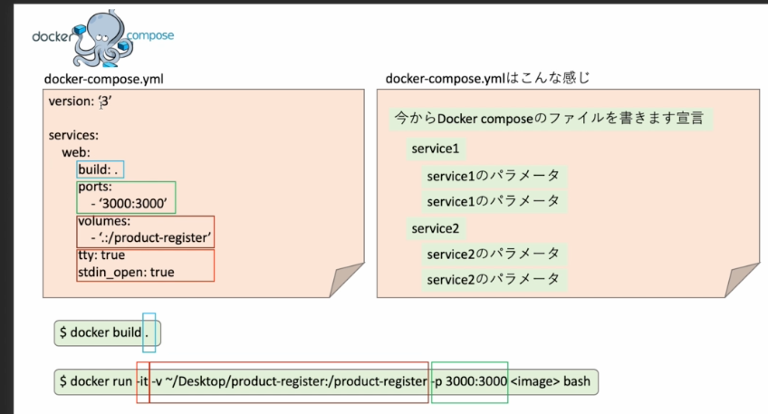
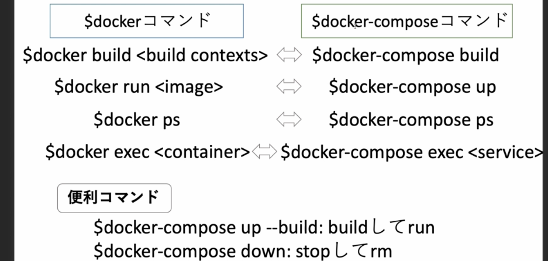

## 1章
- Dockerなしの場合、
    - インストーラのダウンロード→
    - インストーラの起動
    - エラーが出る
    - トラブルシュート
    - 再度インストーラを起動
    - エラーが出る
    - トラブルシュートに戻る
- Dockerありの場合
    - コンテナ起動する。おしまい。

- 自分のPCやサーバにコンテナをたくさん作ることができる
- コンテナ内に開発環境や実行環境を置くことができる、必要なパッケージやライブラリをインストールしておくことができる

- 実際の開発現場では、作業者がたくさんいて、Dockerがないと、各各が上記のDocker無しの場合の工程をやる必要があり、めちゃ工数かかる
- で、おんなじようにテスト環境でもインストールしてトラブルシュートして、、、てやるし、本番環境でも同じ。

- dockerを使えば誰かだ一つコンテナを作ってさえ仕前ばそれを配ってdocker compose コマンドとかすれば環境構築が終わる。すごい！
## 2章（Linuxの基礎）
- DockerはLinuxのコンテナ技術を使っており、linuxの基礎知識が必要
    - LinuxはUnixというOSから派生されたオープンソースのOS
- シェルについて
    - LinuxのOSにはkernel(核)がある。ここに命令を実際は出したい。
    - でもPCのユーザは直接kernelに命令できない。
    - そこでkernelの包むshell(殻)があるので、それを通して、kernelに命令を俺たちは出している
    - bash, zsh, sh, → これらはShell(殻)。
    - shellを起動して使うのに必要なのがターミナル。
    - ターミナルを使ってシェルに命令を出して、そのシェルがカーネルに命令を出す。
    - なので、ターミナルはあくまでも bashとかzshとかのシェルを動かすためのアプリ。

- 環境変数について
    - 環境変数というのは、OSの上で動くプロセスが情報を共有するための変数
        - echo $SHELLで今使っているシェルが何かを確認できる(大体みんなbash。最近買った人はzsh)
        - 以下が使ってるシェルのパス。
        ```
        echo $SHELL
        /bin/zsh
        ```

    - export で環境変数を作成できる
        - これらのコマンドもシェルを通してカーネルに命令を出している。
        ```
        export AGE=20
        echo $AGE
        20
        ```
        - 「$」は環境変数ですよってマークだと思っとけばいい。


    - cd（current directly）
    - pwd(print working directory)

## 3章
- docker hubとは
    - docker imageを管理するDockerレジストリ
    - docker imageはコンテナを作る元になる
    - 基本的にimageを誰かに渡してコンテナの情報を共有する
    - githubはコードを管理するレジストリだが、これはimageを管理するレジストリ
    - いろんな人のdocker imageが管理されてるのでそれのダウンロードに使うくらいで、docker hubにアクセスして自分で何かするってことはあまりないっぽい

- docker desktop
    - mac用のdockerのアプリ。docker hubにログインしたらインストールできた
    - macのホーム画面の上のdockerマーク押下時に緑のマークになってればすでにdockerが動いている状態になる

## 4章（Dockerを使ってみる）
- what is docker
    - 簡単にいうとAさんとBさんが開発環境や実行環境をチームで同じものを使うために使うもの
    - A,Bさんは同じアプリを作ってるので同じ開発環境である必要がある(使ってるライブラりやバージョン)
    - テスト環境や本番環境も開発環境と同じ必要がある・
        - ここが違うと、Aさんの開発環境でテストしてOKだったけど、テスト環境では動かなかったみたいなことが起こる。
    - これをコンテナを使うことで、同じ環境を簡単に高速に構築できる
    - docker hubからdockerimageをローカルに持ってくる
    - imageからコンテナを作る
    - コンテナに入って作業する
    - で、コンテナをもとにimageを新たに作る
    - 新しいimageをdocker hubにｐushすれば他の人が新しいimageでコンテナ作れる

- dockerhubからhello-worldをpullする
    - docker loginでログイン
    - docker pull <image>でimageをdocker hubからpull
    - docker images　でローカルにあるimageのリストを見れる
    
    - docker pull hello-worldで「hello-world」のイメージをpullする
    ```txt
    Using default tag: latest
    latest: Pulling from library/hello-world
    c9c5fd25a1bd: Pull complete
    Digest: sha256:e0b569a5163a5e6be84e210a2587e7d447e08f87a0e90798363fa44a0464a1e8
    Status: Downloaded newer image for hello-world:latest
    docker.io/library/hello-world:latest
    ```

    - docker imagesコマンドでローカルのimage確認。
        - TAGはimageのバージョン（バージョン指定しないとlatestがデフォでpullされる）
        - IMAGE IDはimageのハッシュ値
        ```txt
        REPOSITORY               TAG         IMAGE ID       CREATED        SIZE
        twitter_clone-web        latest      4a57779ba47f   24 hours ago   1.17GB
        hello-world              latest      f1f77a0f96b7   3 weeks ago    5.2kB
        ```

    - docker hubで「https://hub.docker.com/u/library?page=1&search=hello」にアクセスすると
        - library配下のリポジトリ（image）がたくさん出てくる
        - 1レポジトリに対して1つのimage。

- hello worldのコンテナを動かす
    - docker run <image>でコンテナを作る
    - docker psでローカル内のどんなコンテナがあるかを確認できる

    - docker run hello-worldでさっきのimageをコンテナ作成。
        ```txt
        -------------------------------------------------------------------------
        $ docker run hello-world

        Hello from Docker!
        This message shows that your installation appears to be working correctly.

        To generate this message, Docker took the following steps:
        1. The Docker client contacted the Docker daemon.
        2. The Docker daemon pulled the "hello-world" image from the Docker Hub.
            (arm64v8)
        3. The Docker daemon created a new container from that image which runs the
            executable that produces the output you are currently reading.
        4. The Docker daemon streamed that output to the Docker client, which sent it
            to your terminal.

        To try something more ambitious, you can run an Ubuntu container with:
        $ docker run -it ubuntu bash

        Share images, automate workflows, and more with a free Docker ID:
        https://hub.docker.com/

        For more examples and ideas, visit:
        https://docs.docker.com/get-started/
        ```

    - じゃあdocker psでローカルのコンテナ確認〜♪と思ったが出てこない。⇩
        - docker psはアクティブなコンテナだけ表示するもの。
            ```txt
            -------------------------------------------------------------------------
            $ docker ps
            CONTAINER ID   IMAGE                    COMMAND                  CREATED        STATUS                  PORTS                                            NAMES
            428f3870fcc2   twitter_clone-web        "python manage.py ru…"   24 hours ago   Up 24 hours             0.0.0.0:3000->3000/tcp                           twitter_clone-web-1
            d691342cfea8   schickling/mailcatcher   "sh -c 'mailcatcher …"   24 hours ago   Up 24 hours             0.0.0.0:1025->1025/tcp, 0.0.0.0:1080->1080/tcp   twitter_clone-smtp-1
            ef85989ffb7d   postgres                 "docker-entrypoint.s…"   24 hours ago   Up 24 hours (healthy)   0.0.0.0:5433->5432/tcp                           twitter_clone-db-1
            ```

    - なので「docker ps -a」とすればすべてのコンテナが出せる
        - helloworldコンテナのステータスがExitedになっている
        - Exitedは「コンテナ作って、プログラムを動かした途端すぐコンテナから抜ける」というイメージ。
        - さっきはhelloworldコンテナを作った際にテキストを出力するというプログラムがあったので、docker run した時になんか出てた。
        - その出力プログラムが終わり、すぐコンテナから抜けて、Exitedになっている
            ```txt
            docker ps -a
            CONTAINER ID   IMAGE                    COMMAND                  CREATED         STATUS                      PORTS                                            NAMES
            eb54ef15c007   hello-world              "/hello"                 3 minutes ago   Exited (0) 3 minutes ago                                                     sleepy_knuth
            428f3870fcc2   twitter_clone-web        "python manage.py ru…"   24 hours ago    Up 24 hours                 0.0.0.0:3000->3000/tcp                           twitter_clone-web-1
            d691342cfea8   schickling/mailcatcher   "sh -c 'mailcatcher …"   24 hours ago    Up 24 hours                 0.0.0.0:1025->1025/tcp, 0.0.0.0:1080->1080/tcp   twitter_clone-smtp-1
            ef85989ffb7d   postgres                 "docker-entrypoint.s…"   24 hours ago    Up 24 hours (healthy)       0.0.0.0:5433->5432/tcp                           twitter_clone-db-1
            6ad19d2a92aa   django_ec-web            "python manage.py ru…"   8 weeks ago     Created                                                                      django_ec-web-1
            54b8fcaa4e34   postgres                 "docker-entrypoint.s…"   3 months ago    Exited (128) 2 months ago                                                    django_ec-db-1
            dfa480d026d5   906700e23423             "python pip install …"   3 months ago    Exited (2) 3 months ago                                                      django_ec-web-run-42c26a16a515
            f2763c8eac2b   erd                      "erd"                    4 months ago    Exited (0) 4 months ago                                                      xenodochial_austin
            e16712320f66   erd                      "erd"                    4 months ago    Exited (0) 4 months ago                                                      tender_chebyshev
            7adc8de79aee   erd                      "erd"                    5 months ago    Exited (0) 5 months ago                                                      competent_burnell
            06426dce7b6c   erd                      "erd"                    5 months ago    Exited (0) 5 months ago                                                      fervent_hertz
            84e5d0a947e4   erd                      "erd"                    5 months ago    Exited (0) 5 months ago                                                      gallant_panini
            b3eaeeb060f4   erd                      "erd"                    5 months ago    Exited (0) 5 months ago                                                      loving_cori
            397d6b1cffa4   erd                      "erd"                    5 months ago    Exited (0) 5 months ago                                                      laughing_dirac
            c3b790e440d7   erd                      "erd"                    5 months ago    Exited (0) 5 months ago                                                      funny_chaplygin
            3bc26f08dcfc   erd                      "erd"                    5 months ago    Exited (0) 5 months ago                                                      hopeful_blackburn
            425ed87a257a   erd                      "erd"                    5 months ago    Exited (0) 5 months ago                                                      crazy_davinci
            0cab94d32ac6   mailhog/mailhog:v1.0.1   "MailHog"                6 months ago    Exited (2) 5 months ago                                                      docker-practice-mail
            0afcc14dc2c7   demo-db                  "docker-entrypoint.s…"   6 months ago    Exited (255) 5 months ago   3306/tcp, 33060/tcp                              docker-practice-db
            cf4099934d24   demo-app                 "php -S 0.0.0.0:8000…"   6 months ago    Exited (255) 5 months ago   0.0.0.0:18000->8000/tcp                          docker-practice-app
            f0fa5ef8b143   rails_docker-web         "bundle exec rails s…"   6 months ago    Exited (1) 5 months ago                                                      rails_docker-web-1
            debe576d86fc   postgres:12              "docker-entrypoint.s…"   6 months ago    Exited (0) 5 months ago                                                      rails_docker-db-1
            6074e390e50d   postgres                 "docker-entrypoint.s…"   6 months ago    Exited (0) 5 months ago                                                      compose_rails-db-1
            ```
        - 例えばテスト環境で常にコンテナがあるわけではない。Aさんがコード修正してテスト環境でテストする際に、A３のコードとdocker imageをテスト環境に送る
        - すると、テスト環境がimageからコンテナを作って、でコンテナの中にコードを実行するというプログラアムがあるので、それ実行してexitする。みたいな使い方もよくする
        - run create execute exitというサイクル。

    - 「docker run -it ubuntu bash」でubuntuのdocker imageをrunして、ubuntuのbashする
        - コンテナの中にUbuntuのOSが入っている状態
        - コンテナから出る時はexitで出る。
        - exitで出た場合はk音てなのステータスはExitedになっている
            ```txt
            $ docker run -it ubuntu bash
            root@5b758fe766f1:/# ls
            bin  boot  dev  etc  home  lib  media  mnt  opt  proc  root  run  sbin  srv  sys  tmp  usr  var
            root@5b758fe766f1:/# ls usr
            bin  games  include  lib  libexec  local  sbin  share  src
            root@5b758fe766f1:/# pwd
            /
            root@5b758fe766f1:/# touch test
            root@5b758fe766f1:/# ls
            bin  boot  dev  etc  home  lib  media  mnt  opt  proc  root  run  sbin  srv  sys  test  tmp  usr  var
            root@5b758fe766f1:/# exit
            exit
            ```

        - Exitedのステータスのコンテナに対して docker restartすると、Upになる(これでコンテナがリスタートされた)
            ```txt
            $ docker ps -a
            CONTAINER ID   IMAGE                    COMMAND                  CREATED         STATUS                      PORTS                                            NAMES
            5b758fe766f1   ubuntu                   "bash"                   7 minutes ago   Exited (0) 46 seconds ago                                                    confident_kalam
            eb54ef15c007   hello-world              "/hello"                 3 hours ago     Exited (0) 3 hours ago                                                       sleepy_knuth

            $ docker restart 5b758fe766f1
            5b758fe766f1
            docker ps -a
            CONTAINER ID   IMAGE                    COMMAND                  CREATED          STATUS                      PORTS                                            NAMES
            5b758fe766f1   ubuntu                   "bash"                   10 minutes ago   Up 2 seconds                                                                 confident_kalam
            eb54ef15c007   hello-world              "/hello"                 3 hours ago      Exited (0) 3 hours ago                                                       sleepy_knuth
            ```
        ⇩
        - 再度コンテナに入る（コンテナのbashを開いてコンテナのOSに対して命令ができる状態にする）
            - docker execをする　(コンテナを指定してコンテナに対して何かプログラムを実行する)
            - docker exec -it <container> bash (execはコンテナに対してするもの)

            - docker run -it ubuntu bash ←runの方はimageに対してやるやつ。（ubuntuはimage名だね）(image名をしてrunしていた。)

            - -itはbashk移動時に必要なおまじない。

        - exit と detachの違い
            - exitはコンテナを出るときにコンテナを動かしているプロセスを切って出る
                - docker exec -it <container> bash後「Exit」で出たらコンテナステータスが「exited」になった。
                - なのでdocker restartしてUpにして
                - またdocker exec -it <container> bashでコンテナに入った。
                - execコマンドはステータスがexitedに対しては実行できない

            - detachはプロセスを残したままコンテナからで流。
                - detachで出る時は「Ctrl + @ + q」で出るが出た後はコンテナのステータスが「Up」のままになってる。
                - detachで出たコンテナに再度入る時は「docker attach」で入る
            - 基本的にはexitkoマンドを時効することが多い

- コンテナをdocker imageにする
    - docker commit <container> <new image>
        ```txt
        $ docker ps -a
        CONTAINER ID   IMAGE                    COMMAND                  CREATED          STATUS                      PORTS                                            NAMES
        5b758fe766f1   ubuntu                   "bash"                   31 minutes ago   Up 2 minutes                                                                 confident_kalam
        eb54ef15c007   hello-world              "/hello"                 4 hours ago      Exited (0) 4 hours ago                                                       sleepy_knuth

        $ docker commit 5b758fe766f1 ubuntu:updated
        sha256:ba74b561d3eee9a2649eb48b64e2267b430843a06b60b5054be178b130a247f2
        $ docker images
        REPOSITORY               TAG         IMAGE ID       CREATED         SIZE
        ubuntu                   updated     ba74b561d3ee   7 seconds ago   101MB
        ubuntu                   latest      ffb64c9b7e8b   8 months ago    101MB
        ```
- さっきので新しくなったコンテナをいmageにしたので、docker hubにプッシュして他の人も更新されたイメージを使えるようにする
- dockerhubではリポジトリがいろいろあって、その中でimageを管理している。
    - 今までイメージ名と表示されていたのは「Repository名: TAG名」だった。
    - ubuntuなら「library/ubuntu:latest」って感じで。（library/ubuntuがリポジトリ名で、latestがTAG名）
    - 単にREPOSITORY名だけ尾をイメージ名とする場合もある
    - リポジトリ名はハイフンで繋げるのが一般的
- なのでまずdocker hubにリポジトリを作成する
    - 今回は「my-test-repo」という名前でリポジトリを作成
    - イメージをプッシュするにあたって「image名をリポジトリ名」に合わせる必要がある
        - 理由は,dockerは1つのイメージに対して1つのリポジトリが対応するってのは前回話した通り。
        - で、dockerはimageをpushするときにプッシュ先を探しにいく必要があるよね、
        - そのプッシュ先を探すときにdockerは基本的にimageの名前を見て、どこのリポジトリにプッシュすればいいか探す
        - そのイメージ名の変更に使うのが次のコマンド
            - 「docker tag <source> <target>」
            - <source>が変更したいiamgeの「repository名:タグ名」
            - <target>が修正後の名前。新たに作ったリポジトリ名に合わせる。「user名:新たに作ったリポジトリ名」
            - 右記のコマンドになる。docker tag ubuntu:updated kenya6111/my-test-repo
            - すると以下のように同じイメージに別のタグ名のものができた。（イメージIDが同じなので新たにイメージが作られたわけではない。同じイメージに複数のタグがついているような状態。）
            ```txt
            $ docker tag ubuntu:updated kenya6111/my-test-repo
            $ docker images
            REPOSITORY               TAG         IMAGE ID       CREATED        SIZE
            kenya6111/my-test-repo   latest      ba74b561d3ee   24 hours ago   101MB
            ubuntu                   updated     ba74b561d3ee   24 hours ago   101MB
            ```

- DockerHubにdocker imageをpushする
    - docker push <さっき作ったimageのリポジトリ名>
    - docker push kenya6111/my-test-repoとなる

- docker のimageを削除する
    - docker rmi <image>

- docker hub のimageをｐullする
    - docker pull <さっきpushしたリポジトリの名前>
    - docker pull kenya6111/my-test-repo:latest となる


## 5章
- docker runは何をしているか
    - docker imageからコンテナにするコマンドだたね。
        - run後にローカルにイメージないか探して、なかったらdocker hubからイメージとってくるってやつだ多Tね。
    - 実際runは何をしているかというと、 「run = create + start」をしている

    - docker run hello-worldをやると以下のように文字が出力される
    - docker startはどのコンテナにもあるデフォルトのコマンドを実行してくれるってだけのやつ
    - hello-worldでは、デフォルトコマンドはテキスト出力なので、runすると以下のようにテキストが出てくる。
    - 何度もかくがdocker startはコンテナのデフォルトコマンドを実行するだけ。
    - なのでrun してもコンテナはExitedのまま
    ```txt
    docker run hello-world

    Hello from Docker!
    This message shows that your installation appears to be working correctly.

    To generate this message, Docker took the following steps:
    1. The Docker client contacted the Docker daemon.
    2. The Docker daemon pulled the "hello-world" image from the Docker Hub.
        (arm64v8)
    3. The Docker daemon created a new container from that image which runs the
        executable that produces the output you are currently reading.
    4. The Docker daemon streamed that output to the Docker client, which sent it
        to your terminal.

    To try something more ambitious, you can run an Ubuntu container with:
    $ docker run -it ubuntu bash

    Share images, automate workflows, and more with a free Docker ID:
    https://hub.docker.com/

    For more examples and ideas, visit:
    https://docs.docker.com/get-started/
    ```

    - run = create startのcreateはコンテナを作るだけ。
        - docker create hello-world
        - createはこんんてなが作られるだけでコンテナのデフォルトコマンドは実行されない。
        - docker create後はコンテナのステータスは「created」
        ```txt
        $ docker ps -a
        CONTAINER ID   IMAGE                    COMMAND                  CREATED          STATUS                      PORTS                                            NAMES
        7d3246f2af2e   hello-world              "/hello"                 2 minutes ago    Exited (0) 2 minutes ago                                                     adoring_herschel
        7dc7f2eaca69   kenya6111/my-test-repo   "bash"                   17 minutes ago   Exited (0) 17 minutes ago                                                    hopeful_bouman
        5b758fe766f1   ubuntu                   "bash"                   42 hours ago     Up 42 hours                                                                  confident_kalam

        $ docker create hello-world
        e6db0ee54ac9fd7acb2438f1bf30d289440d4ce37807ef0cd06a1e91c721beec

        $ docker ps -a
        CONTAINER ID   IMAGE                    COMMAND                  CREATED          STATUS                      PORTS                                            NAMES
        e6db0ee54ac9   hello-world              "/hello"                 2 seconds ago    Created                                                                      recursing_hofstadter
        7d3246f2af2e   hello-world              "/hello"                 4 minutes ago    Exited (0) 4 minutes ago                                                     adoring_herschel
        7dc7f2eaca69   kenya6111/my-test-repo   "bash"                   19 minutes ago   Exited (0) 19 minutes ago                                                    hopeful_bouman
        5b758fe766f1   ubuntu                   "bash"                   42 hours ago     Up 42 hours                                                                  confident_kalam
        ```
    
    - docker start <コンテナID>でコンテナスタートできる
        - docker start 
        - docker start すると、コンテナのデフォルトコマンド実行された後にする様Exitedになる
        - ただ、普通にdocker startしただけでは、デフォルトコマンドの出力が見えない。
        - dokcer start -a e6db0ee54ac9とすると、テキスト出力される

- コマンドの上書き
    - 普通にdocker run <image>すると、コンテナのデフォルトのコマンドが実行される
    - それを、docker run <image><command>で、デフォルトコマンドではなく、指定したコマンドが実行される・

    - docker psした時に、COMMAND列の値が、デフォルトコマンドとなる。　
    ```txt
    docker ps
    CONTAINER ID   IMAGE                    COMMAND                  CREATED      STATUS                PORTS                                            NAMES
    5b758fe766f1   ubuntu                   "bash"                   2 days ago   Up 2 days                                                              confident_kalam
    428f3870fcc2   twitter_clone-web        "python manage.py ru…"   4 days ago   Up 4 days             0.0.0.0:3000->3000/tcp                           twitter_clone-web-1
    d691342cfea8   schickling/mailcatcher   "sh -c 'mailcatcher …"   4 days ago   Up 4 days             0.0.0.0:1025->1025/tcp, 0.0.0.0:1080->1080/tcp   twitter_clone-smtp-1
    ef85989ffb7d   postgres                 "docker-entrypoint.s…"   4 days ago   Up 4 days (healthy)   0.0.0.0:5433->5432/tcp                           twitter_clone-db-1
    ```

    - なので、docker run ubuntu としても実際はbashが起動されていた！でもすぐExitしているのでdocker run ubuntu しても、何もコマンドラインには出ないように見える
    ```txt
    $ docker run ubuntu
    $ docker run ubuntu ls
    bin
    boot
    dev
    etc
    home
    lib
    media
    mnt
    opt
    proc
    root
    run
    sbin
    srv
    sys
    tmp
    usr
    var

    $ docker run ubuntu pwd
    /
    ```
    - docker run ubuntu pwdとかすると、pwdkコマンドで、デフォルトコマンドを上書きしている！！
    - docker run imageでデフォルトのコマンドが実行される。
    - デフォルトコマンドは上掛ける！！重要

-  -itとはなんなのか
    - 「-i」＝インプット可能（ホストからコンテナへのチャネルを開く）
    - 「-t」＝表示が綺麗になる
- コンテナの削除
    - docker stop <container> （コンテナをとめる）
    - docker rm <container> (コンテナの削除)　（docker ps の一覧から消すイメージ）
    - docker system prune（コンテナ全削除）


## 6章
-Dockerfile
    - docker iiamgeクォどういうイメージでってテキスト書いてあるのもの。
    - docker imageの設計図
    - 今までdocker hubからdocker imageを撮ってきてたが、実務ではDockerfileからdocker imageを作ることが多い
    - Dockerfileを自由にかける＝＝dockeｒを自由に使いこなせる
    - DockerfileがDockerの真骨頂
- FROM, RUN, ADD ←docker インストラクションという。

- FROM
    - 元となるベースのイメージ
- RUN
    - dockerfileからdockerimage作る時に実行するコマンド

- docker build コマンド
    - Dockerfileからdockerimageを作成するコマンド
    - 単にdocker build ~とするとNoneという名前のイメージができてしまいわかりにくい
        - そういう時は dokcer build -t <name> <directory>で名前をつけてimageを作れる

    - Dockerfileのあるディレクトリでdocker buildするルール
    ```Dockerfile
        FROM ubuntu:latest
        RUN touch test
    ```

    - docker build -t unkoimage .
        ```txt
        docker build -t unkoimage .

        [+] Building 0.1s (6/6) FINISHED                                                                                                                                                            docker:desktop-linux
        => [internal] load build definition from Dockerfile                                                                                                                                                        0.0s
        => => transferring dockerfile: 107B                                                                                                                                                                        0.0s
        => [internal] load metadata for docker.io/library/ubuntu:latest                                                                                                                                            0.0s
        => [internal] load .dockerignore                                                                                                                                                                           0.0s
        => => transferring context: 2B                                                                                                                                                                             0.0s
        => [1/2] FROM docker.io/library/ubuntu:latest                                                                                                                                                              0.0s
        => CACHED [2/2] RUN touch test                                                                                                                                                                             0.0s
        => exporting to image                                                                                                                                                                                      0.0s
        => => exporting layers                                                                                                                                                                                     0.0s
        => => writing image sha256:794f122846d1a6d130cd5c74cb9c5d582badba32e31cc635038a655730bfab94                                                                                                                0.0s
        => => naming to docker.io/library/unkoimage                                                                                                                                                                0.0s

        View build details: docker-desktop://dashboard/build/desktop-linux/desktop-linux/soi74mrf3uqcw2n013sq0n1sm

        What's next:
            View a summary of image vulnerabilities and recommendations → docker scout quickview
        ```

    - 作ったunkoimageをdocker runしてコンテナかする
    ```txt
    $ docker run -it unkoimage bash
    root@488c13b3db6b:/# ls
    bin  boot  dev  etc  home  lib  media  mnt  opt  proc  root  run  sbin  srv  sys  test  tmp  usr  var
    root@488c13b3db6b:/#
    ```
    - ちゃんとtestファイルがあるので,Dockerfileの RUN touch testが実行されたのがわかる

## 7章
- FORM
    - ベースとなるイメージを決定
    - DockerfileはFROMから書き始める
    - ほとんどの場合はOSを指定
    - さっきのRUN touch testも、「FROM ubuntu 」でインストールしたOSの土台があってできること。

- RUN
    - Linuxkおマンドを実行
    - RUNを使うことで好きなようにカスタマイズできる
    - RUN毎にLayerが作られる
    ```Dockerfile
    FROM ubuntu:latest
    RUN touch test
    RUN echo 'hello world' > test
    RUN やりたいこと
    RUN やりたいこと
    RUN やりたいこと
    ```

    - ↑こんな感じでやりたいことを書いていく。

- Layer数を最小限にするために
    - docker imageのLayer数は最小限にする！
    - Layer数が多くなる＝＝dokcerの容量が大きくなる
    - Layerを作るのはRUN, COPY , ADDなどの3つ
    - コマンドを&&で繋げる
    - バックスラッシュで改行する
    - 大体のアプリではtouchファイルなんかじゃなくてパッケージやライブラリをインストールするもん
    - apt-get update →新しいパッケージリストを取得
    - apt-get install <packege>で <package>をインスTpーる

    - 基本、コマンドは&&で繋げる
    ```txt
    $ ls
    Dockerfile
    $ touch test.txt && touch test2.txt && echo "テストだよー"
    テストだよー
    $ ls
    Dockerfile	test.txt	test2.txt
    ```

    - あとパッケージのインストールも apt get install aaa bbb ccc.....って感じで複数インストールするようにって感じで書けば🙆
    - 後バックスラッシュを使って改行するのが一般的（改行することで、インストールしたパッケージのリストが見やすい！）(上からアルファベット順に並べてパッケージ追加の際はアルファベット順で挿入してくと、管理しやすい)
    ```Dockerfile
     FROM ubuntu:latest
        RUN touch test
        RUN apt-get update && apt-get install \
        xxx \
        yyy \
        zzz
    ```
    - こういう感じで１行にまとめることでLayerが少なくなってdokcer imageの容量が軽くなる


- cache
    - 実際のDockerfileのコーディングでは、すべてのパッケージが把握できているわけではないので、随時Dockerfileを更新してイメージ作ってビルドしてを繰り返すもの。
    - その時に毎度毎度 apt-get updateとかやるのは時間かかる
    - てか毎回packegeをインストールしな追うのはマジで時間かかる
    - キャッシュはdocker のLayer毎に保存されているので、RUNの１行１行キャッシュに保存されていく！！！
    ```Dockerfile
     FROM ubuntu:latest
        RUN touch test
        RUN apt-get update 
        RUN apt-get install \
        xxx \
        yyy \
        zzz
    ```

    - 上記のDockerfileだと、RUN毎にLayer作られる原則より、apt-get updateのレイヤーと、apt-get installのレイヤーが作られる
    - RUN apt-get installの更新した時、再度dokcer buildする際は、RUN apt-get updateのレイヤーは更新がないのでキャッシュにより過去のデータを使ってくれる
    - なので上記のDocker fileで一旦良さそうで、また追加でパッケージを追加しますって時は以下の感じで新たにRUNで書けば、それ以前のRUNはキャッシュを使ってくれるので早く起動できる
    ```dockerfile
        FROM ubuntu:latest
        RUN touch test
        RUN apt-get update 
        RUN apt-get install \
        xxx \
        yyy \
        zzz
        RUN apt-get install fff
    ```
    - 👆こうすることで、毎回パッケージを追加する毎にゼロからビルドする必要がなくなる

- CMD
    - コンテナのデフォルトコマンドを指定
    - CMD["executable","param1","param2"]
    - 原則Dockerfileの最後に記述
    - CMD["/bin/bash"]

    ```Dockerfile
    FROM ubuntu:latest
    RUN apt-get update && apt-get install -y \
        curl \
        cvs \
        nginx
    CMD ["ls"]
    ```

    - 上記のドッカーファイルの場合、docker run すると以下の出力となる。(CMDに書いたコマンドがデフォルトコマンドとなってrunした時に実行されているのがわかる)
    ```txt
    $ docker run 5cb550e0a666
    bin
    bin.usr-is-merged
    boot
    dev
    etc
    home
    lib
    media
    mnt
    opt
    proc
    root
    run
    sbin
    sbin.usr-is-merged
    srv
    sys
    tmp
    usr
    var
    ```

- RUNはLayerを作る。CMDはLayerを作らない。

## 8章
- なぜDockerfileのあるディレクトとりでdocker build(Dockerfileからdockerimageを作成するコマンド)をしていたか。
    - それは、Docker buildするときに指定したフォルダを、docker deamonに渡す。
    - で、どっかーデーモンが、そのフォルダとDockerfileをもとに、docker imageを作っている
    - ここでいうフォルダのことをビルドコンテキストという

    - ビルドする→ボルドコンテキストがどっかーデーモンに渡される
    - なんでビルドコンテキストわたしてるかというと、ビルドコンテキストの中にあるファイルをビルド時に使うことができるから

- Docker daemonとは
    
    - このDOCKERのアプリっていうのは、こういう構成をしていますで、Clientと呼ばれるものがあって、これはDOCKERのCLI。クライアントのCLIですねで。
    - ここの部分が今まで僕らがこうDOCKERビルドとかDOCKERプルとかRUNというコマンドを打っていた先のアプリなんですね。
    - つまり、僕らはDOCKERを使うときに、このクライアントのアプリケーションを使ってDOCKERを操作していました。で、それはDOCKERCLIっていうツールなんですけど、それを使ってたんですね。
    - えじゃ実際にこのコンテナとかイメージをこう操作していくのは誰がやってたかっていうと、DOCKERデーモンって言われるものがやってた
    - 僕らはこのクライアントのツールCLIを使ってDOCKERデーモンに命令を出してたんですよで、このDOCKERで文があるところ
    - であともう一つレジストリーって言ってたのが、このDOCKERHUBとかのレジストリーですよねで、これについては最初のセクションでやりました。
    -なのでこのクライアント側僕らがDOCKERビルドだとかっていうコマンドを打つ側と、DOCKERホスト（実際にDOCKERのコンテナとかイメージを操作する。デーモンがいるところ）と、DOCKERHUB（実際にイメージをこうストレージしていくところ）、この3つに分かれてるっていうようなイメージです。
    - なので僕らは、このDOCKERのCLIのコマンドを使って、どっかで盛んに命令を出していたんだとで、そのDOCKERデーモンは命令を元に、このDOCKERのオブジェクトを管理していたと、そういうイメージで言っていただければいいかなと思います。

- build contextとは
    - このDOCKERビルドのコマンドを使うときに、Docerfileが置いてあるフォルダを指定してDOCKERイメージをビルドしていました。
    - で、この指定したフォルダのことをビルドコンテキストと呼ぶということを最初に話したと思います。
    - このビルドコンテキストって何なのかっていうと、ビルドはビルドですよねで、このコンテキストって何かっていうと、普通コンテキストっていうと文脈とかっていう意味のイメージが強いと思うんですけど、このDOCKERのビルドコンテキストはどっちかというと、こう状況とか環境っていう意味で使います。なのでこれはビルドをするときの環境ですね。
    - こういう状況でdockerデーモンはビルドしますよって意味になる

- COPY
    - ビルドコンテキストの中にある何かこうファイルをビルドするときにDOCKERイメージに組み込むことができる。このCOPYというDOCKERインストラクションについて解説をしたいと思います。
    - COPYのどっかーインストラクションを使うことによって、ビルドコンテキスト内のDockerfile以外のファイルをdockerimagenに組み込んでコンテナで使うことができる
    - 基本的にはこのコンテナのファイルシステムっていうのは、このホストのファイルシステムとはまったく別のものになるので、このコピーを使うことで、このファイルの受け渡しをホストからコンテナにすることができます
    - COPY <src><dest>
        - srcがコンテナに持っていきたいファイルのパス(ヴビルドコンテキストからのパス)
        - dest が目的のファイルを置く場所パス

        - ikano Copyインストラクションはsomthingというファイルを /new/dirというディレクトリに送るという意味
        ```Dockerfile
        FROM ubuntu:latest
        RUN mkdir /new_dir
        COPY something /new_dir/
        ```


        ```txt
        $ docker build -t unkoimage4 .

        [+] Building 0.2s (8/8) FINISHED                                                                                                                              docker:desktop-linux
        => [internal] load build definition from Dockerfile                                                                                                                          0.0s
        => => transferring dockerfile: 136B                                                                                                                                          0.0s
        => [internal] load metadata for docker.io/library/ubuntu:latest                                                                                                              0.0s
        => [internal] load .dockerignore                                                                                                                                             0.0s
        => => transferring context: 2B                                                                                                                                               0.0s
        => CACHED [1/3] FROM docker.io/library/ubuntu:latest                                                                                                                         0.0s
        => [internal] load build context                                                                                                                                             0.0s
        => => transferring context: 67B                                                                                                                                              0.0s
        => [2/3] RUN mkdir /new_dir                                                                                                                                                  0.1s
        => [3/3] COPY something /new_dir/                                                                                                                                            0.0s
        => exporting to image                                                                                                                                                        0.0s
        => => exporting layers                                                                                                                                                       0.0s
        => => writing image sha256:d26344a8d514d06a6eaee52542f7c77acb424fec3c4d5ab93f58090c3ded78a8                                                                                  0.0s
        => => naming to docker.io/library/unkoimage4                                                                                                                                 0.0s

        View build details: docker-desktop://dashboard/build/desktop-linux/desktop-linux/4cc8btdrddws88lhd7k3j6qtv

        What's next:
            View a summary of image vulnerabilities and recommendations → docker scout quickview
        $ docker run -it unkoimage4 bash
        root@5b51528ab8d3:/# ls
        bin  boot  dev  etc  home  lib  media  mnt  new_dir  opt  proc  root  run  sbin  srv  sys  tmp  usr  var
        root@5b51528ab8d3:/# ls new_dir
        something
        root@5b51528ab8d3:/#
        ```

- ADD
    - 単純にこのファイルとかフォルダっていうのをコピーしたいのであれば、このコピーっていうのを使ってください。
    - こうADDっていうのは、コピーよりも機能が多いんですよね。機能が多い分、結構わかりにくいんですよ。
    - じゃあ、どういうときにじゃADDを使うのかっていうと、おそらく99%は「tar」の圧縮ファイルをコピーして解凍したいときはADDを使います
    - このDOCKERのビルドコンテキストのフォルダに前回このSOMETHINGっていう何かファイルを作ってコピーをして持ってたんですけどじゃ。
    - 仮にこのファイルが何かすごく大きかったり、フォルダ階層になっていて、何かこうサイズが大きいものだった場合、このファイルを圧縮して持てきたいっていうケースが結構あるんですね.この時に使う

- ENTORYPOINT
    - エントリーポイントもこのデフォルトのコマンドを指定することができる
    - CMDでのデフォルトコマンド指定は上書きできる。ENTORYPOINTはできない。
    - docker run時にデフォルトコマンド上書きできるのはCMDの方
    - 同じdockerfile内で、ENTORYPOINTがあルバあいは、CMDはその ENTORYPOINTで指定したデフォルココマンドの引数を書

- ENV 
    - 環境変数を設定するもの。
    - 環境変数っていうのは、OSの上で動くあらゆるプロセスがこう情報を共有する為に使う変数なんです

- WORKDIR
    - このDOCKERインストラクションを実行するディレクトリーを変更してくれます

    - 以下2つのDockerfileの違い。それはインストラクションgな実行される場所。
        - なんと前者は、cdしているが、RUNの後に書かれているので結局毎回のRUNのインストラクションはルートディレクトリでtouchをしているのだ。

        - 一方、後者は1つのRUN内でmkdir,cd touchしてるので、ちゃんと想像通り、ディレクトリ移動した先でtouchしてくれている・！！！
    ```Dockerfile
    FROM ubuntu:latest
    RUN mkdir sample_folder
    RUN cd sample_folder
    RUN touch sample_file
    ```

    ```Dockerfile
    FROM ubuntu:latest
    RUN mkdir sample_folder $$ \
        cd sample_folder && \
        touch sample_file
    ```

    - よってRUN毎に毎回インストラクションのフォルダに写る必要があってRUN描くたびにcdの流れかくのだるすぎってことで、
    - 実行ディレクトリをしてできる、WORKDIRが存在する。
    - WORKDIR<絶対path>

    - WORKDIRを指定すればそれ以降のRUN実行する場所のがそのディレクトリになる

## 9章
- -vオプションを使ってファイルシステムを共有する(ホストのファイルシステムをコンテナにマウントする)
    - コンテナからホストのファイルシステムへは全くアクセスできない状態なんですよね。
    - そこでこのマウントオプションを使うことであたかも、ホストにあるファイルシステムがコンテナのファイルシステムにあるかのように振る舞うことができます
    - 例えばホスト内のdocument/をマウントすると、コンテナの中に入った時にマウンTのしてdocument配下のファイルが見れるって感じ（実際にコンテナ内にあるわけではない）
    - 👆でなんでコンテナに置かないのかというと、ファイルシステムを丸ごとコンテナ内におくと、コンテナの溶炉湯がめちゃくちゃ大き苦なるよね。
    - コンテナってのは誰かに配って開発するもんだから、容量大きくしたくないんよね、。だからコンテナにファイルシステムを置くのではなくてあくまでもホスト側に置いておいて、コンテナ内から見れるって感じにしてる。
    - -v<host>:<container>
    - host にホスと側マウントしたいファイルパスがはいる。<container>がマウントする先のパス

- -p<host_port>:<container_port>でホストのポートをコンテナのポートに繋げる
    - このポートって何かっていうと、プロセスがデータ通信するために使うもの
    
    - ポートが入口であり住所みたいなもんか。
    - Hostの住所としてport1があって、外部からそのｐortを知れればそのHostに入ることができる。
    - で、次そのHost内からコンテナにアクセスしたいからさらにコンテナのport探してその入り口に入ってコンテナにアクセスするって感じか
    - で、HostのこのｐortにアクセスしたらそのHostのコンテナのこのポートに自動で行かせるっていう設定を「パブリッシュ」するといい、それが
    - docker run -it -p 8080:8080 ~~~ってコマンドでできる
    - -pオプション使うんだね

    - 別にホストとコンテナのportは一緒じゃなくても良くて、docker run -it -p 1234:8888とかにすれば
    ローカルでocalhost:1234にログインすれば良いってこと。


## 13章
- docker compose
    - 今回はrailsとpostgresqlのコンテナをそれぞれ作る
    - docker compose を使うと複数のコンテナを簡単に管理できる

    - Dockerfile
    ```txt
    FROM ruby:2.5
    RUN apt-get update
    RUN apt-get install -y \
        build-essential \
        libpq-dev \
        nodejs \
        postgresql-client \
        yarn

    WORKDIR /product-register
    COPY Gemfile Gemfile.lock /product-register/
    RUN bundle install
    ```
        - FROM ruby:2.5 → ベースイメージとして Ruby 2.5 の公式イメージを使用（これは OS + Ruby が入ってる）。
        - RUN apt-get update → コンテナ内のパッケージ情報を最新にする。
        - RUN apt-get install -y ... → 必要なライブラリを コンテナ内 にインストール。
        - WORKDIR /product-register → コンテナ内 に /product-register という作業ディレクトリを設定。
        - COPY Gemfile Gemfile.lock /product-register → ホスト（自分のPC） から Gemfile と Gemfile.lock を コンテナ内 にコピー。
        - RUN bundle install → コンテナ内 で bundle install を実行し、Gem（ライブラリ）をインストール。

    - Gemfile
    ```txt
    source 'https://rubygems.org' #どこからgemを撮ってくるのか
    gem 'rails','~>5.2'

    ## Gemifleは使うパッケージを一覧で書いておく場所
    ## このファイルをコンテナへコピーしてそこでインストールするってところだけ抑える

    ```
        - どの Gem を使うか」 をリスト化して記述するファイル。
        - bundle install を実行すると、この Gemfile に基づいて必要な Gem がダウンロード＆インストールされる。
    
    - 上記のディレクトリでdockerfileからimageを生成して
        - docker build -t rails-test2 .
    - imageからコンテナ生成、起動
        - docker run -v /Users/k_tanaka/other_learn/Docker/docker_spring_test/product-register:/product-register -p 3001:3001 -it a5b078e82af3 bash
        root@17e7c103fcfc:/product-register# ls
        Dockerfile  Gemfile  Gemfile.lock
        root@17e7c103fcfc:/product-register# exit
        exit
    
    - 毎回上記のコマンド打つのクッソだるいよね。
    - そんな時にdocker composeの出番。
    - お案じdokcerkオンテキストに、docker-compose.ymlを置く・
    - 中身はdocker runのコマンド打つ時に書いた-p -v とかのオプションとかをかく
    

    - docker-compose.ymlの中身
        - 最初にdocker-composeってのを書いていくよーって宣言書く
        - その下にネストした形でサービスを書いていく
        - サービスってのは、コンテナの数と言っていい。今回はrailsのコンテナと、postgresqlのコンテナを作ったが、それぞれがサービスって感じ
        - なのでdocker composeが2つのコンテナを操作する。1つはrailsおwebサービスで、1つはデータベスのサービス
    
    - docker composeのymlの書き方
        - docker runのコマンドのオプションの数だけdocker compose.ymlに書いていくって感じかな基本は。
        - なのでそんなに量は多くない
        - なので一旦その分だけdocker compose の書き方を覚えていけば良いかなと思います
        

        - まず最初のdocker-composeのバージョン書く（ここはもう覚えてください）
        - ちなみにymlはキーとバリューの組み合わせで描く
        - servicesの下に各サービスを書いていく感じ。今回はservicesの下にrailsのサービスとDBのサービス2つ描くことになるね・
        - railsのwebアプリは大体「web」か「app」とかく
        - その下にwebのサービスに対してのパラメータを書いてく
        - どういう憂風に描くかっていうと、dokcercomoseはあくまでコンテナを使う時にどういうふうに起動するかっていうパラメタをかく
        - 逆にDockerfileってのはコンテナの中身そのものを定義するもの」
        - volumesのパスは相対パスで書くようにする
        

        - docker compose upはimageがなければビルドも一緒にし￥てくれるので基本このコマンドすればいい
        - もしDockeefileを更新した際はbuildコマンド使う