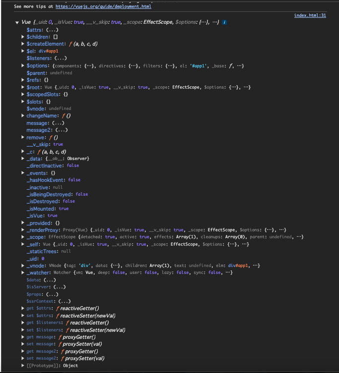
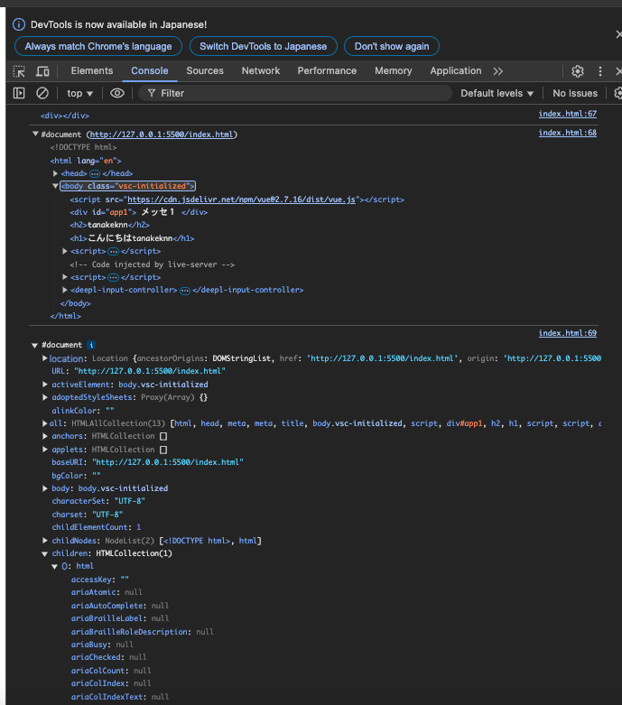
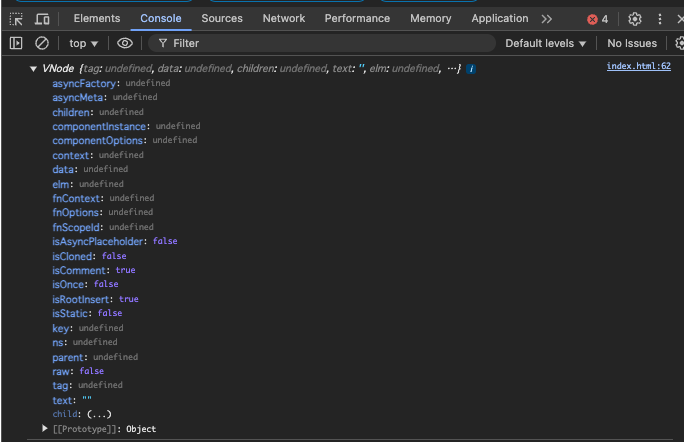
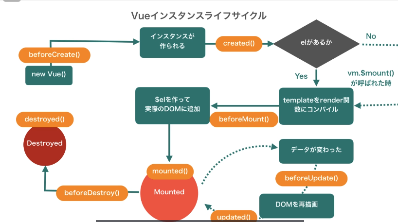

# 見積もり
    - 922分（Vue3のみ）＝約15.5時間
    - 1日30minずつ消化していき、大体１ヶ月で完遂。
## 1章
- Vuejsはブラウザ側で実行されてブラウザ側でUIを構築する
- ページごとに、部品クリックするごとにサーバにアクセスするみたいな一般的なWEBの動きとは少し異なる
- 一回だけHTMLのページをリクエストで取得して、それ以降は新たにリクエストしたりせずにひたすらブラウザ側だけでUIの処理をするみたいなアプリのことをSPA(シングルページアプリケーション)という。
- フレームワーク＝枠組み・骨組み
- ほとんどの処理を書いておいたのであとはここだけ書いておいてください。そしたらいい感じに動くようになりますよっていうのがフレームワーク

## 2章
- Vueはコンポーネントというものをたくさん作って、それをうまく配置することで1つのアプリケーションを作っているんです。（それぞれのファイルは.vueファイルで、単一ファイルコンポーネントという。SFCともいう。）SFC=シングルファイルコンポーネントという。

- .vueファイル内にはtemplateタグやscriptタグなどを使って書くが、
- ブラウザはシンプルなHTML,CSS,JSしか理解できない。なのでブラウザが理解できるようにvueファイルはjsのファイルとかに変換する必要がある

- Vite(ビート)はVue→ｊｓの変換を裏側で自動でやってくれる
- Vueファイルが書き換わったら、裏側で全部書き換えてくれる
- Vite自体もjsで書かれている
- nodejs → 単純にｊｓを実行するソフトウェア。

- npm create vue@latest コマンドでvueプロジェクトが作成できる
- vite.config.js
    - viteのせっていファイル
    - viteでvueを使う設定などがされている
- package.json 
    - project全体のさまざまな設定が書かれている
    - devDependencies → 開発の時だけ使うものが列挙される
    - このpackage.jsonに書かれたものたちは、プロジェクトにインストールは最初されていない。ただ羅列されているにすぎない。書かれただけ。なので以下のコマンドでインストールする。
        - npm install 
    - インストールしたものはnode-modulesというディレクトrに入ってくる。
    - package.jsonのscriptsに書かれたものはコマンドに関するやつら。npm runの後ろに書いて実行できる
    ```json
      "scripts": {
        "dev": "vite",
        "build": "vite build",
        "preview": "vite preview",
        "lint": "eslint . --fix",
        "format": "prettier --write src/"
    },
    ```
    - npm run dev サーバ起動
    - npm run build　開発終わってリリースするよって時に使う。
        - こちら時効するとdistフォルダができる。このフォルダは公開用のものをコードが最適化されて詰められている。このdistフォルダをホスティングしてあげればリリーすできる
    - npm run preview
        - distフォルダの中身を確かめる。
    - npm run lint 
        - コードが正しく書けているかチェック
    - npm run format
        - lint と似ていてコードを綺麗にフォーマットしてくれる

- package-lock.json
    - npm install した時にinstallされたこのnode-modulesの中にあるパッケージたちの厳密なバージョンが「記録されている」
- jsconfig.json
    - vscodeが効率よくコード管理するために必要な設定ファイル
- editorconfig
    - vscodeだけじゃなくさまざまなエディタに一貫したコーディングスタイルを適用させるためのやつ
- index.html
    - プロジェクト全体のWebアプリの元になるhtmlファイルになります。
- prettier.json
    - prettierの設定ファイル
- srcフォルダ
    - ここが一番開発者にとってメイン
    - このソースフォルダ内のファイルに関してはビートはさまざまな変換処理をやってくれる
    - 逆にビートに何も操作されたくないファイルを置きたいときはpublicフォルダ内にファイル置
- .vscodeフォルダ
    - vscodeの設定をするためのフォルダ
    - extentions.jsonファイルにはおすすめのVSCODEの拡張機能が一覧で表示されている。これがあるためにvscode起動時に右下におすすめの拡張機能はこれですってポップアップでていた、
    - settings.jsonには↑でインストールしたeslintやprettierのvscodeの拡張機能に対する設定がかかれている。
    - 拡張機能（vue.volar）
        - vueファイルを認識するための機能。ないとvueファイルが真っ白になる
（56分消化 2025/1/2時点）

- beatで開発されるアプリはindex.htmlがベースになっているとはさっき言った。
    - そのindex.htmlではmain.jsを読まれているのでmain.jsが実行される。

    ```js
    // main.js
    import {createApp} from 'vue' //node-modules内のvueフォルダ内のcreateAppを持ってきてくれる

    import App from './App.vue'

    createApp(App).mount('#app')// ちなみにcreateAppは関数になっており、これでvueのプロジェクトを作成する
    ```

    - App.vueには以下のように記載。これで一旦画面描画される。
    - vueはscript,template,styleタグで成り立つものである。
    ```vue
    <script setup>
        const username="tanaka"
        console.log(username)
    </script>
    <template>
        <h1>title</h1>
    </template>
    <style>
        h1{
        color:red;
        }</style>
    ```

    - scriptタグ内で書いた変数はtemplateタグ内で以下のように表示できる。このように自動で更新してくれる機能を「ホットモジュールリプレースメント」という。
    ```vue
    <script setup>
        const username="tanaka"
        console.log(username)
    </script>
    <template>
        <h1>title</h1>
        <h1>{{  username }}</h1>
    </template>
    <style>
        h1{
            color:red;
        }
    </style>
    ```

    - 上記では変数を入れているが実際は「式」が評価されて画面に出ている
    ```vue

    <template>
    <h1>title</h1>
    <h1>{{  username }}</h1>
    <h1>{{  price }}</h1>
    <h1>{{  price - 1 }}</h1>
    </template>
    ```

    - tempalteのボタンタグに@click="script内の関数名"とすることでボタンクリック時にscriptタグ内の関数を呼び出せる。
    
    - 以下の例ではincrementボタン押下時にcountをインクリメントしてる。consoleの表示はインクリメントされるが、画面のcountの表示は増えません。なぜか！！！！
    - よく考えればjsの絵s会では当たり前のこと。script内では変わっているが、template内までは変わらない。そこで理アクティビティふがある。
    ```vue
    <script setup>
        const title = 'vue'
        const title2 = 'vue2'
        const title3 = 'vue3'
        let price = 9.99
        let count = 0
        function increment() {
        count += 1
        console.log(count)
        }
    </script>

    <template>
    <p>sss</p>
    {{ title }}
    {{ title2 }}
    {{ title3 }}
    {{ price }}
    {{ count }}
    <button @click="increment">increment</button>
    </template>

    <style></style>

    ```

    - 
- リアクティビティ
    - import { ref } from 'vue'でrefという関数をインポートする
    - 以下の例ではボタン押下時にscript内のprinteがインクリメントされるが、画面表示のpriceは9.99のまま。これはリアクティブじゃない。
    ```vue
    <script setup>
        const username="tanaka"
        console.log(username)
        let price=9.99
        function increment (){
        price += 1
        console.log(price)
        }
    </script>
    <template>
        <h1>title</h1>
        <h1>{{  username }}</h1>
        <h1>{{  price }}</h1>
        <h1>{{  price - 1 }}</h1>
        <button @click="increment">increment</button>
    </template>
    <style>
        h1{
        color:red;
        }
    </style>
    ```
    


    - リアクティブにするにはリアクティブにしたい値をref()で囲む。
    - で、するとpriceはrefオブジェクト内のvalueプロパティに格納されるので、更新する際はprice.value+=1という感じでrefオブジェクトのvalueプロパティに対して更新する。templateの方は.valueはつけなくてOK。
    - refで囲むとRefImplというオブジェクトになる
    - なので9.99という数字をリアクティブにすることができる！みたいな言い方をする
    ```vue
    <script setup>
        import {ref} from 'vue'
        const username="tanaka"
        console.log(username)
        let price=ref(9.99)
        console.log(price)

        const info=ref({
            para:100,
            para2:200
        })
        function increment (){
            info.value.para+=100
            price.value += 1
            console.log(price)
        }
    </script>
    <template>
        <h1>title</h1>
        <h1>{{  username }}</h1>
        <h1>{{  price }}</h1>
        <h1>{{  price - 1 }}</h1>
        <h1>{{  info.para }}</h1>
        <button @click="increment">increment</button>
    </template>
    <style>
        h1{
        color:red;
        }</style>
    ```
    - ref()で囲んだ値の返り血をrefオブジェクトという。
    

（32分消化 2025/1/3時点）

- reactive()を使ってオブジェクトをリアクティブにする
    - reactive()を使うと参照時に「.value」を挟まないでよくなる。
    ```vue
    <script setup>
    import {ref, reactive} from 'vue'
    const username="tanaka"
    console.log(username)
    let price=ref(9.99)
    console.log(price)
    const info=ref({
        para:100,
        para2:200
    })

    const instructor = reactive({ // 新規追加
        name : 'tanaken',
        age : 25,
    })
    function increment (){
        info.value.para+=100
        price.value += 1
        instructor.age +=1// .valueを挟まないで良くなる。
        console.log(price)
    }

    </script>
    <template>
        <h1>title</h1>
        <h1>{{  username }}</h1>
        <h1>{{  price }}</h1>
        <h1>{{  price - 1 }}</h1>
        <h1>aaaa: {{  info.para }}</h1>
        <h1>bbbb:{{ instructor.age }}</h1>
        <h1>test!!{{ 3+4 }}</h1>
        <button @click="increment">increment</button>
    </template>
    <style>
        h1{
            color:red;
        }</style>
    ```

    - refオブジェクト内のrefプロパティを呼び出したり書き換えるときは.valueは2ツモつけないでいい。
    - ちなみに公式ドキュメントでは基本t系にref関数を使うように記載がある。
# 3章
- templateタグ内の記載はViteなどによってjsのソースに変換される。
- templateタグ内の書き方をhtmlではなく、テンプレート構文という。そのテンプレート構文がhtmlの文法のルールに従うようになっている。

- 上記でも使用した二重波括弧内では単一の式のみ使える。if文みたいな構文は使えない
- また、templateでscript内の変数を参照する場合、script内でトップレベル（グローバルレベル）で宣言した変数雨でなければ参照できな
```vue
<script setup>
const count =10
const count2 =15
</script>
<template>
  <h1>{{ 3+4 }}</h1>
  <h1>{{ count+4 }}</h1>
  <h1>{{ count2+4 }}</h1>
  <button @click="increment">increment</button>
</template>
<style>
h1{
  color:red;
}</style>
```

（32分消化 2025/1/4時点）

- v-から始まる特別な属性
    - vue-jsはテンプレート構文として特別な属性を用意している。そういうのをディレクティブといって、必ず「v-」から始まる
    - vueは「v-」から始まる属性をいろいろ用意している
        - 以下の例ではv-textの書き方と{{ count}}の書き方は同じ結果になる
    ```vue
    <script setup>
    import {ref} from 'vue'
    let count =ref(10)
        function increment(){
        count.value +=10
    }
    </script>
    <template>
        <h1>{{ count }}</h1>
        <h1 v-text="count"></h1>
        <button @click="increment">increment</button>
    </template>
    <style>
        h1{
            color:red;
        }
    </style>

    ```

    - v-html
        - v-htmlに渡されたrefオブジェクトに格納された文字列（htmlの記述）をhtmlと認識し画面に表示してくれる
        - 以下の例では{{ message}}の方はそのまま「<h1>message</h1>」と出力され、
        - v-htmlの方はhtmlとして画面に表示される。
        ```vue
        <script setup>
            import {ref} from 'vue'
            let message =ref("<h1>message</h1>")
        </script>
        <template>
            <h1>{{ message }}</h1>
            <h1 v-html="message"></h1>
        </template>
        <style>
            h1{
                color:red;
            }
        </style>
        ```
        - ただ、v-htmlに適用する値は信頼できるもの（すなわちユーザの入力したものを入れてはいけない）のみ適用という風雨にしないといけない
        - 出ないとクロスサイトスクリプティングになってしまう。

    ```txt
    1. {{ }}（Mustache記法）による表示
        目的: テンプレート内でテキストを「表示」する。
        使いどころ:単純にテキストを埋め込みたいとき
                {{ msg }} のように変数の値や計算結果をテキストとして画面に反映したい場合
    
    2. v-bind や v-if / v-for などの「v-ディレクティブ」
        目的: テンプレート内の要素や属性に対して、「動的バインド」や「条件分岐・ループ」などのロジックを適用する。
        使いどころ:
        v-bind: HTML属性（src / class / style / value etc.）を動的に変化させたいとき
        v-bind:src="imageUrl" → 画像URLを動的に変えたい
        v-bind:class="{ active: isActive }" → クラス付け替えしたい
        v-model: 主にフォームの入力とデータを双方向バインディングしたいとき
        v-if / v-else / v-show: 要素の表示・非表示をデータの状態によって切り替えたいとき
        v-for: 配列やオブジェクトのリスト表示
    ```

    - v-bind
        - 普通のタグ内のTextContentにjsscriptタグ内の変数を表示させるときは二重波括弧「{{}}」でいいが属性値に表示させるときは「v-bind」を使う
        - どんなhtml属性に対しても、v-bindで動的に値を設定することができる
        - 普通のテキスト出力では二重波括弧。属性値にはv-bindを使う。
        - 逆にv-bind使わず属性名＝”{{ ref変数 }}”ってのは機能しない
        - 省略した書き方で「v-bind」を省いて「:」だけ残した書き方もでき、esLintではこちらが推奨される
        - v-bindを複数の属性に一気に適用させるにはv-bind="{id:vueID, href:vueURL}"のように書く（v-bindの後にコロンじゃなくイコール。）
        ```vue
        <script setup>
            import {ref} from 'vue'
            const vueURL =ref("https://vuejs.org")
            const vueID =ref("vueLink")
        </script>
        <template>
            <button v-on:click="">button</button>
        </template>
        <style>
            h1{
                color:red;
            }</style>
        ```
    - v-on(何かが起きた時に何かをしたい)
        - v-on:click="式"でクリック時に挙動を設定できる。
        - 省略記法として「v-on:」を「@」に置き換えられる
        ```vue
        <script setup>
            import {ref} from 'vue'
            let count=ref(10)
            function countUp(){
            count.value+=10
            }
        </script>
        <template>
        <h1>{{ count }}</h1>
        <button v-on:click="count+=100">increment</button>
        <button @click="count+=100">increment</button> こういう処理を直接書くパターンをインラインハンドラと言って、
        <button @click="countUp">increment</button>　関数を書くパターンをメソッドハンドラという
        </template>
        <style>
        h1{
        color:red;
        }</style>
        ```

        - 語源: “inline（行内）” という言葉のとおり、「インライン」という言葉自体が、「行の中に直接埋め込む」 という意味を持ちます。
        - たとえば HTML の生の書き方でいうと、<button onclick="alert('Hello')"> のように、処理を <button> タグの属性へ直接書くのが「インラインイベントハンドラ」です。
        - これと同じ発想で、Vue テンプレートでも処理を直接書くため「インラインハンドラ」と呼ばれています。
        - @click(v-on:click)の部分をイベント、="count+=10"(="countUp")の部分をハンドラという
        - count++のように直接処理を書くパターンをインラインハンドラ、関数を書くぱたーんをメソッドハンドラという
    - イベントオブジェクトの取得
        - クリックイベントのようなブラウザが発生させているイベントは「イベント」が発生した時に同時に「イベントオブジェクト」というそのイベントの情報を持ったオブジェクトを生成している。vuejsはそれを取得できる。
        - v-onで呼び出した関数の引数には仮引数にeventが書かれなくともeventを呼び出せる。自動でeventが入る。cli
        - tempalteでは$eventで絵べんTのオブジェクトを取得できている
        ```vue
        <script setup>
            import {ref} from 'vue'
            let count=ref(10)
            function countUp(){
                count.value+=10
                console.log(event)
                console.log(event.clientX)
                console.log(event.clientY)
            }
        </script>
        <template>
            <h1>{{ count }}</h1>
            <button v-on:click="count+=100">increment</button>
            <button @click="count = $event.clientX">increment</button>
            <button @click="count+=100">increment</button>
            <button @click="countUp">increment</button>
        </template>
        <style>
            h1{
            color:red;
            }
        </style>
        ```
        - 引数を和すには以下の通り
            - そのまま@click="countUp(100)"のようにかける
            - Reactだと()=>{countUp(100)}のように書かないと即実行されてダメになるんだよな〜
        ```vue
        <script setup>
            import {ref} from 'vue'
            let count=ref(10)
            function countUp(num){
            count.value+=num
            }
        </script>
        <template>
        <h1>{{ count }}</h1>
        <button @click="countUp(5000)">increment</button>

        </template>
        <style>
        h1{
        color:red;
        }</style>

        ```
    - stop prevent
        - preventDefaultはデフォルトの挙動を防ぐ
        - 以下だと、aタグにpreventDefaultしているので、aタグを押下しても画面遷移しない。
        ```vue
        <script setup>
            import {ref} from 'vue'
        </script>
        <template>
        <h1>{{ count }}</h1>
        <a href="https://vuejs.org" @click="$event.preventDefault()">increment</a>
        <button >increment</button>
        </template>
        <style>
        h1{
            color:red;
        }
        </style>
        ```

        - 以下の例ではstopPropagationをしている
        - vueでは@clickのついた以下のbuttonタグを押したら、親要素のdivの@clickも呼ばれる仕様になっている
        - 👆vueではってより、vueでなくとも内包する要素クリック＝親要素クリックってことになるわな。
        - Propagation=「伝播」であり、button押した時に親要素の@clickも呼ばれるような電波を止める働きがある。
        ```vue
        <script setup>
            import {ref} from 'vue'
            function testbutton(){
            console.log("testbutton")
            }
            function testdiv(){
            console.log("testdiv")
            }
        </script>
        <template>
        <h1>{{ count }}</h1>
        <a href="https://vuejs.org" @click="$event.preventDefault()">increment</a>
        <div @click="testdiv">
            <button @click="testbutton">increment</button>
            <button >increment</button>
            <button @click="$event.stopPropagation()">increment</button>
        </div>
        </template>
        <style>
        h1{
            color:red;
        }
        </style>

        ```
        - 両者とも省略して以下のようにかける
        ```vue
        <a href="https://vuejs.org" @click.prevent="">increment</a>
        <button @click.stop="">increment</button>
        ```

（30分消化 2025/1/6時点）
- イベント修飾子と似たものとしてキー修飾子がある
    - これはキーボード系のイベントで使える
    - @keyupでキーが上がった時、@keydownでキーが押された時に設定した式が発動する。
    ```vue
    <script setup>
    import {ref} from 'vue'
    const count = ref(0)
    </script>
    <template>
    <h1>{{ count }}</h1>
        <input type="text" @keydown="count++" @keyup="count++">
    </template>
    <style>
    </style>
    ```
    - 特定のキーに対しての時(以下の場合はスペースをダウンした時)
    ```vue
    <script setup>
    import {ref} from 'vue'
    const count = ref(0)
    </script>
    <template>
    <h1>{{ count }}</h1>
    <input type="text" @keydown.space="count++">
    </template>
    <style>
    </style>
    ```
- ディレクティブの構造
    - 「v-on:click.prevent="changeData"」
    - 「v-on」が名前。「click」が引数。「prevent」が修飾子。「changeData」が値。
- 角かっこ([])を使ってディレクティブの引数にscriptのデータを指定する方法
    - @の後ろに[変数名]で指定する V
    ```vue
    <script setup>
    import {ref} from 'vue'
    const count = ref(0)
    const eventName = 'keyup'
    </script>
    <template>
    <h1>{{ count }}</h1>
    <input type="text" @[eventName].space.delete="count++" >
    </template>
    <style>
    </style>
    ```
    - これによっって動的にデータを指定できる
- v-modelを使用してInputに入力した値をscriptでの変数と同期させる
```vue
<script setup>
    import {ref} from 'vue'
    const userInput=ref('')
</script>
<template>
  <input v-model="userInput" type="text" >
  <h1>{{ userInput }}</h1>
</template>
<style>
</style>

```
- 式もreactiveに扱いたいときはcomputed()を使う。
    - reactiveシステムを保ったまま処理を1つにまとめる方法のこと。
    - 以下の例ではinputに4以上入れれば{{ evaluation}}の表示がBadからGoodに切り替わる。
    - computedは.valueにアクセスするたびにcomputedが実行される
    - あとcomputed内のrefオブジェクトが1つでも変更されればcomputedが評価して最新の値を算出してくれる優れもの。ようは値を監視してくれる
    - 以下では{{}}内で条件指揮を書いてるがこれだとなんか、みづらい、

    ```vue
    <script setup>
    import { ref } from 'vue'
    let count = ref(0)
    </script>

    <template>
        <p>{{ count > 3 ? 'good' : 'bad' }}</p>
        {{ count }}
        <button @click="count++">かアップ</button>
    </template>

    <style></style>
    ```
    - じゃあ評価式をscript内に書いちゃおーって書いてみるも
    - これだとcountが0の時に評価されてbadになって、ずっとそれが表示され続ける。当たり前だが。カウントアップしてもbadから変わらない。
    ```vue
    <script setup>
    import { ref } from 'vue'
    let count = ref(0)
    let evaluetion = count.value > 3 ? 'good' : 'bad'
    </script>

    <template>
    <p>{{ count > 3 ? 'good' : 'bad' }}</p>
    {{ evaluetion }}
    {{ count }}

    <button @click="count++">かアップ</button>
    </template>

    <style></style>
    ```

    - そういう時に使うのがcomputed。
    ```vue
    <script setup>
        import { ref,computed } from 'vue'
        const score =ref(0)
        const evaluation = computed(()=>{
            return score.value > 3 ? 'Good' : 'Bad'
        })
        console.log(evaluation.value)
    </script>
    <template>
    <h1>{{ evaluation }}</h1>
    <input v-model="score" type="text" >
    <h1>{{  score }}</h1>
    </template>
    <style>
    </style>
    ```
    - computedでは、要は値を監視して、変更あれば実行して最新お値を評価して出すって役割なので、computedで算出した値を変更はしてはいけないってか普通しない。読み取り専用って感じ。またcomputed関数内で外部の変数を変更するお湯なことはしない。あくまで最新の値を見て評価するだけ
    - computedは値の更新を検知して最新お値を返すって処理をまとめてくれているだけのやつ。最新の値を返してくれるだけ。
    - computedはcomputed関数内のreactiveなデータを監視して変更されればcomputedを実行するという仕組みだが、その変更を監視する仕組みを「リアクティブエフェクト」という。
    - このリアクティブエフェクトはcomputed以外でも使われており、それは「watcher」とテンプレートで使われている
    - テンプレートでのreactiveeffectは、変更を検知したら再レンダリングする。
    - computedの結果であるevaluationがtemplate内で使われていない場合、毎回最新の値で評価しても無駄なので、（表示しなくて誰もミない）computedは実行されなくなる
    （35分消化 2025/1/7時点）

    - 以下のようにただ評価指揮を入れたメソッドをtempalteで呼び出せばcomputedのようにcountの変更ごとに表示値を変えられるが、
    - 結論computedを使うべき。
    - なぜなら、computeｄは内包する変数が変わった際にだけ実行されるが、上記のニセcomputedだと際レンダリングされると、闇雲に毎回際レンダリングごとに実行される。
    ```vue
    <script setup>
    import { ref } from 'vue'
    let count = ref(0)
    function tmp() {
    return count.value > 3 ? 'good' : 'bad'
    }
    </script>

    <template>
    {{ tmp() }}
    {{ count }}
    <button @click="count++">かアップ</button>
    </template>

    <style></style>

    ```


    - あとcomputedは例えばcomputedの返り値のevaluationがテンプレート内で使われると変更検知して値を返すが、使われてないなら実行しても意味ないやんってことでcomputedが実行されなくなるっていう最適化されている

- class属性はこう指定する！
    - :class="{}"って感じで書いて、その中にプロパティとtrue or falseを書く感じ。
    ```vue
    <script setup>
    import { ref } from 'vue'
    // const isRed = ref(true)
    // const isBgBlue = ref(true)
    // function toggleClass() {
    //   isRed.value = false
    //   isBgBlue.value = false
    // }
    </script>

    <template>
    <p :class="{ red: true, 'bg-blue': true }">Vuejs</p>
    <button @click="toggleClass">kirikae</button>
    </template>

    <style>
    .red {
    color: red;
    }

    .bg-blue {
    background-color: blue;
    }
    </style>

    ```

    - そのtrue,false部分をリアクティブにすることによって、動的に切り替えたりする
    ```vue
    <script setup>
    import { ref } from 'vue'
    const isRed = ref(true)
    const isBgBlue = ref(true)
    function toggleClass() {
    isRed.value = !isRed.value
    isBgBlue.value = !isBgBlue.value
    }
    </script>

    <template>
    <p :class="{ red: isRed, 'bg-blue': isBgBlue }">Vuejs</p>
    <button @click="toggleClass">気r変え</button>
    </template>

    <style>
    .red {
    color: red;
    }

    .bg-blue {
    background-color: blue;
    }
    </style>

    ```

## 4章
- v-if など
    - 以下のように書く
    - v-ifとｋv-elseはその直後に書いていかないといけないルール
    ```vue
    <script setup>
    import { ref } from 'vue'
    const ok = ref(true)
    </script>
    <template>
    <p v-if="ok">OK!</p>
    <p v-else>NG!</p>
    <button @click="ok = !ok">切り替え</button>
    </template>
    <style></style>
    ```

    - こういう感じでv-ifをまとめて適用したいときに無意味なdivを作ってしまい崩れるって時はtemplateでさらに囲えば良い。
    - vueはtemplateを最終てkに存在しないタグとして消してくれうる
    - デベツール見ると消される
    ```vue
    <script setup>
    import { ref } from 'vue'
    const ok = ref(true)
    </script>

    <template>
    <div v-if="ok">
        <p>aaaaaa</p>
        <a href="">gfgsfgsgfds</a>
        <h2>aaaa</h2>
    </div>
    <button @click="ok = !ok">切り替え</button>
    </template>

    <style></style>

    ```

    ```vue
    <script setup>
    import { ref } from 'vue'
    const ok = ref(true)
    </script>

    <template>
    <template v-if="ok">
        <p>aaaaaa</p>
        <a href="">gfgsfgsgfds</a>
        <h2>aaaa</h2>
    </template>
    <button @click="ok = !ok">切り替え</button>
    </template>

    <style></style>

    ```

- v-show
    - v-ifディレクティブに似たやつ。
    - v-ifはfalseの時にDOMから要素自体が消滅するが、
    - v-showはfalseの場合でも要素はDOMに残る。display:noneで消されている状態になるという違いがあある
    - じゃあどっち使えばええねんってところだが、それは判別の変数が高い頻度で切り替わる時はv-showを使う。なぜならv-showは要素を抹消したり作ったりしないので処理が早くなるから。
    ^- 逆に高頻度で切り替わらないといはv-ifでいい
- v-for
    - v-forの書き方は以下。
    ```vue
    <script setup>
    import { ref } from 'vue'
    const fruits = ref(['apple', 'banana', 'grape'])
    </script>

    <template>
    <div v-for="fruit in fruits" :key="fruit">
        {{ fruit }}
    </div>
    </template>

    <style></style>

    ```
    - keyはvueが内部的にレンダリングする際のヒントとなるためだけに存在する
    - keyはユニークに！
    ```vue
    <script setup>
    import { ref } from 'vue'
    const fruits = ref([
    { id: 1, name: 'apple1' },
    { id: 2, name: 'apple2' },
    { id: 3, name: 'banana' },
    { id: 4, name: 'grape' },
    ])
    </script>

    <template>
    <div>
        <button @click="fruits.shift()">シフト</button>
        <li v-for="fruit in fruits" :key="fruit.id">
        {{ fruit.name }}
        <input type="text" />
        </li>
    </div>
    </template>

    <style></style>

    ```

    - vueは際レンダリングするときに可能な限り効率的の要素の移動が最小限になるように変更を加える

ー v-forでインデックス（何周目か）を取るホフ
    - v-forのfruitを（）で囲って第二引数にインデックスが入る
    - このindexはkeyには使えない。なぜなら各要素とインデックスが結び付いてはいないから

    ```vue
    <script setup>
    import { ref } from 'vue'
    const fruits = ref([
    { id: 1, name: 'apple1' },
    { id: 2, name: 'apple2' },
    { id: 3, name: 'banana' },
    { id: 4, name: 'grape' },
    ])
    </script>

    <template>
    <div>
        <button @click="fruits.shift()">シフト</button>
        <li v-for="(fruit, index) in fruits" :key="fruit.id">
        {{ fruit.name }}
        {{ index }}
        <input type="text" />
        </li>
    </div>
    </template>

    <style></style>
    ```

    - こんな感じでfruit部分を分割代入できる
    ```vue
    <script setup>
    import { ref } from 'vue'
    const fruits = ref([
    { id: 1, name: 'apple1' },
    { id: 2, name: 'apple2' },
    { id: 3, name: 'banana' },
    { id: 4, name: 'grape' },
    ])
    </script>

    <template>
    <div>
        <button @click="fruits.shift()">シフト</button>
        <li v-for="({ id, name }, index) in fruits" :key="id">
        {{ id }}
        {{ name }}
        {{ index }}
        <input type="text" />
        </li>
    </div>
    </template>

    <style></style>
    ```
    - 基本的にv-forとv-ifは同じタグ内に書かないことが推奨。
    - v-ifとかv-forで余計なタグ生成したくない時はやはｒtenplateタグ使うべき

- オブジェクトに対してv-forする場合
    - さっきはリストのv-forだったが今回はオブジェクトのv-for.
    - ()内でvalue,key,indexなどとれる
    ```vue
    <script setup>
    import { ref } from 'vue'
    const me = ref({
    id: 1,
    name: 'tanaka',
    age: 25,
    gender: 'man',
    })
    </script>

    <template>
    <div>
        <button @click="fruits.shift()">シフト</button>
        <li v-for="(value, key, index) in me" :key="value">
        {{ key }}
        {{ value }}
        {{ index }}
        <input type="text" />
        </li>
    </div>
    </template>

    <style></style>

    ```

- 数値でv-forもできる
    ```vue
    <script setup>
    import { ref } from 'vue'
    </script>

    <template>
    <div>
        <button @click="fruits.shift()">シフト</button>
        <li v-for="n in 10" :key="n">
        {{ n }}
        <input type="text" />
        </li>
    </div>
    </template>

    <style></style>

    ```

## 5章（コンポーネントはこう使う！）
    - コンポーネントツリー、ルートコンポーネント
    - DOMのようにコンポーネントを組み合わせて作られるhtmlの内容をコンポーネントツリーという。
    - ルートコンオー年とはmain.jsのcreateAPpに渡してるコンポーネントのこと。

    - 以下のようにして、丸々、カウントアップのコンポーネントを埋め込める
    ```vue
    <script setup>
    import { ref } from 'vue'
    import CountUp from './components/CountUp.vue'
    const aaa = ref(0)
    </script>
    <template>
    {{ aaa }}
    <CountUp />
    </template>
    <style></style>
    ```
    - 先頭が大文字、ツナギも大文字＝パスカルケース

## 6章
    - propsで親から子にデータを渡し
    ```vue  App.vue
    <script setup>
    import { ref } from 'vue'
    import ShowCount from './components/ShowCount.vue'
    const count = ref(0)
    </script>
    <template>
    {{ count }}
    <ShowCount :foo="count" />
    </template>
    <style></style>
    ```
    ```vue (ShowCount.vue)
    <script setup>
    import { defineProps } from 'vue'
    defineProps({
    foo: String,
    })
    </script>
    <template>
    <p>count:{{ foo }}</p>
    </template>
    ```

    - こんな感じでprops受け取る際の型の中で色々デフォルト値とか方を複数許容するとかできる。
    ```vue
    <script setup>
    import { defineProps } from 'vue'
    defineProps({
    foo: String,
    bar: String,
    hoge: {
        type: [Number, String],
        default: 100,
    },
    hoge2: {
        type: [Number, String],
        default: function () {
        return 100
        },
    },
    })
    </script>
    <template>
        <p>count:{{ foo }}</p>
        <p>count:{{ bar }}</p>
        <p>count:{{ hoge }}</p>
    </template>
    ```
    - defineProps() 関数は <script setup> を利用する場合のみ利用可能

    - 以下みたいな感じで渡す：
    ```vue (親コンポーネント側)
    <script setup>
    import { ref } from 'vue'
    import CountUp from './components/CountUp.vue'
    </script>
    <template>
    <div>
        <CountUp message="Hello from parent!" />
        <CountUp message="Hello from parent!!" />
        <CountUp message="Hello from parent!!!" />
    </div>
    </template>

    <style></style>
    ```

    ```vue (子コンポーネント側)
    <script setup>
    import { ref } from 'vue'
    import { defineProps } from 'vue'

    const props = defineProps({
    message: String,
    })
    </script>

    <template>
    <div>
        {{ message }}
    </div>
    </template>
    <style></style>
    ```

    - こんな感じで動的に v-bind使って値を渡せる
    ```vue
    <script setup>
    import { ref } from 'vue'
    import CountUp from './components/CountUp.vue'
    const dynamicMessage = ref('This can change!')
    </script>
    <template>
    <div>
        <CountUp message="Hello from parent!" />
        <CountUp message="Hello from parent!!" />
        <CountUp message="Hello from parent!!!" />
        <CountUp :message="dynamicMessage" />
    </div>
    <button @click="dynamicMessage = 'aa'">ダイナミック文章変更</button>
    </template>
    <style></style>
    ```

    - emitで子から親にデータを渡す
        - emitの場合はｐropsのように自由に値を渡せない。そうなると処理の流れが追いにくくなるから
        - データの流れは親から子への一方通行に流れるのが基本button
        - vueでは子から親へコードの流れが極力わかりにくくならない範囲に関して通信できるようになっている
        - そこでイベントを使う
        - vueでは子コンポーネントの中では$emitという関数を使うことができる

        - emitの場合は、子コンポーネントの方で、例えばクリックしたときに親に渡したいなら、
        - @click="$emit('〇〇')"のようにイベント名を設定して、
        - 親コンポーネントの方で@〇〇=""って感じで設定したイベントを使うみたいな感じ

        ```vue (App.vue)
        <script setup>
        import { ref } from 'vue'
        import ResetButton from './components/ResetButton.vue'

        const count = ref(0)
        </script>
        <template>
        <div>
            {{ count }}
            <button @click="count++">カウントアップ</button>
            <ResetButton @reset="count = 0" />
        </div>
        </template>
        <style></style>
        ```

        - 
        ```vue (ResetButton.vue)
        <template>
            <button @click="$emit('reset')">Reset</button>
        </template>
        ```

        - このようにvueではカスタムの独自のイベントを子コンポーネントがわで
        - 上記では子コンポ年と側でこういうイベントが発生しましたよってのを親コンポーネントに伝えているだけで
        - その上で何をするかは親コンポーネント側が決めている

        - ここでやっとデータを親に渡す方法〜〜
            - 
            ```vue (親)
            <script setup>
            import { ref } from 'vue'
            import ResetButton from './components/ResetButton.vue'
            const count = ref(0)
            </script>
            <template>
            <div>
                {{ count }}
                <button @click="count++">カウントアップ</button>
                <ResetButton @reset="count = $event" />　そんで$eventで親で受け取る。以上
            </div>
            </template>
            <style></style>
            ```

            - 子側の$emit()の第二引数に渡すでー他を書く。
            ```vue (子)
            <template>
                <button @click="$emit('reset', 100)">Reset</button>
            </template>
            ```

            - ちなみにこんな風に@resetに関数を設定し、その関数で子コンポーネントからの値を受け取れる
            ```vue
            <script setup>
            import { ref } from 'vue'
            import ResetButton from './components/ResetButton.vue'
            const count = ref(0)
            function onReset(value) {
                count.value = value
            }
            </script>
            <template>
            <div>
                {{ count }}
                <button @click="count++">カウントアップ</button>
                <ResetButton @reset="onReset" />
            </div>
            </template>
            <style></style>
            ```

            - このやり方に関してもpropsと違い勝手に親コンポーネント側のデータが更新されるということはなく、
            - あくまでも。$emitのイベントが発生した時にデータを渡すだけで、それをどういうふうにそれをどういう風に使うかは、親コンポーネント側

## 7章
## 8章
- 仮想DOM
- Vueは最初にレンダリングしようとする際に、実際に書いたコンポーネントを全て解析して、
- そっから一度、仮想的なjavascriptのDOMを作る。あくまでDOMのデータ構造を真似したものをｊｓのオブジェクト使って作る。
- そのあと実際にDOMを作る
- ここはアプリ全体の最初のレンダリングの時だけの話
- そのあと、他のリアクティブな値が更新されたりして再レンダリングされる時、変更分の仮想DOMを含んだ新たな仮想DOMを作る
- そして前回の仮想DOMと新しい方の仮想DOMを比較して差分を調べる。
- そして差分のところだけど、実際のDOMに反映するような動きをしている

- ここで、さっきの一番最初のまだ何もレンダリングされていない時に、初めて1つの仮装DOMを作って実際のDOMに反映するに反映するさセル処理
- これをmountという。
- また、マウント後に際レンダリング起きて新しい仮装DOMができて、前回の仮装DOMとの差分を検出し、その差分を本物のDOMに反映するこの一連の処理のことをpatchという。
なのでvueは最初にマウントしてその後にpatchを繰り返すことによってDOMを更新する
- ちなみにこの本物のDOMを操作する処理あ結構重い処理になる
- 一方で仮装DOMは軽い処理。

- さっき行ったマウントは仮装DOM全体に対して使っていたが、一方でコンポーネント単位で使いもする。
- 例えば新たなコンポーネントができたら(例えばv-ifがfalseからtrueになってDOMが現れた)、このトき本物のDOMにもｐatchによって反映されるが
- 今v-ifで現れたコンポーネントにとっては初めての最初のレンダリング初めての最初のレンダリングだよね。
- なのでこのコンポーネントがマウントしたっていう。
- なので、mountって言葉は、仮装DOM全体に対して最初の蓮台rングをする時と、各コンポーネントに対して最初にレンダリングする時の２パターンがある
- 逆にv-ifがtrue→falseに
## 19章 (はじめに Vue2)
- 1000分=16.8時間
- 1日30分ずつで33日かかる計算。
- vueの特徴
    - 簡単、柔軟、高性能
    - jsfiddle
        - html css jsをすぐ試して遊べるやつ
    - 
    ```html
    <script src="https://cdn.jsdelivr.net/npm/vue@2.7.11/dist/vue.js"></script>

    <div id="app">
    <p>
    hello world
    </p>
    </div>
    ```
    ```js
    new Vue({
	    el: '#app'
    })
    ```
- 上記のソースの解説
    - htmlでVueのCDNを読み込んで、
    - jsでnew Vue()でVueを使いますって宣言しました、
    - new Vue()でVueインスタンスを宣言
    - その中のel: '#app'で、htmlのidがappに対してvueインスタンスを使いますよって宣言している
    - elは要素という意味
    ```html
    <script src="https://cdn.jsdelivr.net/npm/vue@2.7.11/dist/vue.js"></script>
    <div id="app">
    <p>
    {{message}}
    </p>

    </div>
    ```

    ```js
    new Vue({
	el: '#app',
    data: {
        message:'hello world vue'
    }
    })
    ```
- 上記ソースの解説
    - Vueインスタンスではデータを持つことができ、dataというプロパティを持てる
    - このデータ内に定義したものをhtmlで{{ }}で表示できる


    ```html
    <script src="https://cdn.jsdelivr.net/npm/vue@2.7.11/dist/vue.js"></script>

    <div id="app">
    <p>
    {{message}}
    </p>
    <button v-on:click="reverseMessage">メッセージ反転
    </button>

    </div>
    ```
    ```js
    new Vue({
	el: '#app',
    data: {
        message:'hello world vue'
    },
    methods:{
        reverseMessage: function(){
            this.message = this.message.split('').reverse().join('')
            }
    }
    })
    ```
    - v-on
        - vueが用意している特別の属性
        - v-on:clickとすることで、クリック時に上記ソースでいうreverseMessageが呼ばれる。
    - VUeインスタンスは加えてmethodsという領域も持つことができ、いろんな処理を定義できる。
        - methodsはいろんな関数が並べられている場所。
    - methods内の関数内でthis.messageとす流書き方で、Vueインスタンス内のmessageプロパティにアクセスしますという意味になる

- 何かが変更されたら何かの処理をするってだけ使いたい時（処理をまとめたいわけではないとき。computedだと評価値を使わないと実行されないとかもあるし）computedは処理をまとめるモク亭に特化している
    - watchEfectでは何部のヘンスに変更あれば勝手に実行されるってもの。
    - 検知する対象の変数はwatchEffect内部で読み取っっている必要がある
    - なのでconsole.log(count2.value)の行を消すと実行されなくなる。
    ```vue
    <script setup>
        import { ref, watchEffect } from 'vue'

        const count2 = ref(0)

        watchEffect(() => {
        console.log(count2.value)
        })
        </script>

        <template>
        <button @click="count2++">かアップ</button>
        </template>

        <style></style>
    ```
- 
    - watchはwatchEffectと違い引数を2つとる。
    - 第一引数に関したいリアクティブなデータ、
    - 第二引数にその監視しているデータが更新された時に実行したい関数を書く（この関数の引数に新しい値と古い値を引数に取ることがで気、,function取得できる。）
    - なので、watchとwatchEffectの違いは明示的に監視対象のデータを指定するかどうか。が違い。
    - ということはwatchEffectは内包するリアクティブ変数のいづれかが変われば毎回時効されるのに対して、
    - watchは指定した変数が変更時にのみ実行されるってことになるね。
    - 
    - 以下のようになる。
    ```vue
    <script setup>
    import { ref, watch } from 'vue'

    const count2 = ref(0)
    watch(count2, (newV, oldV) => {
    console.log(count2.value)
    console.log(newV)
    console.log(oldV)
    })
    </script>

    <template>
    <button @click="count2++">かアップ</button>
    </template>

    <style></style>
    ```
# 20章（これがVuejsの基礎、テンプレート構文だ！ Vue2）
- そもそもテンプレートとは何か
    - さっきのソースでいう、以下の部分
    - これはあくまでもhtmlではなく「テンプレート」を書いている
    - vueがこのテンプレートを読んで見て、最終的にhtmlとして出してくれる。
    - なので私たちはhtmlを書いているのではない。
    ```html
        <div id="app">
                <p>{{ message }}</p>
            <button v-on:click="reverseMessage">メッセエージ反転</button>
        </div>
    ```

- new Vue()はvueの心臓のような部分
- テンプレートでかく二重中括弧の中身はVueインスタンス内のdataプロパティ内で持つ値である
    - data.messageと書きたくなるが、Vueではテンプレートで直接data内のプロパティをかける
    - {{}} ないは式を書くことができる、jsのね。（でもあくまで単一の式だけ書ける）
    - methods内の関数も{{}}内で呼ぶことができる
    - Vueインスタンス内でVueインスタンス内のプロパティを呼ぶときはthisを使う。
    
    ```html
    <!DOCTYPE html>
    <html lang="en">
    <head>
        <meta charset="UTF-8">
        <meta name="viewport" content="width=device-width, initial-scale=1.0">
        <title>Document</title>
    </head>
    <body>
    <script src="https://cdn.jsdelivr.net/npm/vue@2.7.16/dist/vue.js"></script>
    <div id="app">
        <p>{{ message }}</p>
        <p>{{ number + 3 }}</p>
        <p>{{ ok? 'YES': 'NO'}}</p>
        <p>{{ sayHi()}}</p>
        <p>{{ sayHi2()}}</p>
        p
        <button v-on:click="reverseMessage">メッセエージ反転</button>
        </div>
        <script>
            new Vue({
                el:'#app',
                data: {
                    message: 'helloworld',
                    number:3,
                    ok:true
                },
                methods: {
                    reverseMessage: function(){
                        this.message = this.message.split('').reverse().join("")
                    },
                    sayHi: function(){
                        return 'Hi'
                    },
                    sayHi2: function(){
                        return this.message;
                    }
                }
            })

        </script>
    </body>
    </html>
    ```
- ディレクティブについて
    - Vue.jsにおける特別な属性のこと。
    - vuejs専用のディレクティブ（属性）は先頭に「v-」がついている
    - 以下のソースではv-textを使っている。v-text="message"と{{ messsage }}は同じ意味
    - 以下のソースではv-bindも使っている.htmlの属性をVueインスタンスのプロパティによって束縛する役割があります。
    - v-bindはコロン『:』に置き換えることができます。（省略記法）
    - dataプロパティのmyNameの値を「太郎」にすると、テキストボックスの中身(= value)は「太郎」になりますが、
    テキストボックスの中身(= value)を「太郎」にしても、dataプロパティのmyNameの値は「太郎」になりません。
    v-bind：Vueインスタンス内のデータ → html属性の単方向のみ
    ```html
    <!DOCTYPE html>
    <html lang="en">
    <head>
        <meta charset="UTF-8">
        <meta name="viewport" content="width=device-width, initial-scale=1.0">
        <title>Document</title>
    </head>
    <body>
        <script src="https://cdn.jsdelivr.net/npm/vue@2.7.16/dist/vue.js"></script>
        <div id="app">
            <p>{{ message }}</p>
            <p v-text="message"></p>
            <a v-bind:href="url">google </a>
            <a :href="url">google </a>
        </div>
        <script>
            new Vue({
                el:'#app',
                data: {
                    message: 'helloworld',
                    url: 'https://google.com',
                },
                methods: {
                }
            })

        </script>
    </body>
    </html>
    ```
    - 「v-once」→一回だけ描画する

    - v-bind={}とすることで、バインドするものをまとめてかける。
    - :[変数]とするとこで、属性名も設定できる。
    - Vueインスタンス側でオブジェクト作ってバインドするやり方もできる。
    ```html
    <!DOCTYPE html>
    <html lang="en">
    <head>
        <meta charset="UTF-8">
        <meta name="viewport" content="width=device-width, initial-scale=1.0">
        <title>Document</title>
    </head>
    <body>
        <script src="https://cdn.jsdelivr.net/npm/vue@2.7.16/dist/vue.js"></script>
        <div id="app">
            <a :[attribute]="url"> google </a>
            <a v-bind="{href:urlTwitter,id:number}">Twitter</a>
            <a v-bind="twitterObject">Twitter</a>
        </div>
        <script>
            new Vue({
                el:'#app',
                data: {
                    attribute:'href',
                    url:'https://google.com',
                    urlTwitter:'https://twitter.com',
                    number:30,
                    twitterObject:{
                        href:'https://twitter.com',
                        id:30
                    }
                }
            })

        </script>
    </body>
    </html>
    ```
    - v-on
        - DOMが提供するイベントが発生したものを検知
        - v-on:イベント名="式または関数名"とすることで、クリック時に処理が実行される。
        - 関数名には（）はつけなくてもつけてもどっちでも良い。今回は関数は引数がないのでつけていない。
        - イベントのリファレンス雨はこちら（https://developer.mozilla.org/ja/docs/Web/Events）
        - v-on:mousemoveで対象の要素にマウスが載っている時にイベントが発火し続ける
    ```html
    <!DOCTYPE html>
    <html lang="en">
    <head>
        <meta charset="UTF-8">
        <meta name="viewport" content="width=device-width, initial-scale=1.0">
        <title>Document</title>
    </head>
    <body>
        <script src="https://cdn.jsdelivr.net/npm/vue@2.7.16/dist/vue.js"></script>
        <div id="app">
            <p>{{number}}   回クリックされています</p>
            <button v-on:click="number+=1">ボタン</button>
            <button v-on:click="countup">ボタン</button>
            <p v-on:mousemove="changemouseposition">マウスを乗せてください</p>
            <p>X:{{x}} Y:{{y}}</p>
            <button v-on:click="countup">ボタン</button>
            
        </div>
        <script>
            new Vue({
                el:'#app',
                data: {
                    number:0
                },
                methods:{
                    countup: function(){
                        this.number+=1
                    },
                    changemouseposition: function(event){
                        console.log(event)
                        this.x=event.clientX
                        this.y=event.clientY
                    }
                }
            })

        </script>
    </body>
    </html>
    ```
    - イベントオブジェクトとは
        - そのイベントの情報が入ったオブジェクトのこと。
        - 上記のようにイベントオブジェクトは関数で自動で受け取れていたが、じゃあeventオブジェクト以外に、自分で引数を渡す設定したときにどんな書き方なんの？って時、以下のように書く。（$event）
    ```html
    <!DOCTYPE html>
    <html lang="en">
    <head>
        <meta charset="UTF-8">
        <meta name="viewport" content="width=device-width, initial-scale=1.0">
        <title>Document</title>
    </head>
    <body>
        <script src="https://cdn.jsdelivr.net/npm/vue@2.7.16/dist/vue.js"></script>
        <div id="app">
            <p>{{number}}   回クリックされています</p>
            <p>X:{{x}} Y:{{y}}</p>
            <button v-on:click="countup(2)">ボタン</button>
            <p v-on:mousemove="changemouseposition(3,$event)">マウスを乗せてください</p>
        </div>
        <script>
            new Vue({
                el:'#app',
                data: {
                    number:0,
                    x:0,
                    y:0,
                },
                methods:{
                    countup: function(times){
                        this.number+=1*times
                    },
                    changemouseposition: function(divideNumber,event){
                        console.log(event)
                        this.x=event.clientX/divideNumber
                        this.y=event.clientY/divideNumber
                    }
                }
            })

        </script>
    </body>
    </html>
    ```

- イベント修飾子
    - stoppropagation
        - 以下のように「クリックしないでください」のエリアだけイベント起こしたくない時は、spanタグの属性として、stopPropagation()をするメソッドを持たせる
        - 毎回stoppropagationの関数をmethodsに書くのは冗長すぎるので、vueはmousemove.stopとするだけで同じ動きを実装できる
    ```html
    <!DOCTYPE html>
    <html lang="en">
    <head>
        <meta charset="UTF-8">
        <meta name="viewport" content="width=device-width, initial-scale=1.0">
        <title>Document</title>
    </head>
    <body>
        <script src="https://cdn.jsdelivr.net/npm/vue@2.7.16/dist/vue.js"></script>
        <div id="app">
            <p>{{number}}   回クリックされています</p>
            <p>X:{{x}} Y:{{y}}</p>
            <button v-on:click="countup(2)">ボタン</button>
            <p v-on:mousemove="changemouseposition(3,$event)">マウスを乗せてください
                <!-- <span v-on:mousemove="noEvent">クリックしないでください</span> -->
                <span v-on:mousemove.stop="">クリックしないでください</span>
            </p>
        </div>
        <script>
            new Vue({
                el:'#app',
                data: {
                    number:0,
                    x:0,
                    y:0,
                },
                methods:{
                    countup: function(times){
                        this.number+=1*times
                    },
                    changemouseposition: function(divideNumber,event){
                        console.log(event)
                        this.x=event.clientX/divideNumber
                        this.y=event.clientY/divideNumber
                    },
                    noEvent: function(){
                        event.stopPropagation()
                    }
                }
            })

        </script>
    </body>
    </html>
    ```

    - preventDefault
        - デフォルトの動きを止めてくれる
        - 下記の例ではaタグのクリック時の挙動をpreventで止めている。よってクリックしても飛ばない。
        - これも同じく専用のmethodsを書くのが冗長すぎるので、v-on:click.preventで同じ機能を実装できる
        ```html
        <!DOCTYPE html>
        <html lang="en">
        <head>
            <meta charset="UTF-8">
            <meta name="viewport" content="width=device-width, initial-scale=1.0">
            <title>Document</title>
        </head>
        <body>
            <script src="https://cdn.jsdelivr.net/npm/vue@2.7.16/dist/vue.js"></script>
            <div id="app">
                <a v-on:click="noEvent" href="https://google.com">Google</a>
                <a v-on:click.prevent href="https://google.com">Google</a>
            </div>
            <script>
                new Vue({
                    el:'#app',
                    data: {
                    },
                    methods:{
                        noEvent: function(){
                            event.preventDefault()
                        }
                    }
                })

            </script>
        </body>
        </html>
        ```

- キー修飾子
    - キーボードに対するDOMイベントに対して使える修飾子
    - keyup→キーを押し離した時
    - 以下の例では、1つ目のinputタグでは、キーがアップした時にmyAlertが呼ばれる・
    - 2つ目のinputでは、enterキーのみに対して、キーが上がった時にmyAlertが発火するようになる。
    ```html
    <!DOCTYPE html>
    <html lang="en">
    <head>
        <meta charset="UTF-8">
        <meta name="viewport" content="width=device-width, initial-scale=1.0">
        <title>Document</title>
    </head>
    <body>
        <script src="https://cdn.jsdelivr.net/npm/vue@2.7.16/dist/vue.js"></script>
        <div id="app">
            <input type="text" v-on:keyup="myAlert">
            <input type="text" v-on:keyup.enter="myAlert">
        </div>
        <script>
            new Vue({
                el:'#app',
                data: {
                },
                methods:{
                    myAlert: function(){
                        console.log(111)
                    }
                }
            })

        </script>
    </body>
    </html>
    ```

- v-onディレクティブの引数を[]を使って動的に設定する。
    - 以下のようにv-on以降のDOMイベントをdataで持っておいて、[]で動的に設定できる。
    ```html
    <!DOCTYPE html>
    <html lang="en">
    <head>
        <meta charset="UTF-8">
        <meta name="viewport" content="width=device-width, initial-scale=1.0">
        <title>Document</title>
    </head>
    <body>
        <script src="https://cdn.jsdelivr.net/npm/vue@2.7.16/dist/vue.js"></script>
        <div id="app">
            <p>{{number}}</p>
            <button v-on:[event]="countUp">カウントアップ</button>
        </div>
        <script>
            new Vue({
                el:'#app',
                data: {
                    number:0,
                    event: 'click'
                },
                methods:{
                    countUp: function(){
                        this.number+=1
                    }
                }
            })

        </script>
    </body>
    </html>
    ```
- v-on の省略記法
    - v:bindは「:」で省略できたが、v-onは@で省略できる
    - これはどちらかの記法に統一した方が綺麗になる
    ```html
    <!DOCTYPE html>
    <html lang="en">
    <head>
        <meta charset="UTF-8">
        <meta name="viewport" content="width=device-width, initial-scale=1.0">
        <title>Document</title>
    </head>
    <body>
        <script src="https://cdn.jsdelivr.net/npm/vue@2.7.16/dist/vue.js"></script>
        <div id="app">
            <p>{{number}}</p>
            <button @click="countUp">カウントアップ</button>
            <button @[event]="countUp">カウントアップ</button>
        </div>
        <script>
            new Vue({
                el:'#app',
                data: {
                    number:0,
                    event: 'click'
                },
                methods:{
                    countUp: function(){
                        this.number+=1
                    }
                }
            })

        </script>
    </body>
    </html>
    ```
- v-model
    - 双方向データバインディングを作成するために用いる
    - 今まではVueインスタンスの値を変える → tempalteの値が変わるのバインドはしていたが、逆はなかった
    - これの両方向のバインドをできるのがv-model
    - これで、画面の初期値でinput欄に「こんにちは」（VUeインスタンス→temmpalteへのバインディング）が表示され、
    inputに値を画面から入れると、その下の{{messagen}}の表示が変わる。
    ```html
    <!DOCTYPE html>
    <html lang="en">
    <head>
        <meta charset="UTF-8">
        <meta name="viewport" content="width=device-width, initial-scale=1.0">
        <title>Document</title>
    </head>
    <body>
        <script src="https://cdn.jsdelivr.net/npm/vue@2.7.16/dist/vue.js"></script>
        <div id="app">
            <input type="text" v-model="message">
            <p>{{message}}</p>
        </div>
        <script>
            new Vue({
                el:'#app',
                data: {
                    message:"こんにちは",
                },
                methods:{
                }
            })

        </script>
    </body>
    </html>
    ```
- computedプロパティー(算出プロパティ)
    - 動的なプロパティを用いるときに使うもの
    - dataは動的なものを表現することはできない。あくまでも初期値を扱うだけ。
    - computedプロパティは関数を書くがあくまでもプロパティなので、returnで値を返す必要がある。
    - computedからdataにアクセス時もthisを使う。
    - 以下lessThanThreeを実装したもの。numberのdataプロパティを見て、動的に表示値を切り替えている。
    ```html
    <!DOCTYPE html>
    <html lang="en">
    <head>
        <meta charset="UTF-8">
        <meta name="viewport" content="width=device-width, initial-scale=1.0">
        <title>Document</title>
    </head>
    <body>
        <script src="https://cdn.jsdelivr.net/npm/vue@2.7.16/dist/vue.js"></script>
        <div id="app">
            <button v-on:click="countUp">カウントアップ</button>
            <p>{{ number }}</p>
            <p>{{number > 3 ? '3より大きい':'3より小さい'}}</p>
            <p>{{ lessThanThree }}</p>
        </div>
        <script>
            new Vue({
                el:'#app',
                data: {
                    number:0
                },
                methods:{
                    countUp: function(){
                        this.number+=1
                    }
                },
                computed:{
                    lessThanThree: function(){
                        return this.number > 3 ? '3より上':'3以下'
                    }
                }
            })

        </script>
    </body>
    </html>
    ```

    - 同じような挙動はcomputedを使わなくてもmethodsでも同じことができる。じゃあmethodsとcomputedの違いはなんなのか。
        - 違いはいつ関数が実行されているか。
        - methods(lessThanThreeMethod)は以下のようにthis.numberを関数内で見ているが、numberではなくotherNumberをカウントアップしても呼ばれてしまう。
        - つまりmethodsは画面が再描画される時に毎回呼ばれてしまうものなのだ。
        - ソースが大規模になるにつれて、ちょっとでも書き換わるとmethodsが全部呼ばれてってのはめちゃくちゃ面倒。問題。毎回毎回大量のメソッドが買い変わってしまう。
        - それに対処するためにcomputedプロパティ。なので、Vueの開発者は、computedという、その関数内でもつプロパティが書き換わった時のみ実行される仕組みを作った。
        - なので、numberが変わった場合はcomputedのプロパティ（）
        ```html
        <!DOCTYPE html>
        <html lang="en">
        <head>
            <meta charset="UTF-8">
            <meta name="viewport" content="width=device-width, initial-scale=1.0">
            <title>Document</title>
        </head>
        <body>
            <script src="https://cdn.jsdelivr.net/npm/vue@2.7.16/dist/vue.js"></script>
            <div id="app">
                <button v-on:click="countUp">カウントアップ</button>
                <button v-on:click="otherNumber +=1 ">別のカウントアップ</button>
                <p>{{ number }}</p>
                <p>{{ otherNumber }}</p>
                <p>{{ lessThanThree }}</p>
                <p>{{ lessThanThreeMethod() }}</p>
            </div>
            <script>
                new Vue({
                    el:'#app',
                    data: {
                        number:0,
                        otherNumber:0
                    },
                    methods:{
                        countUp: function(){
                            this.number+=1
                        },
                        lessThanThreeMethod: function(){
                            console.log("methods!")
                            return this.number > 3 ? '3より上':'3以下'
                        }
                    },
                    computed:{
                        lessThanThree: function(){
                            console.log("computed!")
                            return this.number > 3 ? '3より上':'3以下'
                        }
                    }
                })

            </script>
        </body>
        </html>
        ```

- ウォッチャ
    - 特定のデータが変わった時、に何か処理を実行したい
    - 例えばdatapウロパティ内のある変数が変わった時に処理を実行したいって時にウォッチャを使う。
    - ウォッチャとcomuptedは何が違うのか。
        - 基本的にはウォッチャは使用しない。基本的にはcomputedを使用してほしい。
        - computedでも庇いきれないところがあり、それはcomputedはあくまでもプロパティで、テンプレート内でそのcomputedのメソッドを書かないと、たとえカウントアップしてnumberが変わっても実行されない。
        - 一方ウォッチャは値が変われば絶対に呼ばれる。

        ```html
        <!DOCTYPE html>
        <html lang="en">
        <head>
            <meta charset="UTF-8">
            <meta name="viewport" content="width=device-width, initial-scale=1.0">
            <title>Document</title>
        </head>
        <body>
            <script src="https://cdn.jsdelivr.net/npm/vue@2.7.16/dist/vue.js"></script>
            <div id="app">
                <button v-on:click="countUp">カウントアップ</button>
                <p>{{ number }}</p>
                <!-- <p>{{ lessThanThree }}</p> -->ここ記述消したからlessThanThreeは呼ばれない。
            </div>
            <script>
                new Vue({
                    el:'#app',
                    data: {
                        number:0,
                        otherNumber:0
                    },
                    methods:{
                        countUp: function(){
                            this.number+=1
                        },
                    },
                    computed:{
                        lessThanThree: function(){
                            console.log("computed!")
                            return this.number > 3 ? '3より上':'3以下'
                        }
                    }
                })

            </script>
        </body>
        </html>
        ```
        - ウォッチャはよく非同期の処理で使われる。
        - vueインスタンス内の非同期処理の中ではthisは使わない
        - 以下の例ではウォッチャを使って3秒後にnumberをゼロに上書きしている。ただ基本的にウォッチャではなく、computedを使うのがベストプラクティス。
        - computedでやりたいことができないってk時にウォッチャを使う。
        ```html
        <!DOCTYPE html>
        <html lang="en">
        <head>
            <meta charset="UTF-8">
            <meta name="viewport" content="width=device-width, initial-scale=1.0">
            <title>Document</title>
        </head>
        <body>
            <script src="https://cdn.jsdelivr.net/npm/vue@2.7.16/dist/vue.js"></script>
            <div id="app">
                <button v-on:click="countUp">カウントアップ</button>
                <p>{{ number }}</p>
                <!-- <p>{{ lessThanThree }}</p> -->
            </div>
            <script>
                new Vue({
                    el:'#app',
                    data: {
                        number:0,
                        otherNumber:0
                    },
                    methods:{
                        countUp: function(){
                            this.number+=1
                        },
                    },
                    computed:{
                        lessThanThree: function(){
                            console.log("computed!")
                            return this.number > 3 ? '3より上':'3以下'
                        }
                    },
                    watch:{
                        number: function(){
                            console.log(11)
                            var vm = this;
                            setTimeout(function(){
                                vm.number=0

                            },3000)
                        }
                    }
                })

            </script>
        </body>
        </html>
        ```
- ()ってどこでつけるの？？二重カッコないとか@clickの時とか。
    - 二重カッコ内では
        - computedはカッコつけずに
        - methodsは必ずつける、
    - v-onとか@clickの時はカッコつけてもつけなくてもどっちでもいい！
    ```html
    <!DOCTYPE html>
    <html lang="en">
    <head>
        <meta charset="UTF-8">
        <meta name="viewport" content="width=device-width, initial-scale=1.0">
        <title>Document</title>
    </head>
    <body>
        <script src="https://cdn.jsdelivr.net/npm/vue@2.7.16/dist/vue.js"></script>
        <div id="app">
            <p>{{number}}</p>
            <button v-on:click="countUp">カウントアップ</button>
            <button v-on:click="countUp()">カウントアップ</button>
            <p>{{ doubleCounterComputed }}</p>
            <p>{{ doubleCOunterMethod() }}</p>
            <!-- <p>{{ lessThanThree }}</p> -->
        </div>
        <script>
            new Vue({
                el:'#app',
                data: {
                    number:0,
                    otherNumber:0
                },
                methods:{
                    countUp: function(){
                        this.number+=1
                    },
                    doubleCOunterMethod: function(){
                        return this.number * 2
                    }
                },
                computed:{
                    doubleCounterComputed: function(){
                        return this.number * 2
                    }
                }
            })

        </script>
    </body>
    </html>
    ```
- クラスの動的制御
    - 以下のようにバインディングすることでクラスの適用を動的に切り替えることができる。
    - computed内で判別処理を書いて、テンプレートにはcomputedのプロパティだけ書くと見やすくなる。
    - class="{red:isActive, 'bg-blue':!isActive}"のようにオブジェクト内のキーがケバブケースの場合はシングルクォーテーションで囲む必要がある。
    ```html
    <!DOCTYPE html>
    <html lang="en">
    <head>
        <meta charset="UTF-8">
        <meta name="viewport" content="width=device-width, initial-scale=1.0">
        <title>Document</title>
    </head>
    <body>
        <script src="https://cdn.jsdelivr.net/npm/vue@2.7.16/dist/vue.js"></script>
        <div id="app">
            <h1 :class="{red: isActive, 'bg-blue':!isActive}">hellowolrd</h1>
            <h1 :class="classObject">hello</h1>
            <button @click="isActive = ! isActive">切り替え</button>
        </div>
        <script>
            new Vue({
                el:'#app',
                data: {
                    isActive:true
                },
                methods:{
                },
                computed:{
                    classObject: function(){
                        return {
                            red: this.isActive,
                            'bg-blue': !this.isActive
                        }
                    }
                }
            })

        </script>
        <style>
            .red{
                color:red;
            }
            .bg-blue{
                background-color: blue;
            }
        </style>
    </body>
    </html>
    ```
- クラスをバインディングするとき、配列を使う
    - 
    ```html
    <!DOCTYPE html>
    <html lang="en">
    <head>
        <meta charset="UTF-8">
        <meta name="viewport" content="width=device-width, initial-scale=1.0">
        <title>Document</title>
    </head>
    <body>
        <script src="https://cdn.jsdelivr.net/npm/vue@2.7.16/dist/vue.js"></script>
        <div id="app">
            <h1 :class="[color, bg]">hello</h1>
            <h1 :class="[{red: isActive}, bg]">hello</h1>
            <button @click="isActive = ! isActive">切り替え</button>
        </div>
        <script>
            new Vue({
                el:'#app',
                data: {
                    isActive:true,
                    color:'red',
                    bg:'bg-blue'
                },
                methods:{
                },
                computed:{
                    classObject: function(){
                        return {
                            red: this.isActive,
                            'bg-blue': !this.isActive
                        }
                    }
                }
            })

        </script>
        <style>
            .red{
                color:red;
            }
            .bg-blue{
                background-color: blue;
            }
        </style>
    </body>
    </html>
    ```
- スタイル属性をスタイル属性をオブジェクトを用いて動的にバインディングする。
```html
<!DOCTYPE html>
<html lang="en">
<head>
    <meta charset="UTF-8">
    <meta name="viewport" content="width=device-width, initial-scale=1.0">
    <title>Document</title>
</head>
<body>
    <script src="https://cdn.jsdelivr.net/npm/vue@2.7.16/dist/vue.js"></script>
    <div id="app">
        <h1 :style="{color:textColor, 'background-color':bgColor}">hello</h1>
    </div>
    <script>
        new Vue({
            el:'#app',
            data: {
                textColor:'red',
                bgColor:'blue',
            },
        })

    </script>
</body>
</html>
```

- 先ほどstyke属性に直接値を書いていたが、dataプロパティーのオブジェクトに書いて、バインドするという手法もある
```html
<!DOCTYPE html>
<html lang="en">
<head>
    <meta charset="UTF-8">
    <meta name="viewport" content="width=device-width, initial-scale=1.0">
    <title>Document</title>
</head>
<body>
    <script src="https://cdn.jsdelivr.net/npm/vue@2.7.16/dist/vue.js"></script>
    <div id="app">
        <h1 :style="styleObject">hello</h1>
    </div>
    <script>
        new Vue({
            el:'#app',
            data: {
                styleObject:{
                    color: 'red',
                    'background-color':'blue'
                }
            },
        })

    </script>
</body>
</html>
```
- 複数のスタイルオブジェクトを配列構文を用いて適応させる
    - 以下のようにdataプロパティに定義したオブジェクトを配列で適用できる。
    ```html
    <!DOCTYPE html>
    <html lang="en">
    <head>
        <meta charset="UTF-8">
        <meta name="viewport" content="width=device-width, initial-scale=1.0">
        <title>Document</title>
    </head>
    <body>
        <script src="https://cdn.jsdelivr.net/npm/vue@2.7.16/dist/vue.js"></script>
        <div id="app">
            <h1 :style="[styleObject,baseStyles]">hello</h1>
        </div>
        <script>
            new Vue({
                el:'#app',
                data: {
                    styleObject:{
                        color: 'red',
                        'background-color':'blue'
                    },
                    baseStyles:{
                        fontSize:'600px'
                    }
                },
            })

        </script>
    </body>
    </html>
    ```

## 21章(条件付きレンダリングとリストレンダリング)
- v-if
    ```html
    - v-if の値がtrueなら表示。falseなら非表示にできる
    <body>
        <script src="https://cdn.jsdelivr.net/npm/vue@2.7.16/dist/vue.js"></script>
        <div id="app">
            <p v-if="ok">OK</p>
            <p v-if="ng">NG</p>
        </div>
    <script>
        new Vue({
            el:'#app',
            data: {
                ok:false,
                ng:false
            },
        })
    </script>

    </body>
    </html>
    ```

    - v-elseでfalseの場合の表示を制御できる
    - v-else はv-ifやv-else-ifの後に書かないといけない
    ```html
    <!DOCTYPE html>
    <html lang="en">
    <head>
        <meta charset="UTF-8">
        <meta name="viewport" content="width=device-width, initial-scale=1.0">
        <title>Document</title>
    </head>
    <body>
        <script src="https://cdn.jsdelivr.net/npm/vue@2.7.16/dist/vue.js"></script>
        <div id="app">
            <p v-if="ok">OK</p>
            <p v-else>not OK</p>
            <p v-if="ng">NG</p>
        </div>
    <script>
        new Vue({
            el:'#app',
            data: {
                ok:false,
                ng:false
            },
        })
    </script>

    </body>
    </html>
    ```

    - v-else-ifも使える。 else ifと一緒ってだけ、
    ```html
    <!DOCTYPE html>
    <html lang="en">
    <head>
        <meta charset="UTF-8">
        <meta name="viewport" content="width=device-width, initial-scale=1.0">
        <title>Document</title>
    </head>
    <body>
        <script src="https://cdn.jsdelivr.net/npm/vue@2.7.16/dist/vue.js"></script>
        <div id="app">
            <p v-if="ok">OK</p>
            <p v-else-if="maybeok">maybe OK</p>
            <p v-else>not OK</p>
            <p v-if="ng">NG</p>
        </div>
    <script>
        new Vue({
            el:'#app',
            data: {
                ok:false,
                maybeok:false,
                ng:false,
            },
        })
    </script>

    </body>
    </html>
    ```

    - templateタグにまとめてv-ifを書いて表示非表示を制御することができる
    ```html
        <!DOCTYPE html>
    <html lang="en">
    <head>
        <meta charset="UTF-8">
        <meta name="viewport" content="width=device-width, initial-scale=1.0">
        <title>Document</title>
    </head>
    <body>
        <script src="https://cdn.jsdelivr.net/npm/vue@2.7.16/dist/vue.js"></script>
        <div id="app">
            <button @click="ok = !ok">ボタン</button>
            <template v-if="ok">
                <p>OK</p>
                <p>OK</p>
                <p>OK</p>
                <p>OK</p>
                <p>OK</p>
            </template>
        </div>
        <script>
            new Vue({
                el:'#app',
                data: {
                    ok:true,
                    maybeok:false,
                    ng:false,
                },
            })
        </script>
    </body>
    </html>
    ```

- v-show
    - v-ifはfalseの時に要素がそもそもレンダリングされない（検証でそもそも要素がない）が、
    - v-showの場合はfalseの時レンダリングはされ、styleでdisplay:noneが設定され非表示になる
    - v-showはv-else的な構文がないのでそこは不便
    - v-showは要素自体は描画するのは先ほど書いた通り。そこからfalseならstyleにdisplaynoneを設定するので初期描画のコストが高いっていうクソなところもある
    - 逆にv-ifは要素自体をDOMから削除したり追加したりしてるのでボタンでさっき表示非表示を切り替えていたが、そのコストが高い。
    - なのでカチカチカチカチ表示非表示を切り開ける場合は「v-show」、初期表示時から条件がほぼ変わらないものは「v-if」を使うのが良い
    ```html
    <!DOCTYPE html>
    <html lang="en">
    <head>
        <meta charset="UTF-8">
        <meta name="viewport" content="width=device-width, initial-scale=1.0">
        <title>Document</title>
    </head>
    <body>
        <script src="https://cdn.jsdelivr.net/npm/vue@2.7.16/dist/vue.js"></script>
        <div id="app">
            <button @click="ok = !ok">ボタン</button>
            <template>
                <p v-show="ok">show</p>
                <p v-if="ok">if</p>
            </template>
        </div>
        <script>
            new Vue({
                el:'#app',
                data: {
                    ok:true,
                    maybeok:false,
                    ng:false,
                },
            })
        </script>
    </body>
    </html>
    ```

- v-for
    - v-forでv-forをつけた要素を値の要素分生成できる
    ```html
    <!DOCTYPE html>
    <html lang="en">
    <head>
        <meta charset="UTF-8">
        <meta name="viewport" content="width=device-width, initial-scale=1.0">
        <title>Document</title>
    </head>
    <body>
        <script src="https://cdn.jsdelivr.net/npm/vue@2.7.16/dist/vue.js"></script>
        <div id="app">
            <template>
                <li v-for="fruit in fruits">
                    {{ fruit }}
                </li>
            </template>
        </div>
        <script>
            new Vue({
                el:'#app',
                data: {
                    fruits:['りんご','バナナ','ブドウ']
                },
            })
        </script>
    </body>
    </html>
    ```
    - v-forは第二引数にindexも取れる
    ```html
    <!DOCTYPE html>
    <html lang="en">
    <head>
        <meta charset="UTF-8">
        <meta name="viewport" content="width=device-width, initial-scale=1.0">
        <title>Document</title>
    </head>
    <body>
        <script src="https://cdn.jsdelivr.net/npm/vue@2.7.16/dist/vue.js"></script>
        <div id="app">
            <template>
                <li v-for="(fruit, index) in fruits">
                    {{ fruit }}
                    {{index}}
                </li>
                
            </template>
        </div>
        <script>
            new Vue({
                el:'#app',
                data: {
                    fruits:['りんご','バナナ','ブドウ']
                },
            })
        </script>
    </body>
    </html>
    ```

    - objectももちろんんv-forできる
    - objectのv-forでは第2引数にkeyをとる仕様になっている。
    - 第3引数はindexをとる仕様になっている
    ```html
    <!DOCTYPE html>
    <html lang="en">
    <head>
    <meta charset="UTF-8">
    <meta name="viewport" content="width=device-width, initial-scale=1.0">
    <title>Document</title>
    </head>
    <body>
        <script src="https://cdn.jsdelivr.net/npm/vue@2.7.16/dist/vue.js"></script>
        <div id="app">
            <template>
                <ul>
                    <li v-for="(value, key, index) in object">
                        {{key}}:
                        {{ value}}
                        {{index}}
                    </li>
                </ul>
            </template>
        </div>
        <script>
            new Vue({
                el:'#app',
                data: {
                    fruits:['りんご','バナナ','ブドウ'],
                    object:{
                        name:'田中',
                        age:25,
                        detail:"サウナ大好き"
                    }
                },
            })
        </script>
    </body>
    </html>
    ```

    -  v-forは整数値においても適用できる
    - 基本的に in をvueでは使うがofでも大丈夫
    ```html
    <!DOCTYPE html>
    <html lang="en">
    <head>
        <meta charset="UTF-8">
        <meta name="viewport" content="width=device-width, initial-scale=1.0">
        <title>Document</title>
    </head>
    <body>
        <script src="https://cdn.jsdelivr.net/npm/vue@2.7.16/dist/vue.js"></script>
        <div id="app">
            <template>
                <ul>
                    <li v-for="n in 10">
                        {{n}}
                    </li>
                </ul>
            </template>
        </div>
        <script>
            new Vue({
                el:'#app',
                data: {
                },
            })
        </script>
    </body>
    </html>
    ```

    - 最後に、v-forディレクト部を使う時は必ずキー属性を設定すること。
    - 予期しないバグが多々生まれるから。
    ```html
    <!DOCTYPE html>
    <html lang="en">
    <head>
        <meta charset="UTF-8">
        <meta name="viewport" content="width=device-width, initial-scale=1.0">
        <title>Document</title>
    </head>
    <body>
        <script src="https://cdn.jsdelivr.net/npm/vue@2.7.16/dist/vue.js"></script>
        <div id="app">
            <template>
                <ul>
                    <li v-for="(value, index) in fruits" :key="value">
                        <p> {{value}}</p>
                        <input type="text">
                        <p>{{index}}</p>
                    </li>
                </ul>
            </template>
            <button @click="remove">先頭を削除</button>
        </div>
        <script>
            new Vue({
                el:'#app',
                data: {
                    fruits:['りんご','バナナ','ブドウ'],
                    object:{
                        name:'田中',
                        age:25,
                        detail:"サウナ大好き"
                    }
                },
                methods:{
                    remove:function(){
                        this.fruits.shift()
                    }
                }
            })
        </script>
    </body>
    </html>
    ```


## 22章（Vueインスタンスとその内部構造はこうなっている）
- Vueインスタンスって複数あってもいいの？？とか仮装ドム、リアクティブシステムとか、内部構造を解明していく。

- Vueインスタンスは複数作ることができる
    - できるだけ1つのVueインスタンスにまとめるのが好ましい
    - vueインスタンス.〇〇で各Vueインスタンス内のプロパティにアクセスできる
    ```html
    <!DOCTYPE html>
    <html lang="en">
    <head>
        <meta charset="UTF-8">
        <meta name="viewport" content="width=device-width, initial-scale=1.0">
        <title>Document</title>
    </head>
    <body>
        <script src="https://cdn.jsdelivr.net/npm/vue@2.7.16/dist/vue.js"></script>
        <div id="app1">
            {{message}}
        </div>
        <div id="app2">
            {{message}}
        </div>
        <script>
            new Vue({
                el:'#app1',
                data: {
                    message:'インスタンス1'
                },
                methods:{
                    remove:function(){
                        this.fruits.shift()
                    }
                }
            })

            new Vue({
                el:'#app2',
                data:{
                    message:'インスタンス2'
                },
                methods:{

                }
            })
        </script>
    </body>
    </html>
    ```

    - 以下のようにVueインスタンス内から別のVueインスタンス内の変数にアクセスする際もVueインスタンス.○○って感じで書く
    ```html
    <!DOCTYPE html>
    <html lang="en">
    <head>
        <meta charset="UTF-8">
        <meta name="viewport" content="width=device-width, initial-scale=1.0">
        <title>Document</title>
    </head>
    <body>
        <script src="https://cdn.jsdelivr.net/npm/vue@2.7.16/dist/vue.js"></script>
        <div id="app1">
            {{message}}
        </div>
        <div id="app2">
            {{message}}
            <button @click="changeMessage">change Mwssage</button>
        </div>
        <script>
            var vm1 = new Vue({
                el:'#app1',
                data: {
                    message:'インスタンス1'
                },
                methods:{
                    remove:function(){
                        this.fruits.shift()
                    }
                }
            })
            vm1.message='買い換えられました!'

            var vm2 = new Vue({
                el:'#app2',
                data:{
                    message:'インスタンス2'
                },
                methods:{
                    changeMessage:function(){
                        vm1.message="メソッドによって書き換えられました"
                    }
                }
            })
        </script>
    </body>
    </html>
    ```
- 
    - 上記に続いてVueインスタンス.〇〇=△△って感じで新たにプロパティを定義してもそれはリアクティブにならない。
    - リアクティブとか簡単にいうと,Vueインスタンス内の値が変わるとhtmlに表示される値も自動で変わること
    - 以下のようにvm1に対して新たにVueインスタンス外からプロパティを設定しても。それはリアクティブにはならない。
    - ボタンでdataプロパティを変える処理を実行しても、「タナケン」から変化することはない。
    ```html
    <!DOCTYPE html>
    <html lang="en">
    <head>
    <meta charset="UTF-8">
    <meta name="viewport" content="width=device-width, initial-scale=1.0">
    <title>Document</title>
    </head>
    <body>
        <script src="https://cdn.jsdelivr.net/npm/vue@2.7.16/dist/vue.js"></script>
        <div id="app1">
            {{message}}
            {{ name}}
            <button @click="message='メッセージ変更'">メッセージを変更</button>
            <button @click="changeName">名前を変更</button>
        </div>
        <script>
            var vm1 = new Vue({
                el:'#app1',
                data: {
                    message:'インスタンス1'
                },
                methods:{
                    remove:function(){
                        this.fruits.shift()
                    },
                    changeName: function(){
                        this.name="名前を変えました。"
                    }
                }
            })
            vm1.name="タナケン"
            console.log(vm1)
        </script>
    </body>
    </html>
    ```

    - そもそもvueでリアクティブであるための前提条件として、data部分にリアクティブにしたい変数を置いておく必要がある。
        - なので、後付けで「vm1.name="タナケン"」と定義してもそれはリアクティブにはならない
    - じゃあなんでdata部分に定義しないといけないのか。
        - それは、vueはVueインスタンスが作成された時に、そこに書かれているすべてのプロパティを読み取る。
        - かつ、それぞれのプロパティに対してgetter,setterを作る
        - getter はそれらの変数が参照されたときに呼ばれるのがgetter。
        - setter はそれらの変数が書き換わったときに呼ばれる
        - このgetter,setterが定義されているdataのプロパティはリアクティブになる。
        - 上記のconsole.log(vm1)の結果を検証ツールで見てみると、vm1.name=○○○ と定義した場合、getter,setterが生成されていないことがわかる。
        - 逆にdatapウロパティ内で定義したｍessageはgetter,setterがちゃんと定義されている

- Vueインスタンスをコンソール出力した結果した結果⇩
    - 基本的にユーザが使うものは「＄」がついている
    - vueではユーザ定義のプロパティ（上記でいうｍessageとか自分で書いた変数のこと）を区別するために頭に＄がつけられている
    

- $mountで、elプロパティの代わりになる
    - これはあまり使わない。基本elプロパティを使う
    - $mountはelを指定していないVueインスタンスに対して適用できる。つまりすでにマウントしてしまったVueインスタンスを再度マウントすることはできない
    ```html
    <!DOCTYPE html>
    <html lang="en">
    <head>
        <meta charset="UTF-8">
        <meta name="viewport" content="width=device-width, initial-scale=1.0">
        <title>Document</title>
    </head>
    <body>
        <script src="https://cdn.jsdelivr.net/npm/vue@2.7.16/dist/vue.js"></script>
        <div id="app1">
            {{message}}
        </div>
        <div id="app2">
            {{ message2}}
        </div>
        <script>
            var vm1 = new Vue({
                // el:'#app1',
                data: {
                    message:'メッセ１',
                    message2:'メっセ２'
                },
                methods:{
                    remove:function(){
                        this.fruits.shift()
                    },
                    changeName: function(){
                        this.name="名前を変えました。"
                    }

                }
            })

            console.log(vm1)
            vm1.$mount('#app2')
        </script>
    </body>
    </html>
    ```

- templateプロパティ
    - 画面に描画するhtmlはtemplateプロパティに書くことができる
    - すべて文字列にするので普通にhtmlに書いた方が全然良い。
    - 基本使わないがたまーに使ってるところがあるって感じ。
    ```html
    <!DOCTYPE html>
    <html lang="en">
    <head>
    <meta charset="UTF-8">
    <meta name="viewport" content="width=device-width, initial-scale=1.0">
    <title>Document</title>
    </head>
    <body>
        <script src="https://cdn.jsdelivr.net/npm/vue@2.7.16/dist/vue.js"></script>
        <div id="app2">
        </div>
        <script>
            var vm2 = new Vue({
                el:'#app2',
                data: {
                    name:"tanakeknn"
                },
                methods:{
                    remove:function(){
                        this.fruits.shift()
                    },
                    changeName: function(){
                        this.name="名前を変えました。"
                    }
                },
                template:'<h2>{{name}}</h2>'
            })
        </script>
    </body>
    </html>
    ```

    - ちなみに、以下のようにelプロパティではなく、Vueインスタンsの最後に$mount('app2')って感じでもマウントできる
    ```html
    <!DOCTYPE html>
    <html lang="en">
    <head>
        <meta charset="UTF-8">
        <meta name="viewport" content="width=device-width, initial-scale=1.0">
        <title>Document</title>
    </head>
    <body>
        <script src="https://cdn.jsdelivr.net/npm/vue@2.7.16/dist/vue.js"></script>
        <div id="app1">
            {{message}}
        </div>
        <div id="app2">
        </div>
        <script>
            var vm2 = new Vue({
                // el:'#app2',
                data: {
                    name:"tanakeknn"
                },
                methods:{
                    remove:function(){
                        this.fruits.shift()
                    },
                    changeName: function(){
                        this.name="名前を変えました。"
                    }
                },
                template:'<h2>{{name}}</h2>'
            }).$mount('#app2')

        </script>
    </body>
    </html>
    ```
- renderプロパティ（関数）
    - DOM(document object model)。documentはブラウザ（chrome）がhtmlを受け取ることで、DOMに変換させる。つまりツリー型のオブジェクトにさせる
    - documentはすでにブラウザで定義されているもの。その時作ったhtmlを見てブラウザがdocumentというオブジェクトを作ってくれている
    - 以下画像の１行目の出力が以下。htmlっぽく表示したものが表示されている。検証ツールのelementで表示させてるhtmlはhtml「っぽく」表示させているだけ。
    「const dir = document.createElement('div')
      console.log(dir)」
    - 2行目の出力が以下。
    「console.log(document)」
    - 3行目の出力が以下。この出力方法でDOMを見れる
    「console.dir(document)」
        
    
    - 以下のようにrenderでもhtmlを生成できる
    ```html
    <!DOCTYPE html>
    <html lang="en">
    <head>
    <meta charset="UTF-8">
    <meta name="viewport" content="width=device-width, initial-scale=1.0">
    <title>Document</title>
    </head>
    <body>
        <script src="https://cdn.jsdelivr.net/npm/vue@2.7.16/dist/vue.js"></script>
        <div id="app1">
            {{message}}
        </div>
        <div id="app2"></div>
        <div id="app3"></div>
        <script>
            var vm3 = new Vue({
                el:'#app3',
                data: {
                    name:"tanakeknn"
                },
                methods:{
                    remove:function(){
                        this.fruits.shift()
                    },
                    changeName: function(){
                        this.name="名前を変えました。"
                    }
                },
                render:function(createElement){
                    return createElement('h1','こんにちは'+this.name)
                }
            })
            const dir = document.createElement('div')
            console.log(dir)
            console.log(document)
            console.dir(document)
        </script>
    </body>
    </html>
    ```

    - renderで返している、createElement()とは何を返しているか。
        - documentの方はDOMがコンソールに返されていたが,こちらでは「VNode」が返される。別名「仮想ノード」
        - こっちはDOM要素ではなく、「仮想DOM」を生成している
        - 仮想DOMを作るためにcreateElement()ってのをrenderで使っている。
        - そしてDOMに反映しているのはまた別の場所になります。
        - つまりdocument.createElementは直接DOMにアクセスしていて、renderのcreateElementはただ情報をvueの奥底の仮想DOMってとこに与えて、vueがその値を受け取ってから実際にDOMを作る
    

    - ちなみに、htmlにタグとか書いたのも、templateウロパティに書いたのも、結局
    Vueインスタンスが作られるときにすべてrender関数に変換されています。
    - 仮想のーどで仮想的なDOMを作っって実際のDOMに反映させている

- 仮想DOMに関して
    - 仮想DOMとはDOM要素を模したjsのオブジェクト
    - なんでvueでは仮想DOMなんて使ってんの？？
        - 前提としてdocumentを使ってDOMを追加したり削除したり参照したり(getElementByIdとかcreateElementとか)する場合、ものすごく遅いらしい。
            - DOMに直接アクセスしてDOMに何か処理を加える、追加、削除とかは非常に遅い。パフォが悪い。
        - じゃあDOMを変える時にどういうふうにしたら効率よく早く変えれるか。
            - それは変更する箇所だけ（ヘッダのpタグの中身変えるならそこだけとか。）変えるようにすれば効率的。
        - じゃあどうやって部分的にDOMを変えられるか
            - 画面操作した際に新たにDOMを全部作るのがコストなのはさっき書いた通り。documentはブラウザに定義されてjsファイルに定義されてないから、そこへのアクセスが時間かかる。要はDOMにアクセスするのは大変。
            - そこで仮想DOM。これはDOMをjsのただのオブジェクトとして扱う。js側でオブジェクト状のDOMを持たせておいて、そこへの値の追加削除変更はめちゃくちゃ早くできる。
            - で、じゃあもう仮想的にそのDOMをコピーしたjsnoオブジェクトを持っておいて、でなんか値の変更された時にjs側の仮想DOMを変更して、変更前の仮想DOMを見比べて、
            - で実際の仮想DOMのその差分だけを実際のDOMに適応させる。ってことで効率化してる。
            - これが仮想DOMの必要な理由。めちゃめちゃDOMの変更を効率的にするもの。

- Vueインスタンスライフサイクル
    
    - 最初はnew Vue()から始まる
    - そうするとすぐにbeforeCreate()をおいておくことでそこが走るそこが走る
    - ここではまだ何も作られてない。
    - 次にインスタンスが作成される(ここでdatapプロパティがすべてリアクティブになる。methodsmおアクセスできるようになるし、computedにもアクセスできるようになる)
    - 次にcreated()が走る
    - 次にelプロパティがあるかどうかが見られる。
        - あれば、templateはすべてrender関数にすべてコンパイルされる(templateってのはhtmlとして書いてたやつと、templateプロパティに文字列として書いてたやつ)
        - なかったら、vm.$mountが時効されたタイミングで、templateをrenderにコンパイルする。
    - render関数ではVNode（仮想ノード）ってのを返していたと思うが、それをくっつけて仮想DOMにする前がbeforeMount()
    - その次に仮想DOM作って
    - その仮想DOMを実際のDOMにする。それを$elプロパティの要素に適応させる
    - そうするとマウントされたことになる。
    - beforeUpdate()は仮想DOMから実際のDOMに変換はまだしてない状態
    - updated()は仮想DOMを使ってDOMを再描画した後のこと。

    - dataやmethodsにアクセスできるのはcreatedが呼ばれた時。
    - DOMに直接アクセスしたいときはmountedが呼ばれた時
    - updatedはDOMを再描画する前後が契機となっている。値がどこかしら書き換わればその差分を仮想DOMで検出して仮想のDOMを作って、実際のDOMNI適用って流れなので、逆に２回目３回目に以下ソースの名前変更ボタン押しても、ｎameは変わらないので、仮想DOMの差分もなく、実際のDOMに何も反映されずアップデートされないってことになるので、beforeUpdateとupdatedは2,3k藍目押しても呼ばれない
    ```html
    <!DOCTYPE html>
    <html lang="en">
    <head>
        <meta charset="UTF-8">
        <meta name="viewport" content="width=device-width, initial-scale=1.0">
        <title>Document</title>
    </head>
    <body>
        <script src="https://cdn.jsdelivr.net/npm/vue@2.7.16/dist/vue.js"></script>
        <div id="app4">
            <p>こんにちは</p>
            <p>{{name}}</p>
            <button @click="name='太郎さん'">名前を変更</button>
            <button @click="destroy">インスタンスを破壊</button>
        </div>
        <script>
            new Vue({
                el:'#app4',
                data:{
                    name:'よしピー'
                },
                beforeCreate: function(){
                    console.log('befoerCreate')
                },
                created:function(){
                    console.log('created')
                },
                beforeMount: function(){
                    console.log('beforeMount')
                },
                mounted: function(){
                    console.log('Mounted')
                },
                beforeUpdate: function(){
                    console.log('beforeUpdate')
                },
                updated:function(){
                    console.log('updated')
                },
                beforeDestroy: function(){
                    console.log('beforeDestroyed')
                },
                destroyed: function(){
                    console.log('destroyed')
                },
                methods:{
                    destroy:function(){
                        this.$destroy()
                    }
                }

            })

        </script>
    </body>
    </html>
    ```